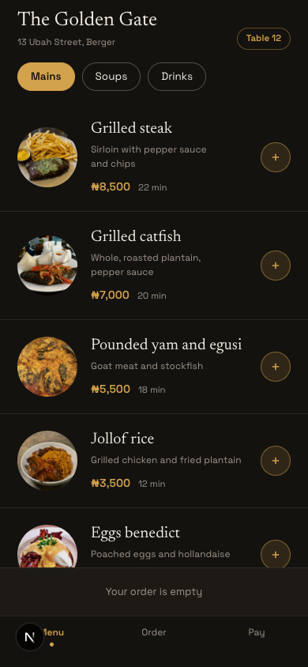
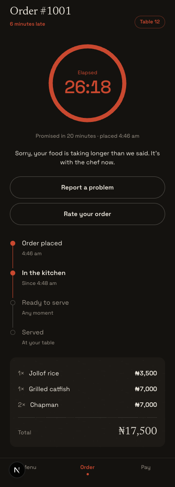
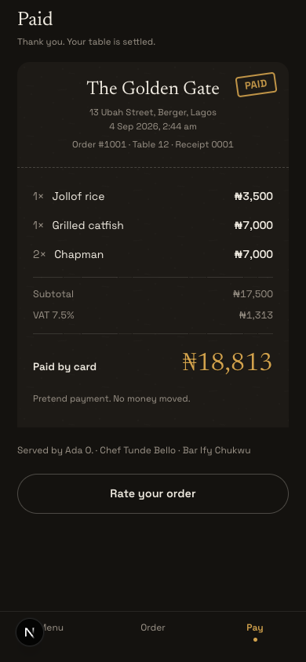
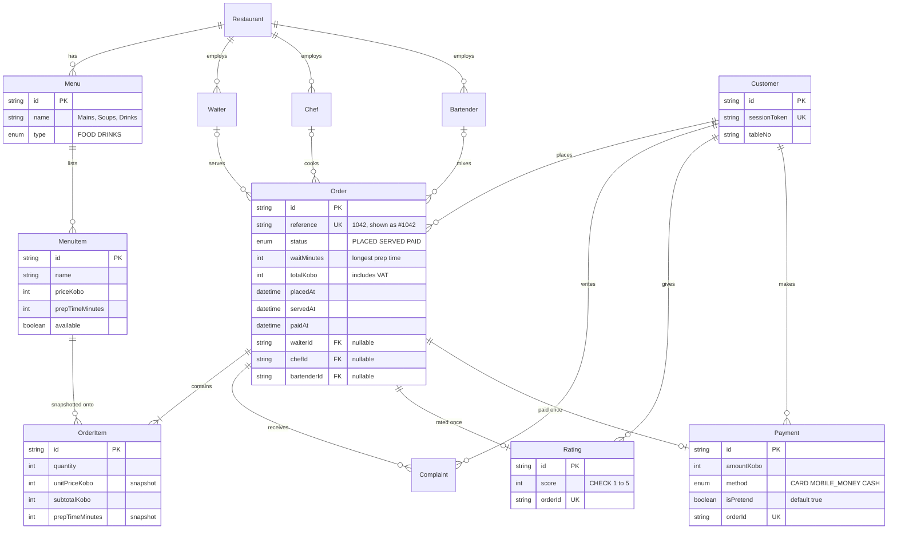
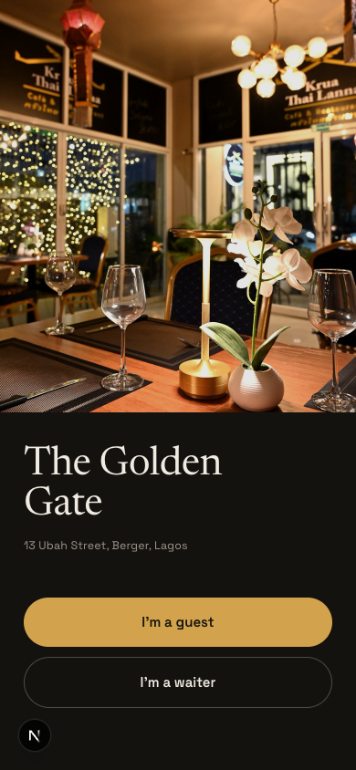

<p align="center">
  
</p>

# CHOWLY

A dining app for a guest already seated in the restaurant. On their own phone they read
the menu, add dishes, place the order against their table, watch a ring count down the
minutes the kitchen promised, report a problem and rate the meal if it runs late, and pay
before they leave. A waiter sees every live order, opens one, records who cooked and who
mixed the drinks, and marks it served.

**Live:** https://chowly-theta.vercel.app

There is no login and no PIN, by design: the assignment forbids logins and requires the
live link to be usable by anyone, so the guest side and the waiter side are both open from
the front door. Payment is pretend. No money moves, the button and the receipt say so, and
every payment row is marked pretend.

## The eight screens

The design is **Night Service**, direction 1c of a design handoff kept in the repository
at [`docs/design-ref`](docs/design-ref/design_handoff_chowly_night_service/README.md):
a warm near-black room, bone text, ochre for every action and for the countdown, one late
red, and a deliberately conventional structure. Every screen and state is captured at 390
in [`docs/screens`](docs/screens/README.md).

<p align="center">
  
  
  
</p>

1. **Landing.** On a cold start, a splash where the mark's arc fills as a progress ring
   from the real load and the dot parks in the gap once the app is ready; then the dining
   room, the name and address, "I'm a guest", "I'm a waiter", and the table: the one the
   link carried, or the door asks for it.
2. **Menu.** Mains, Soups and Drinks as chips; each dish a 76px round photograph with its
   name, description, price and the kitchen's minutes; an add circle that morphs into a
   quantity stepper; a cart bar that never disappears.
3. **Order placed.** The ring, driven from real elapsed time against the promise, the
   steps from placed to served to paid, the items. The tab opens the moment the order is
   placed and the kitchen's number lands on it; every order of the session stays
   reachable from here.
4. **Running late.** The same screen once the promise is spent: everything ochre has
   crossed slowly to red, the ring is closed, the time counts up, and two actions appear.
5. **Live orders.** Every open order as a card with its status, its clock and the count
   of reports from the table, filtered by All, Cooking, Late and Served; the pill asks
   who is serving and keeps the answer for the session.
6. **Order open.** The lines with their minutes, the reports from the table in full,
   waiter, chef and bartender as chips, "Mark as served", which becomes the record of
   when at once.
7. **Pay.** The summary with VAT, three ways to pay, one button.
8. **Receipt.** Printed: perforation, ruled lines, the stamp, the torn foot, the rating,
   and who served, cooked and mixed.

The waiter's other two tabs are the **table board**, the floor by table with what each
still has to pay, and the **86 board**, every dish with a switch that takes it off the
guests' menu and refuses by name any order still carrying it. Every screen shows its own
shape while it loads, says since when it has been offline, and says once when it is
back.

Three things sit on top of the handoff. **Paper as surface detail**, borrowed from an
earlier direction: fibre at very low contrast on the cards, a rule that reads as printed
rather than drawn, numerals struck into the surface, and on the receipt the perforation,
the torn foot and the stamp. **anime.js throughout, restrained**: one entrance per screen,
every visit; everything else answers an action. Every scope degrades to a fade under
reduced motion. **Real photography**, licensed and served from this repository; the
credits are below.

## Stack

| Layer | Choice |
|---|---|
| Framework | Next.js 15.5, App Router, TypeScript strict with `noUncheckedIndexedAccess` |
| Styling | Tailwind v4, the handoff's tokens in `app/globals.css` |
| Type | Newsreader (display) and Space Grotesk (everything else), self-hosted by `next/font` |
| Motion | anime.js 4.5.0, every scope with a reduced-motion branch |
| Database | PostgreSQL on Neon, Prisma 6.19 |
| Validation | Zod, every request shape strict |
| Data fetching | SWR, the menu and the session's orders cached client-side, the live list polled every 3 seconds |
| Hosting | Vercel |

## Data model



The schema carries eleven deliberate departures from the coursework ERD, each annotated
`DELTA` in [`prisma/schema.prisma`](prisma/schema.prisma) and explained in the
[submission document](docs/SUBMISSION.md). The ones a reader meets first: money is
integer kobo everywhere, the wait is a computed integer, delay is derived at read time
and never stored, prices and prep times are snapshotted onto each order line, and one
payment and one rating per order are enforced by unique constraints, with the rating's
range enforced by a hand-written check constraint.

## The wait time and the money

Computed in one server-side place, `lib/wait-time.ts`, from prep times read from the
database, and unit tested. The handoff defines the promise as the longest prep time in
the order, capped so a bad prep time in the data still shows a wait a person would believe:

$$
\text{wait} = \min\big(90,\ \max_i \text{prep}_i\big)
$$

An order is late when $\text{now} > \text{placedAt} + \text{wait}$ and it is still
placed. The ring's arc is the remaining fraction of that promise, recomputed every second
from `placedAt`, so a refresh changes nothing. The total is the sum of the line
subtotals plus VAT at 7.5%, rounded to whole naira so nothing on a receipt carries decimals:

$$
\text{total} = s + 100\,\Big\lfloor \tfrac{0.075\,s}{100} + \tfrac12 \Big\rfloor
\qquad s = \sum_i q_i\, p_i \ \text{(kobo)}
$$

<details>
<summary><strong>Setup</strong></summary>

```bash
git clone https://github.com/DebbyA007/CHOWLY.git
cd CHOWLY
npm ci --ignore-scripts
cp .env.example .env    # then fill it in, see the variables below
npx prisma migrate deploy
node prisma/seed.mts
npm run dev             # http://localhost:3000
```

`npm ci --ignore-scripts` blocks Prisma's postinstall codegen on purpose, so the build
script is `prisma generate && next build` and Vercel's install command is set to the
same `npm ci --ignore-scripts`. The seed is idempotent: run it twice and the same rows
are there. Open `http://localhost:3000/?table=12` to arrive as a guest at table 12.

</details>

<details>
<summary><strong>Environment variables</strong></summary>

| Variable | What it is |
|---|---|
| `DATABASE_URL` | Neon's pooled connection string, used by the app |
| `DIRECT_URL` | Neon's direct connection string, used by Prisma migrations |
| `SESSION_SECRET` | Signs the guest's session cookie. `openssl rand -hex 32` |
| `STAFF_PIN` | The staff PIN the server-side seam compares, in constant time |
| `STAFF_PIN_REQUIRED` | The seam's switch. On only when exactly `true`; absent, `false` or anything else leaves the waiter routes open. The demo sets `false` |
| `DEMO_CONTROLS` | Enables the endpoint the verification script uses to make an order late. Only exactly `true` enables it; production leaves it unset and the endpoint is a 404 |

No secret is ever prefixed `NEXT_PUBLIC_`.

</details>

<details>
<summary><strong>Scripts</strong></summary>

| Script | Does |
|---|---|
| `npm run dev` | Dev server with Turbopack |
| `npm run build` | `prisma generate && next build` |
| `npm run typecheck` | `tsc --noEmit` |
| `npm run lint` | ESLint |
| `npm test` | Node's built-in test runner over `lib`, 28 tests |
| `node prisma/seed.mts` | Seeds the restaurant, the three menus, the ten dishes and the staff |

Every commit passed typecheck, lint and build first, and every screen was clicked
through in headless Chromium and rendered again in WebKit.

</details>

## Security, in one paragraph

Prices, subtotals, VAT, the total and the wait time are computed on the server from the
database; a client that posts a price is rejected by a strict Zod schema that names the
field. Money is integer kobo. The guest's identity is an opaque token in a signed,
httpOnly, sameSite=lax cookie, never localStorage, and every read, report, rating and
payment checks ownership inside the query. Payment is one transaction against a unique
constraint, so a double tap records once. Order creation, reports and ratings are rate
limited per session, counted in the database. The response headers carry a Content
Security Policy, `nosniff`, a referrer policy and `X-Frame-Options: DENY`. There is no
authentication, by design; the server-side seam for the waiter routes stays behind
`STAFF_PIN_REQUIRED`, off unless the flag is exactly `true`.

## Photography

Every photograph is served from this repository, because the Content Security Policy
allows images from its own origin only. Each was downloaded from an openly licensed
source, cropped square, resized, and given one CSS treatment so twelve sources read as
one shoot. The source, author and licence of every image are in
[`docs/PHOTOGRAPHY.md`](docs/PHOTOGRAPHY.md).

## Documents

- [`docs/SUBMISSION.md`](docs/SUBMISSION.md): how it was built, how AI was used, every feature step by step, and a walkthrough for a stranger.
- [`docs/AI-LOG.md`](docs/AI-LOG.md): the AI log, written as the work happened, with every rejection and correction.
- [`docs/screens/README.md`](docs/screens/README.md): every screen and state at 390, in Chromium and in WebKit.
- [`docs/PHOTOGRAPHY.md`](docs/PHOTOGRAPHY.md): the photographs, their sources and licences.
- [`docs/BRAND.md`](docs/BRAND.md): the mark, the lockups, the colour rules and the voice.
- [`docs/design-ref`](docs/design-ref/design_handoff_chowly_night_service/README.md): the design handoff the build follows.
- [`docs/directions/README.md`](docs/directions/README.md): the first three art directions and their critique, from before the handoff.
- [`docs/BUILD-PLAN.md`](docs/BUILD-PLAN.md): the order of work, one commit per step.
- [`CLAUDE.md`](CLAUDE.md): the rulebook the build was held to.

## Walkthrough video

<p align="center">
  <!-- MEDIA PLACEHOLDER: docs/media/walkthrough.mp4, a short screen recording from the landing page through placing an order, the ring running late, the waiter marking it served, and the receipt printing. -->
  
  <br><em>Walkthrough video placeholder. The recording goes at docs/media/walkthrough.mp4.</em>
</p>
