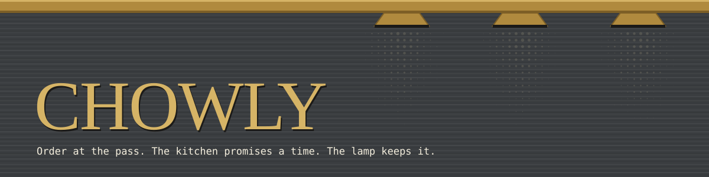
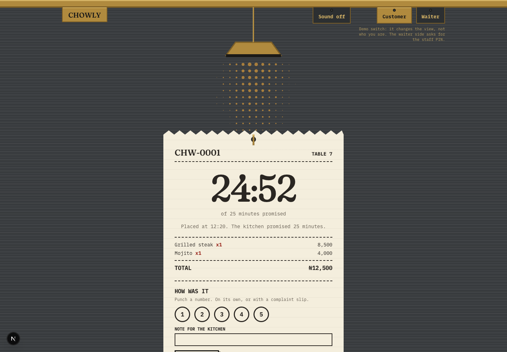
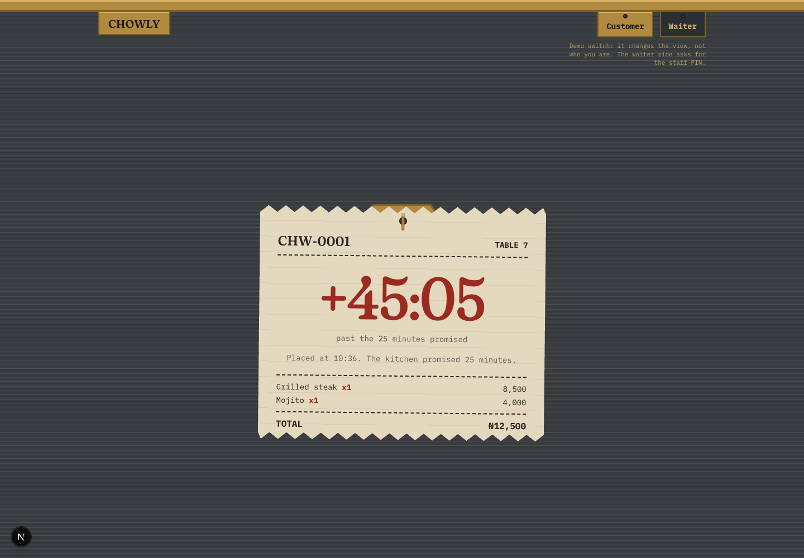
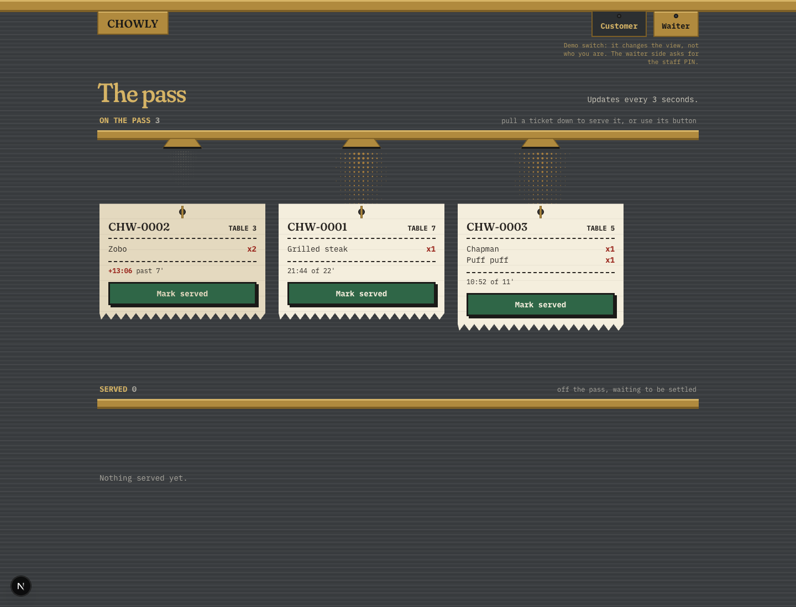
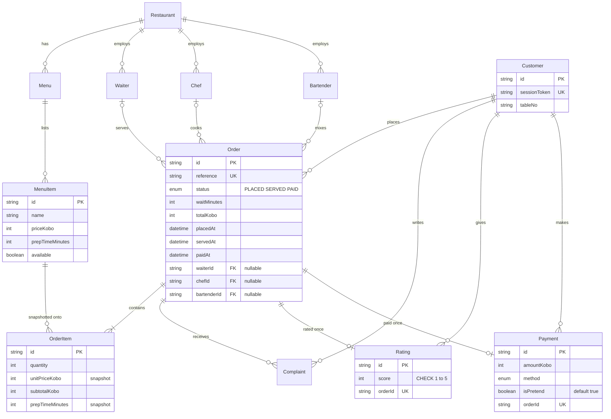
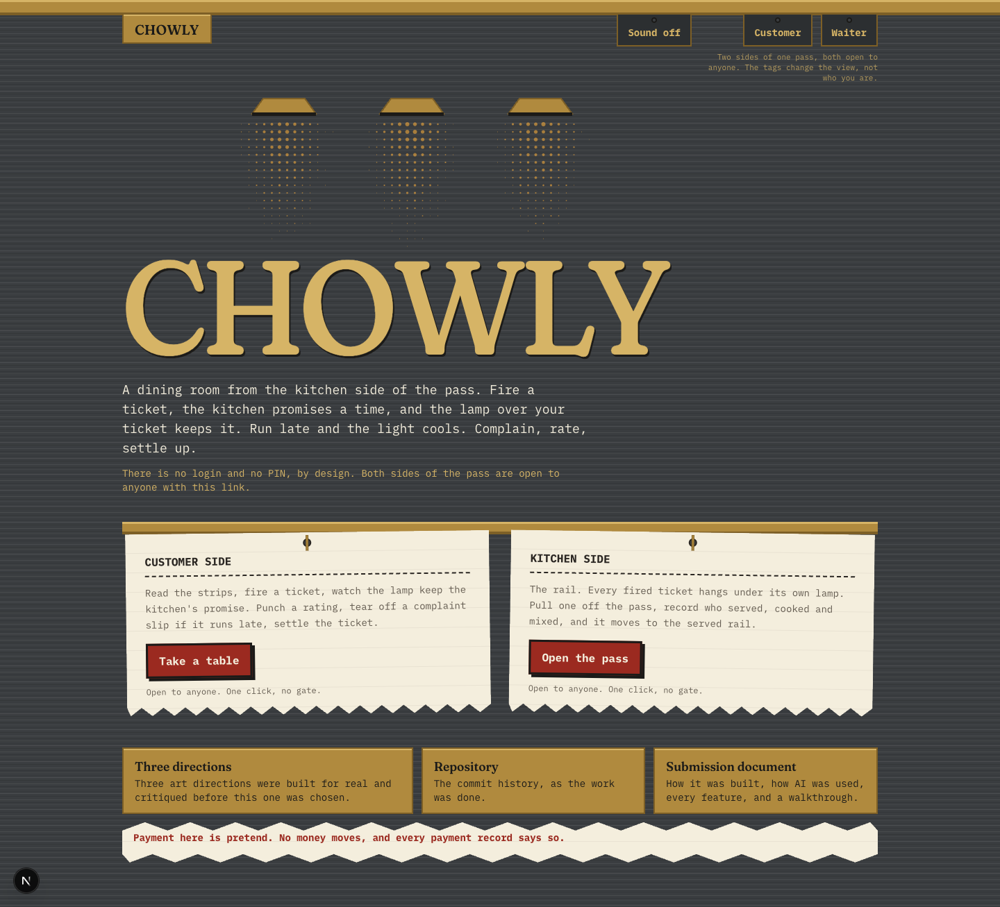

<p align="center">
  
</p>

# CHOWLY

A dining room seen from the kitchen side of the pass. A customer at a table fires a
ticket, the kitchen promises a time, and the heat lamp over the ticket keeps it: the light
cools and the paper ages as the order runs late. The customer can tear off a complaint
slip once it is late, punch a rating, and settle the ticket before leaving. A waiter
works the rail, pulls tickets off the pass, and records who served, cooked and mixed.

**Live:** LIVE_URL

There is no login and no PIN, by design: the assignment forbids logins and requires the
live link to be usable by anyone, so both sides of the pass are open. Payment is pretend.
No money moves, and every payment record says so.

## The five moments

1. **First load.** Three lamps switch on over brushed steel, the restaurant name warms
   into the room, and the menu drops off the rail as two thermal strips and prints.
2. **Firing the order.** Lines print on the ticket as they are tapped; firing it tears
   the ticket off the printer and swings it toward the rail.
3. **The wait.** The order is a ticket on a spike under its own lamp, and the lamp is the
   clock. Its pool shrinks as the promised minutes are used, and past the promise the
   light cools and dims and the paper ages. Never an alarm: a lamp that has been on too
   long. Under reduced motion the shift still happens, in one slow step.
4. **The rail.** Every fired ticket hangs on the kitchen's rail under its own small lamp
   carrying its own heat. Three ways to serve one: the button, the keyboard, or a pull
   down the rail.
5. **Settling up.** The lamp goes out, the receipt tears off below the ticket, and the
   PAID stamp lands once.

<p align="center">
  
  
</p>
<p align="center">
  
</p>

Every screen and state is in [`docs/screens`](docs/screens/README.md).

## Three art directions

Before this interface was built, three directions were proposed, each built for real as
the menu screen on the seeded data, screenshotted at 1440 and 390, and critiqued against
a written bar. They stay in the app at `LIVE_URL/directions` so the choice can be seen
rather than read about. The critique, with the screenshots, is
[`docs/directions/README.md`](docs/directions/README.md).

## Stack

| Layer | Choice |
|---|---|
| Framework | Next.js 15.5, App Router, TypeScript strict with `noUncheckedIndexedAccess` |
| Styling | Tailwind v4, tokens in `app/globals.css` |
| Type | Fraunces (display) and IBM Plex Mono (everything printed), self-hosted by `next/font` |
| Motion | anime.js 4.5.0, every scope with a reduced-motion branch |
| Database | PostgreSQL on Neon, Prisma 6.19 |
| Validation | Zod, every request shape strict |
| Data fetching | SWR, polling every 3 seconds on the rail and the ticket |
| Sound | Web Audio, synthesised, off by default |
| Hosting | Vercel |

## Data model



The schema carries eleven deliberate departures from the coursework ERD, each annotated
with `DELTA` in [`prisma/schema.prisma`](prisma/schema.prisma) and explained in the
[submission document](docs/SUBMISSION.md). The ones a reader meets first: money is
integer kobo everywhere, the wait is a computed integer, delay is derived at read time
and never stored, prices and prep times are snapshotted onto each order line, and one
payment and one rating per order are enforced by unique constraints, with the rating's
range enforced by a hand-written check constraint.

## The wait time

Computed in one server-side place, `lib/wait-time.ts`, from prep times read from the
database, and unit tested. The slowest item sets the floor and every extra unit on the
ticket adds three minutes of kitchen load, capped so a huge ticket still shows a wait a
person would believe:

$$
\text{wait} = \min\Big(90,\ \max_i(\text{prep}_i) + 3\,\big(\textstyle\sum_i q_i - 1\big)\Big)
$$

An order is late when `now > placedAt + waitMinutes` and it is still placed. The lamp's
heat is computed from the same two values on every tick in `components/pass/heat.ts`.

<details>
<summary><strong>Setup</strong></summary>

```bash
git clone https://github.com/DebbyA007/CHOWLY.git
cd CHOWLY
npm ci --ignore-scripts
cp .env.example .env    # then fill it in, see the variables below
npx prisma migrate deploy
npx prisma db seed
npm run dev             # http://localhost:3000
```

`npm ci --ignore-scripts` blocks Prisma's postinstall codegen on purpose, so the build
script is `prisma generate && next build` and Vercel's install command is set to the
same `npm ci --ignore-scripts`. The seed is idempotent: run it twice and the same rows
are there.

</details>

<details>
<summary><strong>Environment variables</strong></summary>

| Variable | What it is |
|---|---|
| `DATABASE_URL` | Neon's pooled connection string, used by the app |
| `DIRECT_URL` | Neon's direct connection string, used by Prisma migrations |
| `SESSION_SECRET` | Signs the customer session cookie. `openssl rand -hex 32` |
| `STAFF_PIN` | The staff PIN the server-side seam compares, in constant time |
| `STAFF_PIN_REQUIRED` | The seam's switch. Off only when exactly `false`; absent or anything else keeps it on. The demo sets `false` |

No secret is ever prefixed `NEXT_PUBLIC_`.

</details>

<details>
<summary><strong>Scripts</strong></summary>

| Script | Does |
|---|---|
| `npm run dev` | Dev server with Turbopack |
| `npm run build` | `prisma generate && next build` |
| `npm run typecheck` | `tsc --noEmit` |
| `npm run lint` | ESLint |
| `npm test` | Node's built-in test runner over `lib` and `components`, 32 tests |
| `npx prisma db seed` | Seeds the restaurant, menus, items and staff |

Every commit passed typecheck, lint and build first.

</details>

## Security, in one paragraph

Prices, subtotals, the total and the wait time are computed on the server from the
database; a client that posts a price is rejected by a strict Zod schema that names the
field. Money is integer kobo. The customer identity is an opaque token in a signed,
httpOnly, sameSite=lax cookie, never localStorage, and every read, complaint, rating and
payment checks ownership inside the query. Payment is one transaction against a unique
constraint, so a double click records once. Order creation, complaints and ratings are
rate limited per session, counted in the database. The response headers carry a Content
Security Policy, `nosniff`, a referrer policy and `X-Frame-Options: DENY`. There is no
authentication, by design; the server-side seam for waiter routes stays behind
`STAFF_PIN_REQUIRED`, on unless the flag is exactly `false`.

## Documents

- [`docs/SUBMISSION.md`](docs/SUBMISSION.md): how it was built, how AI was used, every feature step by step, and a walkthrough for a stranger.
- [`docs/AI-LOG.md`](docs/AI-LOG.md): the AI log, written as the work happened, with every rejection and correction.
- [`docs/directions/README.md`](docs/directions/README.md): the three art directions and the critique.
- [`docs/BUILD-PLAN.md`](docs/BUILD-PLAN.md): the order of work, one commit per step.
- [`CLAUDE.md`](CLAUDE.md): the rulebook the build was held to.

## Walkthrough video

<p align="center">
  <!-- MEDIA PLACEHOLDER: docs/media/walkthrough.mp4, a short screen recording from the landing page through a fired ticket, the lamp cooling, the rail, and the receipt. -->
  
  <br><em>Walkthrough video placeholder. The recording goes at docs/media/walkthrough.mp4.</em>
</p>
