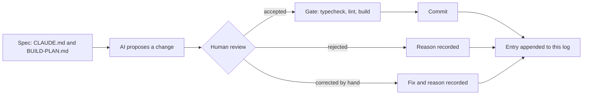

# AI log

How AI was used to build CHOWLY, written while the work happens. Each entry records what
was asked for, what was accepted, what was rejected and why, and what had to be corrected
by hand. The rejections and corrections are the useful part, so they are recorded when
they occur, never reconstructed later.

> [!NOTE]
> **Media placeholder.** A short screen recording of one propose, review, decide loop
> belongs here as `docs/media/ai-log-loop.gif`. It gets recorded in Phase 3, once there is
> an interface to show.

## How an entry gets here



Every commit in every phase appends an entry below, in commit order. The gate is
`npm run typecheck && npm run lint && npm run build`, run before each commit.

<details>
<summary>Entry format</summary>

Each per-commit entry has four fields:

| Field | What goes there |
|---|---|
| Asked for | The instruction as given, in one or two lines |
| Accepted | What the AI proposed that went in unchanged |
| Rejected | What was proposed and turned down, with the reason |
| Corrected by hand | What had to be fixed after the AI produced it, and why |

Decisions made before the first commit use a shorter form: proposed, decided, why.

</details>

## Decisions made before the first commit

### 1. Prisma codegen under `npm ci --ignore-scripts`

- **Proposed:** drop `--ignore-scripts` so Prisma's postinstall hook can generate the client.
- **Decided:** keep the flag. The build script became `prisma generate && next build`.
- **Why:** `--ignore-scripts` is a supply-chain control that stops every dependency's
  install hook, not only Prisma's. Moving codegen into the build keeps that control and
  makes the generate step explicit and visible in the build log.

### 2. A proxy that renders context as images

- **Proposed:** a token-saving proxy that compresses conversation context into PNG images
  before it reaches the model.
- **Decided:** rejected for this project.
- **Why:** prices are integer kobo. A character-level transcription error on a price
  (8500 read as 6500) is still a valid integer, so it passes typecheck, lint and build
  undetected. The saving is not worth a silent money error.

### 3. The `caveman-compress` skill

- **Proposed:** install the full caveman skill bundle as shipped, which includes
  `caveman-compress`.
- **Decided:** removed from every install location before this build started.
- **Why:** its function is rewriting memory files such as `CLAUDE.md` into compressed
  form. `CLAUDE.md` here is a graded deliverable and the rulebook for the remaining
  sessions, so a tool whose job is to rewrite it should not be reachable at all.

### 4. SSH `IdentitiesOnly`

- **Proposed:** push with the machine's default SSH setup, where the agent offers
  whichever key it holds first.
- **Decided:** a dedicated host alias with `IdentitiesOnly yes`, a dedicated key, and a
  repo-local `user.email`.
- **Why:** this machine holds several GitHub identities. With agent key selection, the
  first key the agent offers wins, and a push can carry the wrong identity. The alias
  makes the identity explicit and checkable before every push.

### 5. Deployment first, not last

- **Proposed:** the build plan put Vercel deployment at step 22, after every feature.
- **Decided:** a deploy gate right after the scaffold and security headers, before Prisma.
- **Why:** the pipeline (install command, build script, headers) is proven while the app
  is two files. Any pipeline failure then has two files of suspects, not twenty commits.

## Entries

### Commit 0: `docs: start the ai log with decisions made before the first commit`

- **Asked for:** create this file, seed it with the five decisions above, append at every
  later commit.
- **Accepted:** the structure above: a diagram of the loop, a collapsible entry format, a
  media placeholder, and the five decisions in proposed, decided, why form.
- **Rejected:** nothing.
- **Corrected by hand:** nothing.
- **Gate:** not runnable yet. There is no `package.json` before the scaffold commit, so
  typecheck, lint and build do not exist. The scaffold is the first gated commit.

### Commit 1: `chore: scaffold next.js app with typescript and tailwind`

- **Asked for:** create-next-app with App Router, TypeScript, Tailwind v4, no src directory
  and ESLint. Delete all starter boilerplate in the same commit. Add `typecheck`, set
  `build` to `prisma generate && next build`, strict tsconfig with `noUncheckedIndexedAccess`
  and `noImplicitAny`, animejs pinned exactly, and a page that renders only the CHOWLY name
  on `--enamel-deep` in `--chalk`.
- **Accepted:** Next 15.5.25 through `create-next-app@15`, run in a scratch directory
  because the tool refuses a directory that already holds `CLAUDE.md`, `prisma/` and
  `.githooks`. The generated config files were copied in and the repo's own `.gitignore`
  kept. `animejs` 4.5.0 exact. Prisma CLI and client pinned to 6.19.3 exact and installed
  in this commit, since the build script calls `prisma generate` and the schema is already
  in the repo, so no stub was needed. `*.tsbuildinfo` added to `.gitignore` because
  `tsc --noEmit` with `incremental` writes `tsconfig.tsbuildinfo`.
- **Rejected:** scaffold defaults that would have shipped something generic: the Geist font
  pair, the demo page, the five SVGs in `public/`, the default favicon, the template README
  and the placeholder metadata. `next build --turbopack` (the 15.5 scaffold default) was
  dropped for the plain `next build` the spec names. Prisma 8.0.0-rc.12, the registry's
  `latest`, was rejected: the 7 and 8 lines removed `url` and `directUrl` from the
  datasource block and deprecated the `prisma-client-js` generator, all of which the
  provided schema uses, so taking it would have meant editing a schema this commit must
  not touch.
- **Corrected by hand:** nothing in the committed files. Two process corrections: the first
  gate run captured no exit codes (a bash-only variable under zsh) and was re-run; the
  Playwright plugin wanted Google Chrome, which is not installed, so the visual check used
  Playwright's cached Chromium through a small script instead. A power loss interrupted
  the run after the gate had passed; the commit was made after re-verifying every file
  and re-running the gate.
- **Verified:** typecheck, lint and build all exit 0, and `npm ci --ignore-scripts`
  followed by the build proves the Vercel install path. Headless Chromium computed the
  body background as `rgb(18, 58, 94)` (`#123a5e`) and the text as `rgb(242, 239, 230)`
  (`#f2efe6`), with CHOWLY as the only visible text. One console 404 remains,
  `/favicon.ico`, because the default icon was removed and the designed one belongs with
  the design tokens commit.
- **Finding for the motion phase:** `animejs` 4.5.0 exports both `spring` and
  `createSpring` from `dist/modules/easings/spring/index.d.ts` with the same signature,
  `(parameters?: SpringParams): Spring`. `CLAUDE.md` prefers `createSpring`; both exist in
  this version.

### Commit 2: `chore: configure security headers`

- **Asked for:** Content-Security-Policy, `X-Content-Type-Options: nosniff`,
  `Referrer-Policy: strict-origin-when-cross-origin` and `X-Frame-Options: DENY` in
  `next.config.ts`. The CSP must still allow next/font, and any relaxation is to be named,
  never widened silently.
- **Accepted:** static headers from `headers()` on `/(.*)`, so the document and every
  static asset carry them. Production CSP: `default-src 'self'`, `script-src 'self'
  'unsafe-inline'`, `style-src 'self' 'unsafe-inline'`, `img-src 'self' data: blob:`,
  `font-src 'self'`, `connect-src 'self'`, `object-src 'none'`, `base-uri 'self'`,
  `form-action 'self'`, `frame-ancestors 'none'`, `upgrade-insecure-requests`.
  Development adds `'unsafe-eval'` to `script-src` and `ws://localhost:*` to
  `connect-src` for Fast Refresh, keyed on `NODE_ENV`, so production carries neither.
- **Relaxations, named:** `script-src 'unsafe-inline'`, because Next.js hydrates the App
  Router through inline scripts and a static header cannot carry a per-request nonce.
  `style-src 'unsafe-inline'`, for inline style attributes (the countdown ring sets its
  stroke offset that way) and the style tags Next.js injects in development. next/font
  needed nothing: Bricolage Grotesque was loaded temporarily through `next/font/google`,
  the browser fetched it from `/_next/static/media/` on this origin with a 200,
  `document.fonts` reported it loaded, and Chromium raised no violation. The experiment
  was reverted with git before the commit.
- **Rejected:** a nonce-based CSP through middleware, which would remove `'unsafe-inline'`
  from `script-src`. Rejected for this commit because the spec places the headers in
  `next.config.ts` and a nonce needs per-request middleware. Recorded as the upgrade path
  once route handlers exist.
- **Corrected by hand:** nothing in the committed file. One process correction: the
  recovery gate's `next build` ran while the dev server was starting, both write `.next`,
  and the dev server answered 500 with `ENOENT` on `_buildManifest.js` until restarted.
  The rule from that: never run the build while `next dev` is up.
- **Verified:** `curl -I` against `next dev` shows all four headers. `next start` on port
  3001 shows all four on the document and on a JS chunk. Headless Chromium reported zero
  CSP violations in both modes, and the only console error is the known favicon 404.
  Vercel's preview toolbar loads from `vercel.live` and will be blocked by `script-src` on
  preview URLs; production is unaffected.
- **Deploy gate:** branch pushed after this commit. Connecting the repo to Vercel, setting
  the install command to `npm ci --ignore-scripts` and confirming the URL are manual steps.

### Commit: `chore: override postcss and deepmerge-ts above their advisories`

- **Asked for:** audit the five vulnerabilities `npm ci --ignore-scripts` reported on the
  fresh scaffold, classify each by severity, directness and reach, say whether a fix
  exists without a breaking major, and stop for a ruling. No `npm audit fix --force`.
- **Finding:** five npm entries, two real advisory chains. One: `deepmerge-ts` 7.1.5
  (high, stack exhaustion on recursive object graphs) reached through `prisma` and
  `@prisma/config`. Two: `postcss` 8.4.31 (two high, two moderate: arbitrary `.map` file
  reads through `sourceMappingURL` comments and a `</style>` escape in stringified
  output), pinned by Next 15.5.25 as a nested dependency. The `next`, `prisma` and
  `@prisma/config` entries only inherit from those two.
- **Reach, and how it was proven:** neither chain reaches the production runtime.
  Requiring `@prisma/client` loads only `runtime/library.js`, and neither `deepmerge-ts`
  nor `@prisma/config` appears in Node's module cache afterwards; the word deepmerge does
  not occur in either runtime file, and the lock only marked `prisma` as non-dev because
  `@prisma/client` names the CLI as an optional peer. For postcss, Next requires it from
  `dist/build/` files only and nothing under `dist/server/` does, so `next start` never
  loads it. Both chains run on the build machine: the Prisma CLI during `prisma generate`
  and migrations, postcss during CSS compilation. Their inputs are authored in this repo.
- **Rejected:** npm's own fixes, because both are semver-major: `next` 16.3.4, or
  `prisma` 6.12.0, which is a downgrade to before `@prisma/config` adopted deepmerge-ts.
  No Prisma release, including the 8.0.0 release candidate, had moved off the
  vulnerable range.
- **Accepted (the ruling):** npm `overrides` pinning `postcss` to `^8.5.26` and
  `deepmerge-ts` to `^8.0.0`. Tested first in a scratch copy: audit clean, Prisma
  validate and generate clean, Next build clean. Next 16 itself ships postcss 8.5.23, so
  the 8.5 line is proven inside Next's CSS pipeline. deepmerge-ts 8 is ESM like 7 and only
  raises the Node floor to 16.9.
- **Corrected by hand:** nothing.
- **Verified:** after `rm -rf node_modules && npm ci --ignore-scripts`, the exact Vercel
  install command, the output line is `found 0 vulnerabilities`. Resolved on disk:
  postcss 8.5.28 with no nested copy under `next/`, deepmerge-ts 8.0.2. Gate green.
- **Maintenance note:** overrides pin transitive versions and go stale silently. Nothing
  warns when `next` or `prisma` moves to a version that no longer needs them, or that
  needs a different one. Both overrides get re-checked whenever either parent is bumped,
  and removed the moment the parent's own pin is clean.

### Commit 3: `feat: connect prisma to neon with the first migration`

- **Asked for:** `.env` with `DATABASE_URL` (Neon pooled), `DIRECT_URL` (Neon direct),
  `SESSION_SECRET` and `STAFF_PIN`; a committed `.env.example` with every key present and
  every value blank; confirmation that `.env` is ignored; the first migration, with the
  generated SQL for Order and Payment reported.
- **Accepted:** `.env.example` committed with the four keys blank and a one-line comment
  each. `.env` is ignored by the `.env` rule and `.env.example` is un-ignored by the
  `!.env.example` negation, both confirmed with `git check-ignore`. The human wired the
  real values; the AI checked them for presence and shape only (character counts, the
  `-pooler` host segment on the pooled string and its absence on the direct one) and
  never printed them. Migration `20260903160256_init` was created and applied with
  `prisma migrate dev` over `DIRECT_URL`.
- **Deltas realised by this migration:** 1, `MenuItem.prepTimeMinutes INTEGER NOT NULL`.
  2, `Order.waitMinutes INTEGER NOT NULL`. 3, `waiterId`, `chefId` and `bartenderId` as
  nullable `TEXT` with `ON DELETE SET NULL`. 4, `OrderStatus` enum of exactly PLACED,
  SERVED and PAID, so a delayed state has nowhere to be stored. 5, `placedAt`, `servedAt`
  and `paidAt` as `TIMESTAMP(3)`. 6, `OrderItem.unitPriceKobo`, `subtotalKobo` and
  `prepTimeMinutes` as snapshot columns. 7, every money column `INTEGER`. 8, the unique
  index `Payment_orderId_key`. 9, `isPretend BOOLEAN NOT NULL DEFAULT true`. 11, the
  unique index `Customer_sessionToken_key`. Delta 10's `CHECK` is the next commit, since
  Prisma cannot express it.
- **Rejected:** the build plan's message `feat: add prisma schema and connect neon`,
  because the schema was already committed in `5775a14` and this commit does not touch
  it. A message claiming otherwise would misdescribe the history the assignment grades.
  No schema stub was ever needed for the same reason.
- **Corrected by hand:** nothing.
- **Verified:** `prisma migrate status` reports the database in sync. A Prisma client
  query over the pooled `DATABASE_URL`, the path the app will use, returned PostgreSQL
  18.6, the thirteen tables, and the applied migration row. Gate green.

### Commit 4: `feat: add rating score check constraint`

- **Asked for:** an empty migration carrying the hand-written
  `ALTER TABLE "Rating" ADD CONSTRAINT rating_score_range CHECK (score BETWEEN 1 AND 5);`
  as its own commit, with proof that the database rejects a score of 0 and of 6.
- **Accepted:** `prisma migrate dev --create-only --name rating_score_check` produced the
  empty file, the SQL was written by hand with a comment tying it to delta 10, and
  `prisma migrate dev` applied it. Delta 10's reason: Prisma cannot express a check
  constraint, and a range that only Zod enforces would leave any other write path free
  to store a 0 or a 9. The database is the last line, not the first.
- **Rejected:** nothing.
- **Corrected by hand:** nothing.
- **Verified:** `pg_constraint` on Neon lists `rating_score_range` as
  `CHECK (((score >= 1) AND (score <= 5)))`. Three scripts each inserted a throwaway
  customer and order, then a rating, inside a transaction ending in `ROLLBACK`. Score 0
  and score 6 both failed with `new row for relation "Rating" violates check constraint
  "rating_score_range"`. Score 3 ran to `Script executed successfully`. Row counts after
  all three: 0 customers, 0 orders, 0 ratings. Gate green.

### Commit 5: `feat: seed restaurant, menu, staff and prep times`

- **Asked for:** one restaurant, The Golden Gate, 13 Ubah Street, Berger, Lagos. Two
  menus, food and drinks, around fourteen items reusing the coursework six and extending
  with dishes that fit a Lagos kitchen, all prices in kobo, prep times genuinely varied
  from about 4 for a poured drink to about 22 for a grilled cut. Three chefs, three
  bartenders and three waiters on this one restaurant. Idempotent.
- **Assumption, flagged for review:** the coursework prices are naira, so Grilled Steak
  8500 is stored as 850000 kobo. Read as kobo they would be a steak at 85 naira, which
  no Lagos kitchen charges, so the naira reading was taken and every price is stored
  times one hundred.
- **Accepted:** fourteen items, eight on the kitchen menu and six on the bar, with prep
  times 22, 20, 18, 15, 14, 12, 10, 8 and 6, 5, 5, 4, 4, 4. Every row carries a stable id
  such as `item_grilled_steak` and is written with `upsert`, which is what makes the seed
  idempotent and lets a later edit to a price or prep time land by re-running it. The
  runner is `node prisma/seed.mts`, with no extra dependency, because Node 24 strips
  types natively.
- **Rejected:** a `tsx` or `ts-node` dependency for the seed, since Node runs the file as
  is. A wipe-and-reload seed (`deleteMany` then `createMany`), because it is not
  idempotent in any useful sense and would break `OrderItem` foreign keys once real
  orders reference the items. The `.ts` extension for the seed, after Node warned it had
  to re-parse the file as an ES module because package.json declares no module type;
  the file became `seed.mts`, which states its module type, and the tsconfig `include`
  gained `**/*.mts` so the gate still typechecks it.
- **Corrected by hand:** nothing.
- **Verified:** three seed runs, each reporting the same counts: 1 restaurant, 2 menus,
  14 items, 3 chefs, 3 bartenders, 3 waiters. A read-back query through the pooled URL
  returned every item with its kobo price and prep time, and a GROUP BY on item names
  found no duplicates. `tsc --listFilesOnly` includes the seed and `eslint` lints it
  without warnings. Gate green.

## Phase 2: the data layer

### Commit 6: `feat: add zod schemas and money helpers`

- **Asked for:** a Zod schema for every request shape, rejecting unknown keys.
  `formatNaira(kobo)`. The wait time in one server-side place, unit tested:
  `max(prepTime) + 3 * (itemCount - 1)`.
- **Accepted:** `lib/schemas.ts` with strict objects for order creation, staff assignment,
  complaint, rating and payment, plus a cuid check for order ids and a `parseWith` helper
  that turns the first issue into a sentence a person can act on. An unrecognised key
  gets its own wording, since a posted price is the case that matters. `lib/money.ts`
  formats integer kobo as naira with grouped thousands and shows kobo only when there
  are any. `lib/wait-time.ts` holds `calculateWaitMinutes`, capped at 90, and the derived
  delay check (`isOrderDelayed`, `dueAt`) so delta 4 has exactly one implementation.
  Tests run on Node's built-in runner (`node --test`), and the test files are `.mts`
  importing `.ts` sources, which needed `allowImportingTsExtensions` in tsconfig.
- **Interpretation, flagged:** `itemCount` is units, not lines, so two steaks and three
  zobo count as five. Each extra unit is kitchen load whether or not it is a new dish.
- **Rejected:** a test framework dependency (vitest or jest), because the runner in Node
  24 covers assertion, grouping and TypeScript without a package. `Intl.NumberFormat`
  for naira, because ICU output differs between Node builds and browsers and a money
  string should not depend on which one formatted it.
- **Corrected by hand:** the cap test. The AI wrote it as twenty steaks expecting the cap,
  but 22 + 3 * 19 is 79, under the cap, so the test asserted the wrong number and failed
  on first run. It now uses forty units (139 before the cap) and also pins the 79 case
  just below it. The function was right; the test was not.
- **Verified:** 16 tests pass, including a client posting `priceKobo` on a line and
  `totalKobo` plus `waitMinutes` at the top level, both rejected with the field named.
  Gate green.

### Commit 7: `feat: add customer session cookie`

- **Asked for:** a signed, httpOnly, sameSite=lax cookie holding an opaque token, the
  customer row created on first visit, never localStorage.
- **Accepted:** `lib/session-token.ts` signs a 32-byte random token with HMAC-SHA256 over
  `SESSION_SECRET` using Web Crypto, and verifies with a constant-time compare.
  `middleware.ts` mints the cookie on a visitor's first request, on the edge runtime,
  with a matcher that skips static assets. `lib/session.ts` maps the verified token to a
  Customer row: `getCustomer` is read-only for server components, `requireCustomer` is
  for route handlers and creates the row on first use with an upsert on the unique
  `sessionToken`, or answers 401 when nothing verifies. The customer id is never read
  from the request. `lib/prisma.ts` holds the client singleton, `lib/http.ts` a small
  `HttpError` and `handle` wrapper, and `GET /api/session` returns the customer so the
  behaviour is testable now and the UI can show the table later.
- **Interpretation, flagged:** the cookie is minted on the first visit with no database
  work, and the row is created on the first API call that needs an identity. The edge
  runtime cannot run Prisma, and page views by crawlers should not write rows. From the
  customer's side it is the same thing: a refresh keeps the identity either way.
- **Rejected:** `localStorage`, because injected script can read it. Node's
  `crypto.timingSafeEqual` for the cookie compare, because the same code must run on the
  edge runtime, so a constant-time loop over the hex strings is used instead;
  `timingSafeEqual` is kept for the staff PIN, which only runs on Node. The `server-only`
  package, in favour of a comment, to avoid a dependency for one import.
- **Corrected by hand:** the double Set-Cookie. The first cut had both the middleware and
  `requireCustomer` minting a session, and the curl check on an API-first request showed
  two Set-Cookie headers carrying different tokens, with only header order making the
  created row match the cookie the browser would keep. The middleware is now the only
  minting site. It forwards the signed value to the handler in a request header that it
  deletes from every incoming request first, so a client cannot supply it, and the
  handler verifies that header's signature exactly as it verifies the cookie.
- **Verified:** 20 unit tests pass, including tampered token, tampered signature, wrong
  secret and malformed values. Against the dev server with a cookie jar: an API-first
  request gets exactly one Set-Cookie (`HttpOnly; SameSite=lax; Max-Age=2592000; Path=/`)
  and a row; the next request with that cookie returns the same id and no Set-Cookie; a
  client-sent `x-chowly-session` header with no cookie is ignored; a tampered cookie is
  replaced with a fresh identity; a page visit's cookie is reused by the API call after
  it. The seven test customers were deleted from Neon afterwards. Gate green. `secure`
  is set only in production, which is the one attribute curl against localhost cannot
  show; check it on the live URL.

### Commit 8: `feat: add menu api`

- **Asked for:** `GET /api/menu`, grouped by menu type, unavailable items excluded.
- **Accepted:** one query with the restaurant, its menus ordered by type (so the kitchen
  comes before the bar) and only `available: true` items. Each item carries `priceKobo`
  for arithmetic and `price` already formatted, so the client never formats money. No
  session is needed to read the menu and nothing is written, so it stays outside the
  customer lookup.
- **Rejected:** nothing.
- **Corrected by hand:** nothing.
- **Verified:** against the dev server the response carries The Golden Gate, 8 kitchen
  items and 6 bar items with formatted prices and prep times. Setting Puff puff to
  unavailable in Neon dropped the count to 13 with the item absent; restoring it brought
  back 14. The security headers from Commit 2 are present on the JSON response. Gate
  green.

### Commit 9: `feat: add order placement api`

- **Asked for:** `POST /api/orders` accepting item ids, quantities and a table number
  only. Prices, subtotals, the total and `waitMinutes` computed server-side from the
  database, price and prep time snapshotted onto each line, a posted price rejected.
- **Accepted:** the strict schema from Commit 6 does the rejecting before any database
  work, and the error names the field. Repeated ids merge into one line. Items are
  loaded by id with `available: true`, so an item pulled from the menu between the
  customer's page load and their order is refused with a message to reload. Each line
  stores `unitPriceKobo`, `subtotalKobo` and `prepTimeMinutes` from the row just read
  (delta 6). The total is the sum of those subtotals and the wait comes from
  `calculateWaitMinutes` over those prep times (delta 2). The order and the customer's
  latest table number are written in one transaction. `lib/orders.ts` holds the single
  presenter every order route returns, with `isDelayed` and `dueAt` derived at read
  time (delta 4). `lib/rate-limit.ts` counts in the database, five orders per session
  per ten minutes, so the limit holds across serverless instances.
- **Interpretation, flagged:** the reference is sequential and human readable, `CHW-0001`
  onwards, taken from the order count and retried on the unique constraint if two orders
  land in the same instant. A random suffix would never collide but reads worse on a
  ticket.
- **Rejected:** an in-memory rate limiter, because each Vercel function instance would
  keep its own counter and the limit would be theatre. A per-request `new PrismaClient`,
  in favour of the singleton from Commit 7.
- **Corrected by hand:** nothing.
- **Verified:** against the dev server: steak plus mojito at table 7 returned 201 with
  `CHW-0001`, wait 25 (22 + 3), total 1,250,000 kobo shown as ₦12,500, and both lines
  carrying their snapshotted price and prep time. A line with `priceKobo` and a body with
  `totalKobo` and `waitMinutes` both returned 400 naming the fields. An unknown item id,
  quantity 0, an empty ticket and a non-JSON body each returned 400 with a usable
  message. A request with no cookie at all was still placed, on the identity the
  middleware minted for that same request. Jollof twice on one ticket became a single
  line of three with wait 18. The sixth order in ten minutes returned 429. The session's
  table number updated to 7. Gate green.

### Commit 10: `feat: add order detail api with derived delay`

- **Asked for:** `GET /api/orders/[id]` with an ownership check against the session and
  `isDelayed` derived at read time, never stored.
- **Accepted:** the ownership check is inside the query, `where: { id, customerId }`,
  so there is no window between finding the order and checking who owns it. A miss is
  a 404 whether the id is malformed, unknown, or someone else's, so the endpoint never
  confirms that another table's order exists. The id is validated as a cuid before any
  database work. `isDelayed` and `dueAt` come from the presenter in `lib/orders.ts`,
  which computes them from `placedAt` and `waitMinutes` at the moment of the read.
- **Rejected:** a 403 for someone else's order, because it would leak that the id is
  real. A separate ownership check after the fetch, because a combined query cannot be
  bypassed by a later edit that forgets the check.
- **Corrected by hand:** nothing.
- **Verified:** against the dev server: the placing browser read `CHW-0001` with
  `isDelayed: false` and a `dueAt` 25 minutes after placement; a second browser with its
  own cookie, and a request with no cookie, both got 404; `1 OR 1=1` and a well-formed
  unknown cuid both got 404. Backdating the order's `placedAt` by 30 minutes in Neon made
  the same read return `isDelayed: true` with no other change, and the Order table's
  column list has no delay column. Gate green.

## Phase 3: waiter, complaint, payment

### Commit 11: `feat: add waiter assignment api`

- **Asked for:** `GET /api/waiter/orders` for the rail. `PATCH /api/orders/[id]/assign`
  recording waiter, chef and bartender and setting SERVED with `servedAt`. Gated by
  `STAFF_PIN` compared with `crypto.timingSafeEqual`.
- **Accepted:** `lib/staff-pin.ts` reads the `x-staff-pin` header and compares it with
  `timingSafeEqual` over equal-length buffers; a wrong-length PIN still runs a compare
  against the expected value before returning false, so the length check is not itself
  an early exit. The rail returns every PLACED and SERVED order oldest first, with the
  derived delay, plus the waiter, chef and bartender lists in the same response so the
  pick lists need no second call. Paid orders have left the floor and are not listed.
  Assign takes the strict body, refuses anything but a PLACED order with a 409 that
  names the current state, checks all three staff ids exist, and writes the assignment,
  SERVED and `servedAt` in one update.
- **Honest statement for the document:** the role switch is UI convenience, because the
  assignment forbids logins. The PIN is the boundary. A PIN typed into a browser is as
  secret as the people who know it, and that is what the no-login rule allows.
- **Decision, flagged:** the rail GET is PIN-gated as well as the mutation, since it
  lists every table's order and the spec only named the PATCH. Lift it if the rail is
  meant to be public.
- **Rejected:** nothing.
- **Corrected by hand:** nothing.
- **Verified:** with three fresh orders on the dev server: no PIN, a wrong PIN of the
  same length, and a wrong-length PIN each got 401; the right PIN got the three orders
  and three of each staff role; assign with an extra `status` key got 400 naming it, an
  unknown chef got 400, no PIN got 401; a valid assign returned SERVED with `servedAt`
  and the three names; assigning again got 409 "already served"; a garbage id got 404.
  Gate green.

### Commit 12: `feat: add complaint and rating apis`

- **Asked for:** POST complaint and POST rating, both ownership-checked, the rating
  upsert-safe against the unique constraint, both rate limited per session.
- **Accepted:** ownership is part of each query. A complaint is refused with 409 unless
  the order is late, where late means still PLACED past the promised wait or served
  after it (`isOrderLate` in `lib/wait-time.ts`, unit tested, paying does not erase
  lateness). The UI will only show the entry point once the ring has crossed, and the
  server enforces the same rule, so the complaint is earned on both sides. The rating is
  an upsert on the unique `orderId`, so rating again changes the score, and the reply is
  201 the first time and 200 after. Zod bounds the score first, the check constraint
  from Commit 4 is the last line. Limits are counted in the database: five complaints
  and ten ratings per session per ten minutes.
- **Decision, flagged:** a rating is accepted at any point after placing, not only after
  serving, since the assignment lets the rating stand on its own.
- **Rejected:** nothing.
- **Corrected by hand:** nothing.
- **Verified:** a complaint on an on-time order got 409; after backdating the order 30
  minutes in Neon the same complaint got 201 with `isDelayed: true`; the other browser
  got 404; a two-character description got 400. Scores 6, 0 and 3.5 got 400 with the
  bound named; 4 got 201; 5 on the same order got 200 with the score changed and still
  one row; the other browser got 404. Complaints two to five got 201 and the sixth got
  429. Gate green.

### Commit 13: `feat: add pretend payment api`

- **Asked for:** `POST /api/orders/[id]/pay` in one `prisma.$transaction`, inserting the
  payment with `isPretend: true`, flipping status to PAID and setting `paidAt`. A second
  call returns the existing payment rather than erroring or duplicating.
- **Accepted:** ownership in the query, and the order must be SERVED, since a customer
  pays after being served. The amount is the order's stored total, never anything from
  the body, and the strict schema takes only the method. The transaction inserts the
  payment and flips the status together. If a payment already exists the call returns
  it with 200. If two calls race, the unique `Payment.orderId` (delta 8) makes the loser
  fail with P2002 inside its transaction, which rolls back its status update, and the
  handler answers with the payment the winner wrote. Delta 9: the row says pretend.
- **Rejected:** allowing payment while PLACED. It would let an order leave the rail
  unserved, and the story is order, wait, serve, pay.
- **Corrected by hand:** nothing.
- **Verified:** paying a PLACED order got 409; the other browser paying a served order
  got 404; a bad method and a posted `amountKobo` got 400. The owner's first call got
  201 with PAID, `paidAt`, and a payment of the stored 300,000 kobo marked pretend; the
  second call got 200 with the same payment id, the original method kept, one row. On a
  third order, two calls fired in the same instant with `Promise.all` returned 201 and
  200 carrying the same payment id, and Neon holds exactly one payment for it. Paid
  orders vanished from the rail. Gate green.
- **Postcss re-check, now that route handlers exist:** the audit in the overrides commit
  proved `next start` never loads postcss. Route handlers on Vercel run as serverless
  functions from a different bundle, so the check was repeated against Next's per-route
  file traces (`route.js.nft.json`), which list every file shipped with each function.
  The order and payment routes trace 64 files each with zero references to postcss or
  deepmerge, no server trace anywhere mentions either, and no compiled file under
  `.next/server` contains the string postcss. The conclusion holds: both chains are
  build-time only, and after the overrides they are patched versions anyway.

## Phase 4: the interface

### Design plan, reviewed before building

The brief fixes the direction, so the plan is about executing it as a decision rather than
a default.

- **Palette:** the seven tokens from `CLAUDE.md`, unchanged. Two derived values only:
  `--ink` is the rim colour used as text on chalk, so edges and type are one material,
  and `--ink-soft` for secondary text on chalk. Flame is spent on time and nothing else.
- **Type:** Bricolage Grotesque with the `opsz` and `wdth` axes loaded, used wide (wdth
  112) for the restaurant name and the countdown and tighter (wdth 92) for section
  heads. Instrument Sans for everything else. Tabular figures on the countdown.
- **Layout concept:** the customer screen is a table seen from above. The deep speckled
  ground is the tabletop, the dishes are chalk plates with the rim hairline, and the cart
  is a tray along the bottom edge. The order page is one plate in the centre with the
  countdown ring as the dish. The waiter side is a rail of paper tickets.

```
  CHOWLY                         [ Customer | Waiter ]
  The Golden Gate
  13 Ubah Street, Berger, Lagos
  Kitchen
  ( plate ) ( plate ) ( plate )
  ( plate ) ( plate ) ( plate )
  Bar
  ( plate ) ( plate ) ( plate )
  ================ tray: 3 items, ₦12,500, Place order ================
```

- **Radii mean something:** plate 28px (a bowl), tray 14px, button 8px (a stamp), ticket
  4px (paper). No single radius on everything.
- **Separation:** the rim hairline only. No shadows, no left-edge bars, no glass.
- **Copy:** sentence case, a button names what happens ("Place order", then "Placed").

Reviewed against the generic defaults: not cream with terracotta and a serif, not
near-black with an acid accent, not a card kit with one radius and a grey shadow, no
eyebrow labels, no middle dots, no arrows. Every choice above traces to enamelware or to
the data on the plate. One thing to watch: the plates grid could drift toward a SaaS
card grid, so plates get the large bowl radius, the rim and the speckle, and no two
surfaces share a radius unless they are the same kind of thing.

### Commit 14: `feat: add enamel design tokens and typography`

- **Asked for:** the token block into `app/globals.css`, Bricolage Grotesque and
  Instrument Sans via `next/font/google`, the enamel rim and speckle as reusable
  utilities.
- **Accepted:** the seven tokens on `:root` under the brief's own names, mapped into
  Tailwind's colour namespace so `bg-chalk` and `text-flame` exist. Utilities that say
  what a thing is: `enamel` (chalk, ink, rim), `rim`, `speckle-deep` and `speckle-chalk`
  (inline SVG flecks, so they need no request and stay within `img-src 'self' data:`),
  `plate`, `tray`, `stamp` and `ticket` for the four radii, `display-wide` and
  `display-tight` for the two width settings, `tabular` for the countdown. Both fonts
  loaded with `next/font/google`, Bricolage with its `opsz` and `wdth` axes as the
  installed declaration allows. `app/icon.svg`, a chalk plate with the rim on the deep
  ground, replaces the 404 the probe had been logging. A visible focus ring in flame on
  the ground and enamel-mid on chalk.
- **Rejected:** Tailwind theme tokens for the fonts and radii. The first draft declared
  them in `@theme inline` under the same names as the raw `:root` tokens, which reads as
  a self-reference and would have inlined the variables away; the raw tokens stay on
  `:root` and the shapes are named utilities instead. A CSS `prefers-reduced-motion`
  blanket rule that zeroes every transition, because the anime.js scopes carry their own
  reduced-motion branch and the blanket rule would also kill the deliberate opacity
  fallback.
- **Corrected by hand:** nothing.
- **Verified:** Chromium reports the heading in Bricolage Grotesque with
  `"opsz" 96, "wdth" 112` at weight 600, the body in Instrument Sans, the speckle SVG as
  the body background image over the deep ground, `icon.svg` served as `image/svg+xml`
  and linked from the head, and no console messages at all. Screenshot reviewed. Gate
  green.

### Commit 15: `feat: add role switch`

- **Asked for:** a persistent customer and waiter switch, honest about being UI
  convenience and not auth. The waiter side prompts for the PIN once per session.
- **Accepted:** the role is the route. `/` is the customer and `/waiter` is the waiter,
  and the switch in the site header is a pair of links styled as one enamel two-segment
  control with the active segment filled, so the state survives refresh through the URL
  and nothing pretends to be a login. The caption under it says so in one sentence. The
  PIN lives in React state in a provider at the root layout: switching roles and back
  keeps it, a reload asks again. The gate on `/waiter` checks the PIN against the rail
  endpoint, which compares in constant time server-side, and only renders the waiter
  view after a 200.
- **Rejected:** `localStorage` and `sessionStorage` for the PIN, because both are readable
  by any script on the page. Storing the role in a cookie or storage, because the URL
  already holds it and is shareable. A 403 body message that reveals whether the PIN was
  close, in favour of one message for missing and wrong alike.
- **Corrected by hand:** the browser check, not the code. The first script waited on any
  `role="alert"` and matched a region Next injects, so it read an empty string while the
  request was still in flight; re-checking against the form's own error id read the
  message.
- **Verified:** in Chromium the home page marks Customer current and `/waiter` marks
  Waiter current. A wrong PIN shows "That PIN was not accepted. Check it with the manager
  and try again." with `aria-invalid` on the field and the gate still up. The right PIN
  reveals the waiter content. Going to Customer and back does not prompt again; a reload
  does. Both storages are empty afterwards. The one console error is the 401 the wrong
  PIN produced. Gate green.

### Commit 16: `feat: add menu browsing with entrance sequence`

- **Asked for:** the menu grid with the single orchestrated load sequence: `createDrawable`
  rims, `splitText` on the restaurant name, `stagger` from centre. Nothing else animates
  unprompted.
- **Accepted:** `lib/menu.ts` holds `getMenu()`, and the home page is a server component
  that reads it straight from the database and hands real plates to the client board,
  so the first paint has something to draw. Each plate is a chalk, speckled, bowl-radius
  surface whose rim is an SVG rect drawn in with `svg.createDrawable`; the name is split
  into characters with `splitText`; a `createTimeline` runs rims, then name, then the
  section heads, then the plates settling with `stagger(45, { from: "center" })`. All of
  it lives in one `createScope` with `mediaQueries: { reduceMotion }`, reverted on
  unmount so strict mode's double mount leaves nothing behind. With reduced motion on,
  every part is a single 200ms opacity change and the name is never split.
- **Decision, flagged:** `app/api/menu/route.ts` still carries its own copy of the menu
  query rather than calling `getMenu()`. Moving it is a change of more than ten lines to
  an existing file, which the editing rule reserves for the human to approve. The two
  copies are identical today; approve the refactor and the route becomes one line.
- **Rejected:** a CSS rule zeroing all transitions under reduced motion, because the
  scope already carries the branch and the rule would also flatten the deliberate
  opacity fallback. Hover transitions on plates and a per-section fade, because the brief
  allows exactly one unprompted sequence.
- **Corrected by hand:** two defects the browser check exposed. The settled screenshot
  showed plates with no rim: the rim SVG came before the plate body in the DOM, so the
  opaque chalk body painted over it; the SVG now sits above the body. The reduced-motion
  read showed the rect's `draw` attribute at `0 0`, meaning invisible: `createDrawable`
  initialises every rim to nothing drawn, and it was being created before the
  reduced-motion branch returned; it is now created only on the animated path. A third,
  smaller one: `calc()` inside an SVG `width` attribute is not reliable, so the rect is
  sized through CSS geometry properties instead.
- **Verified:** in Chromium at 0.35 seconds the rims are part-drawn (`draw` around
  `0 0.003`) and four characters of the name are in; at 3.5 seconds all 14 plates and
  rims are at opacity 1 with `draw` at `0 1` and all 17 characters visible. With reduced
  motion emulated, 0.45 seconds in, all 14 plates and rims are visible, no plate carries
  a transform, and the name has zero split spans. No horizontal overflow at 390px. No
  console errors. Screenshots reviewed. Gate green.

### Commit: `style: draw the rims in chalk before the plates settle`

- **Asked for:** nothing; a refinement from reviewing the mid-sequence screenshot.
- **Why:** the rims drew in ink over the deep ground, dark on dark, so the opener of the
  one orchestrated sequence was nearly invisible. Enamel is seen chalk-first, so the
  rims now draw in chalk and take their ink colour as the plates settle under them.
- **Rejected:** widening the stroke or adding a glow to make the ink read on the ground;
  a glow is on the banned list and a wider rim stops being a hairline.
- **Verified:** Chromium reads the rim stroke as chalk (`rgb(242, 239, 230)`) at 0.6
  seconds and as ink (`rgb(10, 31, 51)`) once settled. Gate green.

### Commit 17: `feat: add cart and order submission`

- **Asked for:** a motion path arc on add, a `createSpring` badge, and a timeline that
  folds the cart into a printed ticket on submit.
- **Accepted:** `lib/cart.ts` holds the cart shape and its sums, display only. The tray
  sits along the bottom edge, always shows the badge so an added item has somewhere to
  land, and says what to do when empty. On add, a chalk disc is created at the button,
  flown along a quadratic SVG path built from the button and badge rectangles with
  `svg.createMotionPath`, removed on arrival, and the badge lands with
  `createSpring({ stiffness: 320, damping: 13 })`. Plates that are on the tray show a
  stepper in place of the button. On submit the body posts item ids, quantities and the
  table number only, and on 201 a `createTimeline` folds the tray to nothing, unfolds a
  paper ticket carrying the reference, the promised minutes and the total, and slides it
  away before the order page opens. Under reduced motion the disc is never created, the
  badge blinks, and the ticket step is skipped for an immediate navigation. Everything
  runs inside one `createScope` with the reduced-motion query and is reverted on
  unmount.
- **Rejected:** a client-side wait time preview on the tray, because the wait is
  computed in exactly one server-side place and a preview would be a second one.
  Letting the browser's native "fill out this field" tooltip handle an empty table
  number, because it does not say where the number is; the form is `noValidate` and
  the message is "Enter the number printed on your table."
- **Corrected by hand:** nothing in the code beyond the validation copy above.
- **Verified:** in Chromium the empty tray reads "Nothing on the tray yet. Add a dish to
  start an order." Adding steak created one flyer, caught mid-flight at a point between
  plate and tray, removed after landing with the badge mid-spring (transform 1.0037 and
  settling); badge 1, total ₦8,500. Plus and minus moved the badge and total to 2 and
  ₦17,000 and back. Steak plus mojito read ₦12,500. Placing the order produced the
  ticket "Order CHW-0001. Placed. The kitchen promised 25 minutes. ₦12,500" over a
  folded tray, then navigated to `/order/<id>`, which is a 404 until the next commit.
  Under reduced motion no flyer was created and submit navigated straight away. Test
  rows were deleted from Neon afterwards. Gate green.
- **Not verifiable headlessly:** the feel of the arc and the spring. The numbers say the
  disc travelled and the badge overshot, not whether it reads as an item landing on a
  tray.

### Commit 18: `feat: add live countdown ring`

- **Asked for:** the hero. SVG `stroke-dashoffset` from real elapsed time against
  `waitMinutes`, computed from `placedAt` so it survives a refresh. Flame on time, pepper
  past the wait, leaf when served.
- **Accepted:** `/order/[id]` renders on the server for the browser that placed the
  order, with the same combined ownership query the API uses, and 404s for anyone else.
  A styled not-found page replaces Next's generic one, since a link to another table's
  order lands there. The client view polls `/api/orders/[id]` through SWR every three
  seconds with the server render as fallback, so the ring settles to leaf the moment the
  waiter marks the order served, without a refresh. The ring itself ticks once a second
  from `Date.now()` against `placedAt`: it drains through the promised wait in flame,
  holds full in pepper with a `+mm:ss` overrun once elapsed passes the wait, and holds
  full in leaf reading "Served" or "Paid". Digits are Bricolage wide with tabular
  figures. The ring does not know the client clock on the server, so it renders `--:--`
  until mounted and fills within a frame.
- **Rejected:** a timer started on mount, because a refresh would restart it; the ring
  reads the clock against `placedAt` every tick. A stored delay flag, again, because
  `ringState` derives it exactly as the server does.
- **Corrected by hand:** a hydration mismatch found by the browser check. The status
  line formatted the placed time with `toLocaleTimeString`, and the server produced
  "10:38" while the browser produced "10:38 AM", so React discarded the server tree.
  Clock times now render only after mount, and the sentence reads without them until
  then. A second read of the served ring caught the stroke mid-fade; sampling after the
  600ms transition confirmed leaf.
- **Verified:** in Chromium, with the order placed from the page's own session: the ring
  read 24:53 in flame with the offset growing over two seconds; after a reload it
  continued from 24:45 rather than restarting; with `placedAt` backdated 30 minutes it
  read +05:05 in pepper with "past the 25 minutes promised"; after the waiter assignment
  went in through the API it turned to "Served" in leaf through the poll alone, with the
  waiter, chef and bartender named. A second browser opening the order address got the
  styled 404, and so did a malformed id. No console errors after the fix. Screenshots
  reviewed. Test rows deleted. Gate green.

### Commit 19: `feat: add waiter ticket rail`

- **Asked for:** SWR at 3 seconds, `createDraggable` tickets from Placed to Served, with
  keyboard and button equivalents for the same action. The assignment dialog records
  chef and bartender.
- **Accepted:** the rail polls `/api/waiter/orders` with the PIN header every three
  seconds and re-prompts for the PIN if the server stops accepting it. Tickets are paper:
  small radius, a perforated top edge, the reference and table, the lines, elapsed
  against promised, a pepper "Late" tag from the derived delay, and a complaint count.
  Three paths reach one dialog: a "Mark served" button on every placed ticket, Enter or
  Space on a focused ticket, and a drag. The drag is `createDraggable` on the x axis
  inside the Placed column with container friction, so a ticket can be pulled toward
  the Served column and springs back on release through the release spring; releasing
  past forty-five percent of the column width opens the dialog. The draggables live in
  a `createScope` with the reduced-motion query and are not created at all when it
  matches, leaving the button and keyboard paths. The dialog is a native `<dialog>`, so
  focus trapping and Escape come free, with three labelled selects filled from the rail
  response. Paid orders are not on the rail.
- **Rejected:** a drop that marks served without the dialog, because requirement 3 is
  that the waiter records who cooked and who mixed, so a drop opens the dialog and
  never skips it. A custom modal, in favour of the native element. Storing the PIN
  anywhere but memory.
- **Corrected by hand:** a nesting mistake caught on review before the gate: the drag
  wrapper and the ticket inside it shared a class, so the draggable query would have
  created draggables inside draggables; the wrapper has its own class now. And an
  improvement the browser check prompted: the served ticket first waited for the next
  poll to move, which on a slow connection left it sitting in Placed after the toast
  said served, so the dialog now hands the PATCH response to the rail and the ticket
  moves at once, with the poll confirming.
- **Verified:** in Chromium: an empty rail shows "No tickets on the rail. Orders placed
  from the menu appear here within a few seconds." Three orders placed from a customer
  session appeared through the poll. Enter on the focused first ticket opened "Serve
  CHW-0001", and after choosing the three names it moved to Served as soon as the PATCH
  answered. The button opened the dialog, Cancel closed it, and serving through it moved
  the second ticket. A short drag opened nothing and the ticket sprang back to a
  transform of zero; a long drag opened the dialog for the third ticket and the ticket
  sprang back; Escape closed it. With reduced motion emulated the ticket did not move
  under the pointer and the button remained. No console errors. Screenshots reviewed.
  Gate green.
- **Not verifiable headlessly:** the spring feel on release and the grab cursor. The
  transform readings prove the return, not how it looks.

### Commit 20: `feat: add complaint and rating flow`

- **Asked for:** the complaint entry point appears only once the ring has crossed into
  delay. The rating is a one to five control that submits with the complaint or on its
  own.
- **Accepted:** the order view derives lateness from the same rule as the server:
  still waiting past the promised time, or served after it. Only then does the "Running
  late" section render, in pepper, saying how far past the promise the order is and
  that the manager sees the complaint on the rail. Sending posts the complaint, then
  the score as its own request if one was picked, so the two endpoints stay
  independent and the database keeps one rating per order. "How was it?" renders on
  every order with five numbered stamps; the selected run takes pepper up to 2, enamel
  at 3 and leaf from 4, so the colour says what the number means. Rating again reads
  "Change rating" and upserts. Complaints already sent are listed above the form, and
  the rail shows a complaint count on the ticket.
- **Rejected:** star icons, in favour of numbered stamps in the enamel palette. Hiding
  the rating until the order is served, because the assignment lets it stand on its
  own.
- **Corrected by hand:** a type error the gate caught after the browser run had passed:
  the presenter's complaint dates are `Date` objects and the client receives strings.
  A single `SerializedOrder` type in `lib/orders.ts` now describes the JSON shape, and
  both client views use it instead of their own partial versions.
- **Verified:** in Chromium: an on-time order shows no complaint section and the rating
  section reads "Rate the order, on its own or with a complaint." Rating without a score
  says "Pick a score from 1 to 5 first." A 4 with a comment saved as one row and the
  intro changed to "You rated this 4 of 5"; changing to 5 kept one row with score 5 and
  the stamps in leaf. With `placedAt` backdated 20 minutes against a 12 minute promise,
  the section appeared reading "8 min 4 s past it"; an empty send said what to write; a
  complaint with a score of 2 produced "Complaint sent", one listed complaint, one row in
  Neon, the rating changed to 2 with the stamps in pepper, and the rail response carried
  the complaint on the ticket. No console errors. Screenshot reviewed. Gate green.

### Commit 21: `feat: add payment and receipt`

- **Asked for:** the pay button, the stamp animation, the receipt. Pretend legible on the
  button, on the receipt and in the record. The ring goes quiet.
- **Accepted:** the payment panel renders only once the order is served, headed with the
  stored total and a sentence that says no money moves. Three method stamps, then
  "Pay now (pretend)". The request carries the method and nothing else. On success the
  PATCH-style response replaces the SWR data at once, the panel gives way to the
  receipt, and the ring settles on leaf reading "Paid". The receipt is paper with both
  edges perforated: the lines, the total from the payment row, "Paid by mobile money",
  and "Pretend payment. No money moved, and the record is marked pretend." driven by the
  row's `isPretend`. The PAID stamp lands once, on the payment that just happened, with
  `animate` inside a `createScope` carrying the reduced-motion query: a scale and a
  slight rotate settle with `outBack`, or a plain opacity change when the query
  matches. On a later visit the stamp is simply there.
- **Rejected:** any treatment that could pass for a real checkout: no card fields, no
  processing spinner theatre, no success confetti. A stamp with letter spacing, since
  a tracked-out label is on the banned list; the stamp is the word in caps and nothing
  more.
- **Corrected by hand:** nothing.
- **Verified:** in Chromium: the panel was absent on a placed order and appeared through
  the poll once the waiter served it, reading "Pay ₦11,500" with the pretend sentence.
  Paying by mobile money produced the stamp mid-landing with its scale in progress, then
  the ring on "Paid", the panel gone and the receipt reading the two lines, the total,
  the method and the pretend sentence. Neon holds one payment with `isPretend: true`
  and the stored total of 1,150,000 kobo, and the order is PAID. After a reload the
  stamp is static and the status line reads "Paid at 10:53." Under reduced motion the
  stamp carried rotation only and faded in. No console errors. Screenshots reviewed.
  Gate green.
- **Not verifiable headlessly:** whether the stamp reads as a rubber stamp landing. The
  transform samples prove scale and rotation ran, not the feel.

## Phase 4b: the redesign

The Phase 4 interface was judged competent and forgettable, which the brief calls a
failure. The bar is that a person opens the live URL and reacts before reading a word.
Four things are fixed: motion safety, no AI-default tells, 390px and keyboard, and the
API and behaviour. Everything else is open, enamelware included.

### Step 1: three art directions

**1. Signwriter.** World: a bukka off Ubah Street at dusk, its plywood signboard freshly
painted, the day's menu chalked on slate under one bulb. Material: painted plywood and
chalk on slate. Type: Alfa Slab One for everything painted or chalked, the fat slab sign
painters cut by hand, set with a hard offset shade in a second colour; Karla for the
small print. Palette: board blue-green `#0E4D64`, sign yellow `#F5C33B`, sign red
`#C4321C`, plywood cream `#EFE3C6`, slate `#1F2A26`, chalk `#F3EFE4`. Unlike any other
restaurant app because the menu is not laid out, it is lettered: every name and price is
painted or chalked, wobble included, and the wait is chalk tally marks wiped away.

**2. The Pass.** World: the pass of a hotel kitchen on Berger at nine at night, a brass
rail, heat lamps, thermal tickets curling in the heat. Material: brushed steel, brass,
thermal paper, heat. Type: Fraunces, the variable serif with its soft and wonk axes, for
the name and the big numbers; IBM Plex Mono for everything a printer would print.
Palette: steel `#3A3D40`, brass `#B08A3E`, heat amber `#F2A93B`, thermal cream
`#F4EEDD`, char red `#C9362A`, print soot `#1B1A18`. Unlike any other restaurant app
because the customer stands on the kitchen side of the pass: their order is a ticket
under a heat lamp, and the lamp is the clock, its light warming toward red as the order
runs late.

**3. Cast Enamel.** World: the shelf above a Lagos kitchen stove, enamel bowls and trays
stacked, chipped at the rims from years of use. Material: enamel over pressed steel,
with the chips showing the metal. Type: Bricolage Grotesque on its width axis, as an
element; Instrument Sans for the rest. Palette: the seven tokens plus chip metal
`#3A3F44` and rust `#8A4B2A`. Unlike any other restaurant app because the dishes are
bowls, drawn, set down on one tray at the angles a hand leaves them, and time is a pot
on the stove that boils over.

They are three worlds: a sign painter's board, a kitchen pass, a shelf of enamel. Each
gets the menu screen built for real on the seeded data, with its own entrance and its
own add-to-order motion, before any of them is chosen.

### Step 2: the three menu screens, built

Each direction was built as a real menu screen on the seeded data, with its own
entrance and add-to-order motion, at `/directions/signwriter`, `/directions/pass` and
`/directions/enamel`, and screenshotted at 1440 and 390 into `docs/directions/`. The
entrance choreography in all three collapses to an opacity change under reduced motion,
which was checked with the query emulated. None can scroll sideways at 390. Corrections
during the build: anime.js function values declare optional parameters, so per-letter
rotations are written as a `[from, to]` pair of such functions; The Pass overflowed at
390 because its lamps hang past the edge, so the panel clips sideways; Cast Enamel's chip
paths hydrated with a mismatch because `Math.sin` differs in its last digits between Node
and Chromium, so the coordinates are rounded.

### Step 3: the critique and the choice

The full critique, with the screenshots, is `docs/directions/README.md`. The decision:

- **Signwriter, rejected.** It wins the first three seconds outright, and its type is
  lettering rather than a label. But the chalkboard menu is the most worn trope in cafe
  design, the hard-offset sign treatment is a fashion that would date, and the world
  stops at the menu: chalk tallies are a metaphor a person must be told about, a second
  chalkboard for the waiter is a classroom not a kitchen, and payment has no material of
  its own. It has no answer for the wait or the rail.
- **Cast Enamel, rejected.** Its one real idea, the bowl sized by prep time, is honest
  information design. Everything else is the existing app with the plates rounded off:
  the same palette, type and ground, so it carries the exact "forgettable" risk that
  started this phase. Scattered circles on a dark ground read as a bubble interface, the
  tray rim is a caption rather than a perception, the bowls are diagrams not drawings,
  and the rail would be a dashboard with a texture.
- **The Pass, chosen.** It is the only direction where the subject, time under pressure,
  is the material: the heat lamp is the clock, so a late order changes the light of the
  whole screen. Every screen has a place in one world, since the customer's ticket, the
  rail and the receipt are three states of the same thermal paper. And it takes the
  real risk, a steel kitchen one step from the banned dark-with-one-accent default,
  answered with three warm materials, halftone light and torn paper instead of gradients
  and glow. Its derivative parts are named in the critique: the receipt aesthetic is a
  known microsite trope, Fraunces is the serif of the moment, halftone is print
  nostalgia. The build will have to earn its way past them with the lamp as the clock,
  which none of those tropes has.

### Step 4, commit: `feat: switch the tokens and chrome to the pass`

- **Asked for:** the whole application in The Pass, with two amendments: the three
  prototypes stay behind `/directions` with an index, noindex and off the nav; and the
  lamp clock cools and dims rather than alarms, continuously, with contrast holding at
  both extremes and a single slow step under reduced motion.
- **Accepted:** `app/globals.css` replaces the enamel tokens with steel, brass, soot,
  ink, char and served, plus the heat system: one custom property, `--heat`, running
  from 1 (a lamp just switched on) to 0 (a lamp on far too long), and every colour that
  belongs to the lamp mixed from a warm and a cool end by that number with `color-mix`,
  so the paper, the pool colour and the pool opacity move together from a single value.
  Paper glides over one second per tick, and two seconds under reduced motion. Utilities
  for brushed steel, thermal paper with print ruling, torn edges top, bottom and both,
  brass bars and plates, the display and print type, and stamped buttons. The root
  layout loads Fraunces with its axes and IBM Plex Mono and drops the enamel families.
  The header is the brass rail with the name on a hanging plate and the roles as two
  tags on rings, with the same honest caption. `/directions` is an index of the three
  prototypes with `robots: noindex, nofollow`, and each prototype page carries the same;
  the Cast Enamel prototype now loads its own fonts since the root no longer does.
- **Contrast, checked at the extremes, not the average:** ink on paper 12.95 fresh and
  10.71 fully aged; secondary ink 5.86 and 4.84; paper text on steel 9.43; brass on steel
  5.51; soot on brass 5.43. Two failures found and fixed before anything was built on
  them: char red and served green as small text on paper fell to 3.70 and 3.49 on aged
  paper, so text uses darker ink versions and the bright versions are kept for large
  stamps only. (Corrected in the next entry: the figures first written here were typed
  before the script ran for the ink variants. The measured values are char-ink 5.45 and
  served-ink 4.81 on aged paper, both passing, and paper text on the bright button faces
  measures 4.48 and 4.22, both failing, so button faces use the ink variants too.) Text directly on a lamp pool fails at warm heat (3.17,
  brass 1.85), so the rule is that no text ever sits on a pool: pools hang above the
  name and behind paper, never behind type.
- **Rejected:** a red late state. The late end of the range is a cooler, dimmer straw
  over aged paper, a lamp that has been on too long, not a fire. Removing the
  temperature shift under reduced motion; it stays, as a single two-second step on
  state change, because it is the app's central idea.
- **Corrected by hand:** nothing.
- **Transitional state, stated plainly:** the old enamel screens still exist for two
  commits and render unstyled until each is rebuilt in turn. Every commit builds.
- **Verified:** Fraunces and IBM Plex Mono load, the heading computes as Fraunces with
  `SOFT 100, WONK 1, opsz 144`, the index carries `noindex, nofollow`, no sideways
  scroll at 390. Gate green.

### Step 4, commit: `feat: rebuild the menu as the pass`

- **Asked for:** moment one, the first three seconds, and moment two, committing the
  order.
- **Accepted:** the prototype's menu promoted to the real screen with the real cart and
  the real POST. Three lamps hang from the header's rail (one at 390), the name warms
  into the steel in Fraunces, the two thermal strips drop off the rail and print, and the
  customer's own ticket feeds up from a printer slot at the bottom. Tapping a line
  punches its hole and prints the count, and a new line feeds up on the ticket. Firing
  the order posts item ids, quantities and the table only, and on 201 the ticket is
  torn off the printer, swings up toward the rail, settles with a small overshoot and
  fades, and the order page opens. Under reduced motion every entrance is a plain fade
  and the tear is skipped. The button says what a kitchen says: fire the order.
- **Rejected:** a fourth lamp over the role tags, since a pool behind text fails the
  contrast rule from the previous entry; the lamps sit between the plate and the tags
  and the two outer ones are hidden at 390. Any text on a lamp pool.
- **Corrected by hand:** the contrast figures in the previous entry, which were typed
  before the script ran for the ink variants; the entry now carries the measured values
  and the button faces use the ink variants.
- **Verified:** in Chromium at 0.7 seconds two lamps are on and the strips are still
  hidden; settled, three lamps, all 14 lines, the slot up, and the strips resting at
  their small opposite tilts. Two steaks and a mojito printed on the ticket at ₦21,000,
  the minus brought it to ₦12,500, firing with no table said where the number is, and
  firing with table 7 read "fired as CHW-0004", caught the ticket mid-tear, and landed
  on the order page. 390 has no sideways scroll and one lamp. Reduced motion shows
  everything with no strip transform. Four tabs land on the first line with the char
  focus ring. No console errors. Screenshots in `docs/screens/menu-*`. Gate green.

### Step 4, commit: `feat: light the order ticket with the lamp clock`

- **Asked for:** moment three. Time is the condition of the whole screen, slow and
  continuous, cooling or dimming as the order runs late, never an alarm, contrast held at
  the extremes, and one slow step under reduced motion.
- **Accepted:** `components/pass/heat.ts` is the one place the lamp is computed. From
  `placedAt` and `waitMinutes` on every tick: heat runs 1 to 0.55 across the promised
  minutes, then on toward 0 over a second promise's worth of time and settles. It only
  ever falls while an order is placed, which a unit test walks minute by minute. Served
  holds at 0.75, warm and steady; paid goes to 0.1 and the stylesheet takes the pool to
  six percent, the lamp out. The screen carries `--heat` as an inline custom property
  and the stylesheet mixes the pool colour, the pool opacity and the paper from it with
  `color-mix`, so one number moves the whole screen. The pool also shrinks with the
  promised minutes. The ticket is thermal paper on a brass spike, torn top and bottom,
  with the reference, the table, the digits set in Fraunces at ticket-width, the lines
  and the total; a late ticket curls by half a degree over two seconds. Under reduced
  motion `computeHeat` returns one value per state and the transitions are two seconds,
  so the idea stays and the glide goes. The 404 is a blank ticket on an empty spike.
- **Rejected:** any red in the late state beyond the digits themselves in char ink;
  the late end of the range is straw over aged paper. A timer started on mount.
- **Corrected by hand:** the derived colours did not move at all in the first browser
  run: `--lamp`, `--paper` and `--lamp-opacity` were declared on `:root`, where a custom
  property resolves with the root's own heat of 1 and is inherited already mixed. They
  are declared on the `.heat` element now, beside the inline heat, and move. Inline
  transitions on the ticket and the pool were overriding the reduced-motion duration,
  so they live in the stylesheet. And the in-page contrast reader had parsed oklab
  strings as RGB; it reads through a canvas now.
- **Verified, measured in Chromium:** paper rgb(244,238,221) and an amber pool at 0.60
  on a fresh order; rgb(240,232,213) and 0.49 with fifteen of twenty-five minutes used;
  rgb(235,226,204) and 0.38 five minutes late with "+05:04" in char ink; rgb(228,217,191)
  and a straw pool at 0.20 at the floor. Contrast at that floor: ink 10.71, secondary
  ink 4.84, the late digits 5.45. Served through the poll: 0.75 and "Served"; paid
  through the poll: the pool at 0.06 and "Paid" at 4.91 on the paper. Heat fell between
  two reads two seconds apart. Under reduced motion heat stayed at 1 through half the
  promise and stepped to 0.25 when late with a two second transition. A stranger gets
  "Nothing on this spike". No sideways scroll at 390. No console errors. Screenshots in
  `docs/screens/order-*`. 27 unit tests. Gate green.

### Step 4, commit: `feat: print the complaint slip and punch the rating`

- **Asked for:** the complaint entry point only once the ring has crossed, and the one to
  five rating with the complaint or on its own, in the world of the pass.
- **Accepted:** the rating is punched into the ticket like a rail ticket: five holes, one
  to five, punching a number punches every hole up to it, and the holes show the steel
  behind the paper. "Punch it in" posts to the rating endpoint, which upserts, so
  punching again changes the score. The complaint is a tear-off slip printed below the
  lines only once the order is late, still waiting past the promise or served after it,
  the same rule the server enforces; it sends the description, then the punched score as
  its own request if one was chosen. Slips already sent print above the form. The
  composition lives in a client `OrderScreen`, since a render function cannot cross the
  server boundary.
- **Rejected:** star icons, in favour of punched holes, which are what a ticket takes.
  Coloured punches: a hole has no colour, so the score's meaning is carried by the
  confirmation text, char ink for 1 and 2 and served ink above.
- **Corrected by hand:** the lamp on the order ticket was invisible in the previous
  commit's screenshots even though its pool measured correctly. The ticket's 250px top
  margin collapsed through `main`, so `main` itself started 250px lower and the lamp,
  absolutely positioned at its top, sat on the ticket's top edge behind the paper; the
  brass wedge at the top of those tickets was the bell. The offset is padding on `main`
  now, the lamp hangs from a brass drop rod on wide screens, and every state was
  re-shot: the lamp sits at 120px and the ticket at 370px.
- **Verified:** in Chromium an on-time order shows no slip and "Punch a number. On its
  own, or with a complaint slip." Punching without a number says so. A 4 with a note
  stored one row with four holes punched. Backdated twenty minutes against a twelve
  minute promise the slip printed, reading "8 min 4 s past it"; an empty slip said what
  to write; a slip with a score of 2 read "Slip sent. It is on the rail.", listed once,
  one complaint row, the rating changed to 2. At 390 the late ticket has no sideways
  scroll and four tabs reach the slip's textarea. No console errors. Screenshots in
  `docs/screens/order-*` re-shot with the lamp in place. Gate green.

### Step 4, commit: `feat: settle the ticket and print the receipt`

- **Asked for:** moment five, payment and receipt. The last thing anyone sees.
- **Accepted:** once the order is served the ticket prints a SETTLE section with the
  stored total, three method stamps and "Settle the ticket (pretend)", with the pretend
  sentence above it. The request carries the method only. On success the response
  replaces the SWR data at once: the lamp goes out (the stylesheet drops the pool to six
  percent for the paid state), the digits read "Paid" in served ink, and a second ticket,
  the receipt, feeds out below the first with the lines, the total from the payment row,
  the method, and "PRETEND PAYMENT. No money moved, and the record is marked pretend."
  driven by the row's `isPretend`. The PAID stamp lands once, in bright char at stamp
  size, which is large text and holds 3.7:1 on aged paper; under reduced motion the
  receipt and the stamp fade in. On a later visit the stamp is simply there. One
  refinement from reviewing the late ticket against the amendment: the late digits were
  set in char ink, which read as the red alert the brief forbids, so the digits count in
  ink at every state and only the plus sign is red. Lateness is told by the light and
  the paper.
- **Rejected:** anything that could pass for a checkout: no card fields, no spinner
  theatre, no confetti. Red digits.
- **Corrected by hand:** nothing.
- **Verified:** in Chromium: no settle section on a placed order; the section appeared
  through the poll after the waiter served it, reading "SETTLE ₦11,500" with the lamp
  at 0.5; settling by mobile money caught the stamp mid-landing (scale in progress,
  opacity rising), then the pool at 0.06, the state paid, the settle section gone and
  the receipt reading the two lines, the total, the method and the pretend sentence.
  Neon holds one payment, `isPretend: true`, 1,150,000 kobo, and the order is PAID.
  After a reload the stamp is static and the digits read "Paid". No sideways scroll at
  390. Under reduced motion the stamp carried rotation only and faded in. No console
  errors. Screenshots in `docs/screens/order-settle-*` and `order-receipt-*`. Gate
  green.

### Step 4, commit: `feat: hang the rail`

- **Asked for:** moment four, the waiter's rail. Service under pressure; a kitchen, not
  a dashboard.
- **Accepted:** the waiter station is a steel panel with a brass plate, and the PIN is
  checked against the rail endpoint as before. The pass is two brass rails. On the top
  rail every placed order hangs on a spike under its own small lamp, and each ticket
  carries its own heat computed from its own `placedAt`, so a ticket that has hung past
  its promise sits under a cooler, dimmer light on aged paper beside a fresh one under
  amber. The ticket prints the reference, the table, the lines, the time against the
  promise with a plus sign once past it, and a SLIPS count when complaints have come in.
  The served rail below holds tickets that have come off the pass. Three paths mark an
  order served and all open one steel dialog: the button on every ticket, Enter or Space
  on a focused ticket, and a pull. The pull is `createDraggable` on the y axis with the
  ticket's own resting spot as its bounds, so any pull meets friction and springs back
  on release, and a deliberate pull of 120px of actual travel opens the dialog. Under
  reduced motion no draggable is created and the other two paths carry the action. The
  rails scroll sideways inside themselves at 390 while the page never does. The served
  ticket moves from the PATCH response and the poll confirms it.
- **Rejected:** a drop that serves without the dialog, since requirement 3 is that the
  waiter records who cooked and who mixed. A red "Late" tag; the light and a plus sign
  say it.
- **Corrected by hand:** two, both from the browser run. The first drag container was
  the whole top rail, so a short pull stayed within bounds and never sprang back, and a
  long pull never travelled far enough through friction to cross a threshold measured
  against the served rail; the bounds are now the ticket's own spot and the threshold a
  fixed pull. The lamp bells overlapped the rail labels, which now sit above the bars.
- **Verified:** in Chromium a wrong PIN says so; the right PIN opens an empty pass
  reading "Nothing on the pass. Orders fired from the menu hang here within a few
  seconds." Three fired orders hung under lamps through the poll, and the backdated one
  reached heat 0.000 beside two at 0.99. Enter on the focused first ticket opened
  "Serve CHW-0001" and the ticket moved to the served rail as soon as the PATCH
  answered. The button opened and Cancel closed the dialog. A short pull opened nothing
  and returned to a transform of zero; a long pull opened the dialog for the right
  ticket and returned to zero; Escape closed it. At 390 the page has no sideways scroll
  and the rail scrolls inside itself. Under reduced motion the ticket did not move
  under the pointer and the button remained. The one console error is the 401 the
  wrong PIN produced. Screenshots in `docs/screens/waiter-*`. Gate green.
- **Not verifiable headlessly:** the feel of the spring on release, the grab cursor, and
  touch dragging on a phone, which was not exercised at all.

### Step 4, commit: `feat: add the soundscape, off by default`

- **Asked for:** a soundscape if it serves the moments, off by default with a visible
  toggle.
- **Accepted:** four cues, synthesised with Web Audio so nothing is fetched and the
  CSP stays as it is: a thermal head buzzing when a line prints on the ticket, paper
  tearing along the serration when the order is fired, a metallic tick when a ticket is
  spiked on the rail or a number is punched, and a low thud when the PAID stamp comes
  down, timed to land with the stamp. The switch is a tag on the rail beside the roles,
  reading "Sound off" or "Sound on" with `aria-pressed`. Nothing plays and no audio
  context exists until a person switches it on; switching on plays the printer once so
  they hear what they chose. The choice is kept in localStorage, which is a convenience
  and not an identity, so the rule about the session cookie does not apply.
- **Rejected:** ambient loops (a kitchen hum, a lamp buzz), because they would play with
  nothing to answer and the brief asks for sound that serves a moment.
- **Corrected by hand:** nothing.
- **Verified:** in Chromium the tag reads "Sound off" with `aria-pressed="false"` and
  zero audio contexts exist; adding a line with sound off creates none. Switching on
  reads "Sound on", creates one context and stores the choice; adding a line with sound
  on raises no error; the choice survives a reload; switching off stores off. Gate
  green.
- **Not verifiable headlessly:** the sounds themselves. The cues are synthesised, so
  their character (a buzz, a tear, a tick, a thud) has to be heard.

### Step 4, commit: `docs: screenshot every screen and state of the pass`

- **What shipped:** the whole application in The Pass, every screen and state, on the
  API and data unchanged from Phase 3. The five moments as built: the lamps switching on
  over the steel and the strips dropping and printing; the ticket tearing off the
  printer when the order is fired; the lamp as the clock, cooling and dimming the whole
  screen as the order runs late, with the slip printing once the promise is past; the
  rail with tickets on spikes under their own lamps and three ways to serve one; and
  the lamp going out as the receipt tears off under the stamp. Sound off by default
  behind a visible tag. The three direction prototypes remain at `/directions` behind an
  index, marked noindex, as evidence of the choice; the critique that rejected two of
  them is in `docs/directions/README.md` and in the Step 3 entry above.
- **Corrected by hand across the step, in order:** contrast figures typed before the
  script ran; button faces under 4.5:1; derived heat colours declared on `:root` and
  never moving; inline transitions overriding the reduced-motion duration; an oklab
  string read as RGB; the lamp hidden behind the ticket by a collapsed margin; red late
  digits against the amendment; drag bounds that never sprang back; lamp bells over the
  rail labels; the header colliding at phone width; a lamp bell over the name plate.
  Each was found by a measurement or a screenshot, not by reasoning.
- **Not verifiable headlessly, for the human to check on the live URL:**
  1. The feel of the entrance: lamps on one at a time, the name warming in, strips
     dropping and printing. Then with Reduce Motion on, everything should simply fade.
  2. The tear on firing: the ticket pulled up off the printer, swinging toward the
     rail, then the order page. Reduced motion: straight to the order page.
  3. The lamp clock in real time. Fire one Zobo (a four minute promise) and watch the
     pool shrink and cool over four minutes with no step; at 4:00 the plus sign should
     appear and the slip print with no refresh, and nothing should flash or redden.
     With Reduce Motion on, the light should stay warm until 4:00, then take one slow
     step to its cooled state.
  4. Serving from a second tab: the customer's ticket should go to "Served" within
     three seconds and the lamp should steady.
  5. The pull on the rail with a mouse, and with a finger on a phone: a short pull
     springs back, a deliberate pull opens the dialog and springs back. Touch was not
     exercised at all.
  6. The stamp and the thud: settle a served ticket with sound on.
  7. The four sounds: their character can only be heard.
  8. Phone layouts beyond the captures here, in a real browser with its own chrome.
  9. Keyboard: tab through every screen and confirm the focus ring shows on steel (lamp
     amber) and on paper (char red).
  10. Production: the fonts self-hosted, no CSP violations in the console, and the
      session cookie showing Secure.
- **Flagged for the human:** `CLAUDE.md` still describes the enamelware direction and
  its tokens under "Design direction"; it is the rulebook and a graded file, so it is
  not edited here. Phase 5 links `/directions` from the README and the AI-used section.

### Between phases: the rulebook and the banned-visuals audit

- **CLAUDE.md:** the Design direction section now describes The Pass, with the token
  block matching `app/globals.css`. The enamelware direction moved intact under a
  Superseded heading with one line on why it was replaced, so the rulebook carries its
  own lineage.
- **Audit of the built CSS**, run against `.next/static/css` after a production build,
  by grep and a hue pass over every colour literal rather than by reasoning: one honest
  hit and three false ones. The honest hit was the thermal paper's print ruling, a
  `repeating-linear-gradient` with hard stops drawing a one pixel line every 28px, in the
  app's paper utility and in the Pass prototype; it drew no colour transition, but the
  check is the grep, so it is an SVG pattern now like the steel grain, and the rebuilt
  stylesheet contains zero gradient functions. The false ones: `backdrop-filter` appears
  once, inside Tailwind's transition-property list, with no such rule declared anywhere;
  a `.filter` rule and a `.ring, .shadow` rule exist because Tailwind's scanner picked
  those words up as candidate classes from code comments, and their variables are empty
  and no element uses them. Every `box-shadow` in the build is a hard offset with zero
  blur (`4px 4px 0`, `2px 2px 0`, inset one-pixel edges) and both `text-shadow` rules
  are hard offsets; no `rgba(0,0,0,.1)` exists. Forty distinct colour literals, none
  with a hue between 240 and 300 degrees at any saturation above ten percent, and no
  oklch or oklab literal at all. The lamp pools are dots and the steel is lines.

## Before Phase 5: no gates, and a front door

### Commit: `feat: open the waiter side behind an explicit server-side flag`

- **Asked for:** no gates anywhere. Remove the PIN prompt from the waiter side entirely,
  keep the server-side seam and the constant-time compare, and gate the seam behind an
  explicit `STAFF_PIN_REQUIRED` flag that is on when absent or malformed and off only
  when it is exactly false. Keep the tests for the enabled path. Reloading the waiter
  page must just work.
- **Accepted:** `lib/staff-pin.ts` gains `staffPinRequired(env)`: the check is on unless
  the flag, trimmed, is exactly the string `false`; absent, empty, `0`, `no`, `off`,
  `False` and `true` all keep it on. `assertStaffPin` takes the environment as a
  parameter so the seam is unit tested for every shape of the variable: eleven cases
  for the flag, the required path with a missing, wrong, short and long PIN, the
  fail-closed path when no PIN is configured, and the open path. `HttpError` moved to
  `lib/errors.ts`, free of framework imports, so the seam can be tested under plain
  Node; `lib/http.ts` re-exports it. The rail fetches with no header and, if a
  deployment has the check on, says so plainly instead of asking for anything. The PIN
  plate, the in-memory PIN provider and every `x-staff-pin` header in the UI are gone.
  The role tags' caption reads that both sides are open to anyone. `.env` and
  `.env.example` carry `STAFF_PIN_REQUIRED="false"` with the rule in a comment.
- **Rejected:** opening the routes when `STAFF_PIN` is unset, because an absent variable
  meaning allow-everything is fail-open. A case-insensitive `false`, because explicit
  means exact; only whitespace around it is tolerated.
- **Corrected by hand:** the new unit file would not load under Node because the seam's
  relative import lacked an extension, which the bundler tolerates and Node does not;
  the import spells `./errors.ts`.
- **Verified:** 32 unit tests pass. Against the dev server with the flag off: the rail
  endpoint answers 200 with no header; clicking Waiter from the tags lands on the rail
  with no password field, and a reload shows the rail again with no prompt. Against a
  second dev server with `STAFF_PIN_REQUIRED=true`: the same endpoint answers 401 with
  no header, 200 with the right PIN, 401 with a wrong one. Gate green.
- **For the human:** set `STAFF_PIN_REQUIRED=false` in Vercel's environment, or the
  deployed waiter routes will answer 401 by design.

### Commit: `feat: add the landing page and move the menu to /menu`

- **Asked for:** a landing at `/` that does the three second job and answers "what is
  this" at once, with what CHOWLY is in the kitchen's own voice, two entrances one click
  each and plainly open to anyone, a link to the three directions, links to the
  repository and the submission document, and a visible note that payment is pretend.
  Concept offered: the pass before service, lamps cold, rail empty, lamps warming as you
  arrive.
- **Accepted:** the concept as offered. Three lamps hang cold over an empty rail; a
  third of a second after arrival `--heat` goes from 0 to 1 and the stylesheet glides
  the pools from straw at 0.2 to amber at 0.6, which is the one thing that moves without
  being asked, and it is the heat system rather than an animation, so under reduced
  motion it takes its single slow step. CHOWLY is set at up to 192px in Fraunces. Two
  lines in the kitchen's voice, then the plain statement that there is no login and no
  PIN and both sides are open. The two entrances are two tickets hanging from the rail,
  the two sides of the same pass: "Take a table" to `/menu` and "Open the pass" to
  `/waiter`, each with "Open to anyone. One click, no gate." Below, three brass plates
  link the three directions, the repository and the submission document, and a paper
  strip says payment is pretend. The menu moved to `/menu`; the Customer tag and the
  404's way back point there.
- **Rejected:** a hero image, a big number, or any motion beyond the lamps warming and
  the tickets dropping.
- **Corrected by hand:** nothing.
- **Verified:** in Chromium at 0.15 seconds the pools are straw at 0.2 with the doors
  not yet dropped; at 3.4 seconds amber at 0.6 with both doors in. The five links are
  present. Tab reaches the name plate, both tags and the doors with the amber focus
  ring, and Enter on the kitchen door lands on the rail with no password field. The
  customer door lands on `/menu` with the Customer tag current, and an order fired from
  there lands on its ticket. No sideways scroll at 390. Under reduced motion both doors
  are visible at half a second and the pool's transition is two seconds. No console
  errors. Screenshots in `docs/screens/landing-*`. Gate green.

## Phase 5: the documents

### Commit: `docs: add readme`

- **Asked for:** per project, not a template. An animated SVG header, a Mermaid ERD of
  the final schema, the wait time formula in LaTeX, collapsible setup and environment
  variable sections, a video placeholder, and links to the three directions.
- **Accepted:** `docs/assets/header.svg` is generated by a script so the halftone is
  real: a brass rail with three lamps over brushed steel whose pools warm from straw to
  amber and back on a seven second alternating loop, staggered, with `animation: none`
  and warm pools under `prefers-reduced-motion`. It is pure SVG with CSS, so it plays
  inside GitHub's image tag, fetches nothing, and contains no gradient. The README opens
  with it, states what CHOWLY is and that there is no login, walks the five moments with
  three screenshots, links the directions, tables the stack, draws the ERD with Mermaid,
  sets the wait formula in LaTeX with the cap, folds setup, environment variables and
  scripts into collapsible sections, puts security in one paragraph, links every
  document, and ends with a video placeholder pointing at `docs/media/walkthrough.mp4`.
- **Verified:** the header rendered directly in Chromium reads its pool fill as straw at
  0.3 seconds and moving toward amber at 3.8 seconds, and with reduced motion emulated
  the animation name is none and the fill is warm. The file is 16.5 KB with 366 dots
  and zero gradient functions.
- **For the human:** the live URL is written as `LIVE_URL` in two places; it was never
  given in this session.

### Commit: `docs: add submission document`

- **Asked for:** four sections. How it was built with stack, structure, final data model
  and deployment; how AI was used, drawn from this log and including what was rejected
  and what had to be corrected; the behaviour of every feature step by step from menu to
  payment; a walkthrough a stranger can follow on the live URL including the role
  switch, with no PIN step. A threat model that says there is no authentication by
  design and names the one flag.
- **Accepted:** all four, plus the threat model as its own heading under how it was
  built. The AI section lists a selection of the 33 rejections and all twelve
  corrections from this log, each traceable to an entry, and closes with where the AI
  was strongest and weakest. The walkthrough is twelve steps in two tabs, uses the four
  minute Zobo so the lamp's whole story fits in one sitting, and includes the sound tag
  and the reduced-motion check.
- **For the human:** `LIVE_URL` appears five times and needs the real address.

## Phase 4c: three clickable directions, set in the dining room

### The verdict on The Pass, and a distinction worth keeping

The Pass was well built and wrong. It put the customer on the kitchen side of the
counter: industrial, dark, heavy, a service worker's world rather than a guest's. The
person using CHOWLY is seated at a table in a restaurant, and the interface should feel
like where they are sitting, not where their food is cooked.

The feedback was informal, from people shown the app, not from anyone grading it. Two
criticisms were weighed and one was rejected. Accepted: too industrial, too dark, too
heavy. Rejected: "too novel, wants something familiar". Familiar is not the target. The
assignment opens on restaurants competing to be extraordinary, and building toward
familiar is exactly how the first interface became forgettable. So the inversion is
light rather than dark and air rather than density, with restraint as the luxury, and
the ideas that worked survive with a new material: every component, route, API call and
interaction; the five moments and their choreography; ambient time as the central idea,
which cannot be a heat lamp now and must be the dining room's version of the clock.

The trap is named too: light and spacious is one careless step from a generic wellness
app, cream, soft sans, rounded cards, padding and nothing else. Every direction below
names a material with texture, weight or imperfection and makes it visible. Two lessons
are taken from a competing submission, mobile first and visible food, and nothing else
from it.

### Step 1: three directions

**One. Linen.** World: Sunday lunch at the long table under the almond tree behind The
Golden Gate, the cloth just ironed, the afternoon moving across it. Material: white
linen with a visible weave, the ring a cold glass leaves on it, gouache. Type:
Instrument Serif for the display, with its true italic for dish names, and Karla for
everything else. Palette: linen `#F7F3EA`, thread `#E3DBC9`, shade `#D8D2C2`, ink
`#2B2A28`, olive `#6B7A4C`, tomato `#C8553D`, ochre `#D9A441`, glass `#9FB7B5`. Food:
painted in gouache on the cloth, flat opaque colour with edges that do not quite meet,
the way gouache dries. Ambient time: the afternoon light. A sharp-edged patch of sun lies
across the cloth where your order sits and moves across the table as the promised
minutes pass; past the promise it has moved off and you are eating in the shade, the
cloth cooler, the paint duller. Never red. Unlike any other restaurant app because it is
a set table rather than a screen: the menu is a folded card on the cloth and the clock
is the sun on it.

**Two. Bill of fare.** World: the printed card at a small dining room on Ubah Street,
letterpress on cotton paper, a candle in a glass. Material: cotton paper stock with
visible fibre, letterpress bite, two inks a hair out of register, candle wax. Type: EB
Garamond for the card, with old-style figures, and Work Sans only where a screen has to
speak. Palette: paper `#F4EFE4`, fibre `#E8E1D2`, ink `#1E1B18`, second ink deep green
`#2F5D3A`, wax `#F0E6C8`, flame ochre `#D9A441`. Food: ink line drawings printed in one
colour with the second laid over a hair out of register, the way a two-colour press
prints. Ambient time: the candle. Drawn beside your order, it burns down through the
promised minutes; past the promise it is a stub in a pool of wax and the room's light
has lowered so the ink sits on a dimmer page. Never red. Unlike any other restaurant
app because the whole app is one printed card and the clock is a candle burning on it.

**Three. Glaze.** World: a table at a new Lagos restaurant in the evening, terrazzo
tabletop, glazed stoneware, the room settling. Material: terrazzo, chips of colour set
in a pale ground; glazed ceramic with crazing lines and a glaze drip at the rim. Type:
Newsreader for the display on its optical size axis, and Figtree. Palette: terrazzo
ground `#EEE9E0` with chips of rust `#B4553A`, sage `#7E9A7B`, sand `#D9C79B` and ink
`#2A2B2E`; glaze white `#FAF8F2`, glaze teal `#3D7A78`, glaze ochre `#C98B2C`. Food:
painted onto the plates as glaze, flat colour that pools darker at the edge of each
shape, on a plate with crazing. Ambient time: the room settling. The light on the
terrazzo goes from bright to evening as the promised minutes pass; past the promise the
room has settled into dusk, cooler and dimmer, a grey-green and never a purple, with
the plate's rim catching the last of it. Unlike any other restaurant app because the
dishes sit on plates you can see the glaze on, and time is the room around you rather
than a number.

**How the food is drawn, in all three.** The fourteen dishes are drawn once as vector
geometry authored in this repository, then printed in each direction's material: gouache
fills on linen, ink line with a second colour out of register on paper, glaze fills with
crazing on ceramic. No photography, so nothing to licence and nothing that reads as
stock; the drawing is part of the material. Source: `components/directions-2/shared`.

**What the three share and what they do not.** They share the API, the seeded data,
the cart and order logic, and the dish geometry. They do not share a layout: Linen is a
set table with a folded card, Bill of fare is a single long printed card, Glaze is
plates on a terrazzo table. They do not share a clock: sun, candle, dusk.

### Commit: `feat: add the demo clock control behind DEMO_CONTROLS`

- **Asked for:** a demo control that fast-forwards the wait clock so the late state is
  reachable in seconds, labelled clearly, scoped to the walkthrough routes and
  unreachable from the real customer flow, with confirmation that it cannot be hit from
  production since an endpoint that moves an order's clock is a live endpoint.
- **Accepted:** `POST /api/demo` with two actions in a strict discriminated union:
  `fast-forward` backdates `placedAt` of one order by 1 to 600 minutes, `reset` deletes
  the caller's own orders so a walkthrough cleans up after itself. Three layers keep it
  out of the product. The route answers 404 unless `DEMO_CONTROLS` is exactly `true`,
  which production never sets; the flag's parser is unit tested for absent, empty, `1`,
  `yes`, `TRUE` and `true`. Every action is scoped through the same ownership query the
  real routes use, so a session can only move or delete its own orders, and only a
  placed order's clock can be moved. And nothing in the customer or waiter flows
  renders the control; only the walkthrough routes under `/directions-2` will.
- **Verified:** with the flag on, fast-forwarding the session's own four-minute order by
  ten minutes returned it delayed; another session on the same order got 404; an
  unknown action got 400 naming the two allowed; reset deleted the one order. With the
  flag overridden to empty on a second dev server, exactly as production, the route
  answered 404 to everything. 34 unit tests. Gate green.

### Step 2, commit: `feat: build direction one, linen, as a clickable walkthrough`

- **What it is:** the shared walkthrough engine and the first of three directions.
  `components/directions-2/shared` holds the fourteen dishes as vector geometry with
  three material renderers, and presentation-free hooks for the cart, the order with
  ambient time, and the waiter side, plus the drag helper and the demo control. Linen is
  four routes under `/directions-2/one`: the set table as the landing, the folded card
  as the menu, the plate under the moving sun as the order, and the waiter's pad as the
  floor, all on the real API and the seeded data, writing real orders and cleaning up
  through the demo reset.
- **Ambient time:** a sharp-edged patch of sun across the cloth, its position and
  opacity driven by the same progress number as before; the cloth itself mixes from
  linen to shade. Past the promise the sun has moved off the plate and the caption says
  so. Never red; the late digits print in ink.
- **The food:** gouache on the cloth, every dish laid down twice a hair apart so no edge
  quite meets.
- **Corrected by hand:** a tuple destructuring the strict compiler refused in the shared
  dish geometry; typed tuples now.
- **Verified at 390 in Chromium, clicked through as a person would:** the landing's two
  entrances sit at 587 and 767 pixels of 844, in the lower third; the Pass chrome is
  hidden; Zobo and Chapman on the napkin at ₦5,000; asking the kitchen lands on the order
  with the cloth in sun; "Make it late" moves the clock, the cloth reads shade and the
  digits "+05:12"; a word sent with a score of 2 and a rating of 4; the floor shows the
  entry "in the shade" with "1 word from the table"; Enter opens the card and marking
  served moves it; the bill settles by mobile money into "Paid, thank you." with the
  pretend line. No sideways scroll. Reduced motion shows the landing at once with a two
  second sun. The tomato focus ring shows on the first entrance. No console errors.
  Screenshots in `docs/directions-2/one-*`, 390 first. Gate green.

### Step 2, commit: `feat: build direction two, bill of fare, as a clickable walkthrough`

- **What it is:** four routes under `/directions-2/two` on the shared engine: the card
  face up with the candle lit as the landing, the bill of fare as one long printed
  column, the order printed beside its candle, and the house book with one page per
  order. Letterpress on cotton paper: fibre in the ground, every rule a dark line with
  a paper-white highlight under it, the second colour a hair out of register on the
  headings, old-style figures. The food is ink line with the green laid down first, out
  of register.
- **Ambient time:** the candle. Its wax burns down with progress and the pool grows;
  the flame sways slowly and holds still under reduced motion; past the promise the
  candle is a stub and the page has dimmed. Paid puts it out with a wisp. Never red.
- **Verified at 390 in Chromium, clicked through:** the Pass chrome hidden; Zobo and
  Chapman on the slip at ₦5,000; the order printed with the candle tall; the demo
  control making it late with the page dimmed, "+05:11" and the note section printed;
  a note sent with a score of 2, a mark of 4; the book page "the candle is a stub" with
  the note counted; Enter opening the form; served; the account settled into "Paid in
  full." with the pretend line. No sideways scroll; the green focus ring on the first
  door. No console errors. Screenshots in `docs/directions-2/two-*`. Gate green.

### Step 2, commit: `feat: build direction three, glaze, as a clickable walkthrough`

- **What it is:** four routes under `/directions-2/three` on the shared engine: the
  place set on the terrazzo as the landing, the dishes glazed onto round plates in a
  grid you tap, the order as one big plate with the digits on it, and the floor as a
  plan of tables. Terrazzo in the ground: chips of rust, sage, sand and ink in an SVG
  pattern, no two the same shape. Every light surface is glazed stoneware: white,
  a dark rim, a teal drip at the top edge, crazing drawn as fine cracks. Mass is a
  hard offset in ink, never a blur.
- **Ambient time:** the room settles. The ground mixes from terrazzo to a cool
  grey-green dusk with progress, and the plate's hard shadow lengthens as the light
  drops. Past the promise it reads "the room has settled into evening". Never red,
  never purple. Reduced motion steps once at 2000ms.
- **Verified at 390 in Chromium, clicked through:** entrances at 566 and 772 of 844;
  Zobo and Chapman on the bill at ₦5,000; the plate with the digits and the room
  bright; the demo control settling the room, "+05:11" and the word section on a
  glazed card; a word sent with a score of 2, a rating of 4; the floor plan reading
  "the room has settled" with the word counted; Enter opening the card; served; the
  bill settled into "Settled. Thank you." with the pretend line. No sideways scroll,
  ochre focus ring, no console errors. Screenshots in `docs/directions-2/three-*`.
  Gate green.

### Step 3, critique: `docs: critique the three directions and pick linen`

- **Asked for:** a harsh critique naming what is derivative in each, the bar answered per
  direction, a ranking, and a pick in three sentences.
- **Written** to `docs/directions-2/README.md`, with the four frames per direction that
  the argument rests on.
- **The pick is Linen.** The reason is the clock: light moving across a table is the
  brief's sentence and a person feels it. Glaze had the best food and the best hero and
  lost on its material; terrazzo dates a thing to 2019. Bill of fare was the most
  restaurant-native and lost on being the paper-and-Garamond template with the food
  reduced to glyphs.
- **Rejected by the critique, from my own work:** Instrument Serif in italic, which I
  reached for in Linen because it is the serif everyone reaches for; it goes in the
  rebuild. The dashed stitched border, a stock handmade device. The teal drip on every
  glazed card in Glaze, which on the landing plate rendered as a bar at twelve o'clock.
  The empty middle of Bill of fare's landing at 1440, where the doors sit at the foot of
  the viewport with nothing above them.
- **Also indexed** at `/directions-2`, plain and neutral on purpose, describing the three
  and the demo control's limits; linked from `/directions`, the README and the
  submission document. Every screen of every walkthrough now exists at 390 and at 1440
  in `docs/directions-2/`.

### Correction: `fix: send upgrade-insecure-requests only outside development`

- **What happened.** After the three walkthroughs were delivered, the pages rendered
  white and unstyled in Safari on the dev server while every automated check said they
  were fine: curl returned 200 with `text/css` on every stylesheet, the Tailwind classes
  were present in the generated sheet, and headless Chromium rendered all three
  directions styled with no console errors.
- **Wrong turns, all mine.** First that a stale tab from the server restarts explained
  it. Then, after a pasted line said "Chrome on macOS", that a second server on another
  machine was being looked at, which cost a full round of diagnosis before it was
  corrected to Safari on this machine. Then the MIME type against `nosniff`, ruled out by
  the headers. Then the Safari version against Tailwind v4's 16.4 floor, ruled out by
  macOS 26.5.2 and Safari 26.5.2.
- **Found by reading Safari's own console, not by any tool of mine:** every asset was
  being requested over `https://localhost:3000` and failing the TLS handshake. The cause
  is `upgrade-insecure-requests` in the Content Security Policy set at commit 2. It
  rewrites every http subresource to https, which is right in production behind TLS and
  fatal on a plain-http dev server. Chromium treats `http://localhost` as potentially
  trustworthy and does not upgrade it; WebKit upgrades it anyway. That is why the
  headless Chromium checks passed and Safari did not.
- **Confirmed independently at the same time** with a probe in the system WebKit
  framework (Safari's engine) through a proxy that strips one header at a time: with the
  CSP stripped, all three sheets applied; with only `nosniff` stripped, nothing changed.
  WebKit reported the upgraded sheets as "cross-origin", because `https://localhost:3000`
  is a different origin from the page.
- **Fix.** The directive is now sent only outside development, on the same `isDev`
  switch that already gates `unsafe-eval` and the Fast Refresh websocket. It stays on in
  production and in any environment that is not explicitly development, which is the
  fail-safe direction. Verified: the dev CSP no longer carries it and the same WebKit
  probe renders all four pages styled; a `next start` of the production build on this
  machine still sends it, and, as expected, that plain-http production server is
  unstyled in WebKit for exactly the same reason, which is correct because production
  is served over https.
- **Lesson recorded.** A green build is not proof for anything visual, and one engine is
  not proof for another. The verification loop now includes the system WebKit probe
  beside headless Chromium.

## Phase 4d: three structurally different directions, The Pass repaired among them

### Verdict and brief

- **The verdict on directions-2:** none of the three is the answer. They shared a layout,
  the same callouts and the same white ground, so they were three palettes on one
  structure. The routes and the critique stay as artefacts. **The Pass is not scrapped
  after all:** the three complaints (industrial metal, too dark and heavy, shapes
  blocking the ordering task) were a defect list, not a verdict on the world.
- **The new brief:** three walkthroughs under `/directions-3`. Direction one is The Pass
  repaired, not reimagined. Directions two and three each break a structural assumption
  every version so far has shared, and neither may share direction one's layout, ground
  or way of showing time. Constants: 390 first, food visibly depicted, no sound feature
  anywhere, no explanatory callouts, the pretend label only on the payment button and the
  receipt, a real landing page, the role switch made immediate with the cause reported.

### Commit: `feat: remove the sound feature`

- **Asked for:** the toggle, the cues, the audio context and the tag in every header,
  gone. "It earns nothing."
- **Done:** `lib/sound.ts` and `components/pass/sound-tag.tsx` deleted; the four cue
  calls removed from the menu, the rating, the rail and the receipt; the tag removed from
  The Pass header and from the three directions-2 frames; the README, CLAUDE.md, the
  submission document and the screens index no longer describe it.
- **Accepted without argument.** The cues were built well and answered real actions, but
  a feature that is off by default and that nobody asked for is decoration with a
  switch. The rejection is recorded here because it is a design decision the document
  has to own.

### Commit: `refactor: move the walkthrough engine and make the role switch immediate`

- **The cause of the slow role switch, measured on the production build.** Switching
  to Customer is a full server render of a `force-dynamic` page that waits on the
  database before sending any HTML (0.41s of server time from this machine), and then
  the menu replays its whole entrance choreography, so the felt time from tapping the
  tag to seeing the strips was 2.3s and 3.2s on two consecutive switches. Switching to
  Waiter renders an empty shell instantly and then waits for the rail API, which makes
  seven sequential database round trips through Prisma's nested includes (2.5s from this
  machine, far less from Vercel next to Neon, but every round trip counts on a phone).
  Felt: 1.3s the first time, 60ms the second, because SWR had it cached by then.
- **The fix, in the engine every direction-3 walkthrough uses:** the menu is read once
  through the API into the client cache and kept, the rail is kept with the previous data
  while it revalidates, both are preloaded when the frame mounts and again when a tag is
  hovered or focused, the menu API is cached on the server for thirty seconds, and the
  entrance choreography plays once per session. The pages themselves carry no server
  data, so a switch is a client navigation of a prefetched static route.
- **Also:** the engine moves from `components/directions-2/shared` to
  `components/walkthrough`, since a third round shares it.
