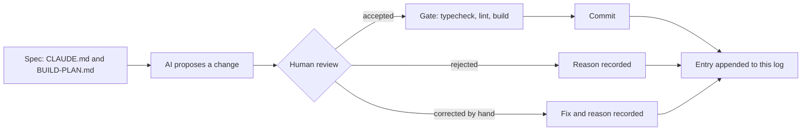

# AI log

How AI was used to build CHOWLY, written while the work happens. Each entry records what
was asked for, what was accepted, what was rejected and why, and what had to be corrected
by hand. The rejections and corrections are the useful part, so they are recorded when
they occur, never reconstructed later.

> [!NOTE]
> **Media placeholder.** A short screen recording of one propose, review, decide loop
> belongs here as `docs/media/ai-log-loop.gif`. It gets recorded in Phase 3, once there is
> an interface to show.

## How an entry gets here

Every commit in every phase appends an entry below, in commit order. The gate is
`npm run typecheck && npm run lint && npm run build`, run before each commit.

Entry format

Each per-commit entry has four fields:

| Field | What goes there |
|---|---|
| Asked for | The instruction as given, in one or two lines |
| Accepted | What the AI proposed that went in unchanged |
| Rejected | What was proposed and turned down, with the reason |
| Corrected by hand | What had to be fixed after the AI produced it, and why |

Decisions made before the first commit use a shorter form: proposed, decided, why.

## Decisions made before the first commit

### 1. Prisma codegen under `npm ci --ignore-scripts`

- **Proposed:** drop `--ignore-scripts` so Prisma's postinstall hook can generate the client.
- **Decided:** keep the flag. The build script became `prisma generate && next build`.
- **Why:** `--ignore-scripts` is a supply-chain control that stops every dependency's
  install hook, not only Prisma's. Moving codegen into the build keeps that control and
  makes the generate step explicit and visible in the build log.

### 2. A proxy that renders context as images

- **Proposed:** a token-saving proxy that compresses conversation context into PNG images
  before it reaches the model.
- **Decided:** rejected for this project.
- **Why:** prices are integer kobo. A character-level transcription error on a price
  (8500 read as 6500) is still a valid integer, so it passes typecheck, lint and build
  undetected. The saving is not worth a silent money error.

### 3. The `caveman-compress` skill

- **Proposed:** install the full caveman skill bundle as shipped, which includes
  `caveman-compress`.
- **Decided:** removed from every install location before this build started.
- **Why:** its function is rewriting memory files such as `CLAUDE.md` into compressed
  form. `CLAUDE.md` here is a graded deliverable and the rulebook for the remaining
  sessions, so a tool whose job is to rewrite it should not be reachable at all.

### 4. SSH `IdentitiesOnly`

- **Proposed:** push with the machine's default SSH setup, where the agent offers
  whichever key it holds first.
- **Decided:** a dedicated host alias with `IdentitiesOnly yes`, a dedicated key, and a
  repo-local `user.email`.
- **Why:** this machine holds several GitHub identities. With agent key selection, the
  first key the agent offers wins, and a push can carry the wrong identity. The alias
  makes the identity explicit and checkable before every push.

### 5. Deployment first, not last

- **Proposed:** the build plan put Vercel deployment at step 22, after every feature.
- **Decided:** a deploy gate right after the scaffold and security headers, before Prisma.
- **Why:** the pipeline (install command, build script, headers) is proven while the app
  is two files. Any pipeline failure then has two files of suspects, not twenty commits.

## Entries

### Commit 0: `docs: start the ai log with decisions made before the first commit`

- **Asked for:** create this file, seed it with the five decisions above, append at every
  later commit.
- **Accepted:** the structure above: a diagram of the loop, a collapsible entry format, a
  media placeholder, and the five decisions in proposed, decided, why form.
- **Rejected:** nothing.
- **Corrected by hand:** nothing.
- **Gate:** not runnable yet. There is no `package.json` before the scaffold commit, so
  typecheck, lint and build do not exist. The scaffold is the first gated commit.
