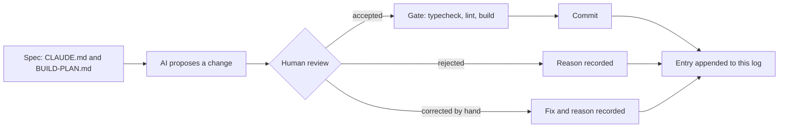

# AI log

How AI was used to build CHOWLY, written while the work happens. Each entry records what
was asked for, what was accepted, what was rejected and why, and what had to be corrected
by hand. The rejections and corrections are the useful part, so they are recorded when
they occur, never reconstructed later.

> [!NOTE]
> **Media placeholder.** A short screen recording of one propose, review, decide loop
> belongs here as `docs/media/ai-log-loop.gif`. It gets recorded in Phase 3, once there is
> an interface to show.

## How an entry gets here

Every commit in every phase appends an entry below, in commit order. The gate is
`npm run typecheck && npm run lint && npm run build`, run before each commit.

Entry format

Each per-commit entry has four fields:

| Field | What goes there |
|---|---|
| Asked for | The instruction as given, in one or two lines |
| Accepted | What the AI proposed that went in unchanged |
| Rejected | What was proposed and turned down, with the reason |
| Corrected by hand | What had to be fixed after the AI produced it, and why |

Decisions made before the first commit use a shorter form: proposed, decided, why.

## Decisions made before the first commit

### 1. Prisma codegen under `npm ci --ignore-scripts`

- **Proposed:** drop `--ignore-scripts` so Prisma's postinstall hook can generate the client.
- **Decided:** keep the flag. The build script became `prisma generate && next build`.
- **Why:** `--ignore-scripts` is a supply-chain control that stops every dependency's
  install hook, not only Prisma's. Moving codegen into the build keeps that control and
  makes the generate step explicit and visible in the build log.

### 2. A proxy that renders context as images

- **Proposed:** a token-saving proxy that compresses conversation context into PNG images
  before it reaches the model.
- **Decided:** rejected for this project.
- **Why:** prices are integer kobo. A character-level transcription error on a price
  (8500 read as 6500) is still a valid integer, so it passes typecheck, lint and build
  undetected. The saving is not worth a silent money error.

### 3. The `caveman-compress` skill

- **Proposed:** install the full caveman skill bundle as shipped, which includes
  `caveman-compress`.
- **Decided:** removed from every install location before this build started.
- **Why:** its function is rewriting memory files such as `CLAUDE.md` into compressed
  form. `CLAUDE.md` here is a graded deliverable and the rulebook for the remaining
  sessions, so a tool whose job is to rewrite it should not be reachable at all.

### 4. SSH `IdentitiesOnly`

- **Proposed:** push with the machine's default SSH setup, where the agent offers
  whichever key it holds first.
- **Decided:** a dedicated host alias with `IdentitiesOnly yes`, a dedicated key, and a
  repo-local `user.email`.
- **Why:** this machine holds several GitHub identities. With agent key selection, the
  first key the agent offers wins, and a push can carry the wrong identity. The alias
  makes the identity explicit and checkable before every push.

### 5. Deployment first, not last

- **Proposed:** the build plan put Vercel deployment at step 22, after every feature.
- **Decided:** a deploy gate right after the scaffold and security headers, before Prisma.
- **Why:** the pipeline (install command, build script, headers) is proven while the app
  is two files. Any pipeline failure then has two files of suspects, not twenty commits.

## Entries

### Commit 0: `docs: start the ai log with decisions made before the first commit`

- **Asked for:** create this file, seed it with the five decisions above, append at every
  later commit.
- **Accepted:** the structure above: a diagram of the loop, a collapsible entry format, a
  media placeholder, and the five decisions in proposed, decided, why form.
- **Rejected:** nothing.
- **Corrected by hand:** nothing.
- **Gate:** not runnable yet. There is no `package.json` before the scaffold commit, so
  typecheck, lint and build do not exist. The scaffold is the first gated commit.

### Commit 1: `chore: scaffold next.js app with typescript and tailwind`

- **Asked for:** create-next-app with App Router, TypeScript, Tailwind v4, no src directory
  and ESLint. Delete all starter boilerplate in the same commit. Add `typecheck`, set
  `build` to `prisma generate && next build`, strict tsconfig with `noUncheckedIndexedAccess`
  and `noImplicitAny`, animejs pinned exactly, and a page that renders only the CHOWLY name
  on `--enamel-deep` in `--chalk`.
- **Accepted:** Next 15.5.25 through `create-next-app@15`, run in a scratch directory
  because the tool refuses a directory that already holds `CLAUDE.md`, `prisma/` and
  `.githooks`. The generated config files were copied in and the repo's own `.gitignore`
  kept. `animejs` 4.5.0 exact. Prisma CLI and client pinned to 6.19.3 exact and installed
  in this commit, since the build script calls `prisma generate` and the schema is already
  in the repo, so no stub was needed. `*.tsbuildinfo` added to `.gitignore` because
  `tsc --noEmit` with `incremental` writes `tsconfig.tsbuildinfo`.
- **Rejected:** scaffold defaults that would have shipped something generic: the Geist font
  pair, the demo page, the five SVGs in `public/`, the default favicon, the template README
  and the placeholder metadata. `next build --turbopack` (the 15.5 scaffold default) was
  dropped for the plain `next build` the spec names. Prisma 8.0.0-rc.12, the registry's
  `latest`, was rejected: the 7 and 8 lines removed `url` and `directUrl` from the
  datasource block and deprecated the `prisma-client-js` generator, all of which the
  provided schema uses, so taking it would have meant editing a schema this commit must
  not touch.
- **Corrected by hand:** nothing in the committed files. Two process corrections: the first
  gate run captured no exit codes (a bash-only variable under zsh) and was re-run; the
  Playwright plugin wanted Google Chrome, which is not installed, so the visual check used
  Playwright's cached Chromium through a small script instead. A power loss interrupted
  the run after the gate had passed; the commit was made after re-verifying every file
  and re-running the gate.
- **Verified:** typecheck, lint and build all exit 0, and `npm ci --ignore-scripts`
  followed by the build proves the Vercel install path. Headless Chromium computed the
  body background as `rgb(18, 58, 94)` (`#123a5e`) and the text as `rgb(242, 239, 230)`
  (`#f2efe6`), with CHOWLY as the only visible text. One console 404 remains,
  `/favicon.ico`, because the default icon was removed and the designed one belongs with
  the design tokens commit.
- **Finding for the motion phase:** `animejs` 4.5.0 exports both `spring` and
  `createSpring` from `dist/modules/easings/spring/index.d.ts` with the same signature,
  `(parameters?: SpringParams): Spring`. `CLAUDE.md` prefers `createSpring`; both exist in
  this version.

### Commit 2: `chore: configure security headers`

- **Asked for:** Content-Security-Policy, `X-Content-Type-Options: nosniff`,
  `Referrer-Policy: strict-origin-when-cross-origin` and `X-Frame-Options: DENY` in
  `next.config.ts`. The CSP must still allow next/font, and any relaxation is to be named,
  never widened silently.
- **Accepted:** static headers from `headers()` on `/(.*)`, so the document and every
  static asset carry them. Production CSP: `default-src 'self'`, `script-src 'self'
  'unsafe-inline'`, `style-src 'self' 'unsafe-inline'`, `img-src 'self' data: blob:`,
  `font-src 'self'`, `connect-src 'self'`, `object-src 'none'`, `base-uri 'self'`,
  `form-action 'self'`, `frame-ancestors 'none'`, `upgrade-insecure-requests`.
  Development adds `'unsafe-eval'` to `script-src` and `ws://localhost:*` to
  `connect-src` for Fast Refresh, keyed on `NODE_ENV`, so production carries neither.
- **Relaxations, named:** `script-src 'unsafe-inline'`, because Next.js hydrates the App
  Router through inline scripts and a static header cannot carry a per-request nonce.
  `style-src 'unsafe-inline'`, for inline style attributes (the countdown ring sets its
  stroke offset that way) and the style tags Next.js injects in development. next/font
  needed nothing: Bricolage Grotesque was loaded temporarily through `next/font/google`,
  the browser fetched it from `/_next/static/media/` on this origin with a 200,
  `document.fonts` reported it loaded, and Chromium raised no violation. The experiment
  was reverted with git before the commit.
- **Rejected:** a nonce-based CSP through middleware, which would remove `'unsafe-inline'`
  from `script-src`. Rejected for this commit because the spec places the headers in
  `next.config.ts` and a nonce needs per-request middleware. Recorded as the upgrade path
  once route handlers exist.
- **Corrected by hand:** nothing in the committed file. One process correction: the
  recovery gate's `next build` ran while the dev server was starting, both write `.next`,
  and the dev server answered 500 with `ENOENT` on `_buildManifest.js` until restarted.
  The rule from that: never run the build while `next dev` is up.
- **Verified:** `curl -I` against `next dev` shows all four headers. `next start` on port
  3001 shows all four on the document and on a JS chunk. Headless Chromium reported zero
  CSP violations in both modes, and the only console error is the known favicon 404.
  Vercel's preview toolbar loads from `vercel.live` and will be blocked by `script-src` on
  preview URLs; production is unaffected.
- **Deploy gate:** branch pushed after this commit. Connecting the repo to Vercel, setting
  the install command to `npm ci --ignore-scripts` and confirming the URL are manual steps.

### Commit: `chore: override postcss and deepmerge-ts above their advisories`

- **Asked for:** audit the five vulnerabilities `npm ci --ignore-scripts` reported on the
  fresh scaffold, classify each by severity, directness and reach, say whether a fix
  exists without a breaking major, and stop for a ruling. No `npm audit fix --force`.
- **Finding:** five npm entries, two real advisory chains. One: `deepmerge-ts` 7.1.5
  (high, stack exhaustion on recursive object graphs) reached through `prisma` and
  `@prisma/config`. Two: `postcss` 8.4.31 (two high, two moderate: arbitrary `.map` file
  reads through `sourceMappingURL` comments and a `</style>` escape in stringified
  output), pinned by Next 15.5.25 as a nested dependency. The `next`, `prisma` and
  `@prisma/config` entries only inherit from those two.
- **Reach, and how it was proven:** neither chain reaches the production runtime.
  Requiring `@prisma/client` loads only `runtime/library.js`, and neither `deepmerge-ts`
  nor `@prisma/config` appears in Node's module cache afterwards; the word deepmerge does
  not occur in either runtime file, and the lock only marked `prisma` as non-dev because
  `@prisma/client` names the CLI as an optional peer. For postcss, Next requires it from
  `dist/build/` files only and nothing under `dist/server/` does, so `next start` never
  loads it. Both chains run on the build machine: the Prisma CLI during `prisma generate`
  and migrations, postcss during CSS compilation. Their inputs are authored in this repo.
- **Rejected:** npm's own fixes, because both are semver-major: `next` 16.3.4, or
  `prisma` 6.12.0, which is a downgrade to before `@prisma/config` adopted deepmerge-ts.
  No Prisma release, including the 8.0.0 release candidate, had moved off the
  vulnerable range.
- **Accepted (the ruling):** npm `overrides` pinning `postcss` to `^8.5.26` and
  `deepmerge-ts` to `^8.0.0`. Tested first in a scratch copy: audit clean, Prisma
  validate and generate clean, Next build clean. Next 16 itself ships postcss 8.5.23, so
  the 8.5 line is proven inside Next's CSS pipeline. deepmerge-ts 8 is ESM like 7 and only
  raises the Node floor to 16.9.
- **Corrected by hand:** nothing.
- **Verified:** after `rm -rf node_modules && npm ci --ignore-scripts`, the exact Vercel
  install command, the output line is `found 0 vulnerabilities`. Resolved on disk:
  postcss 8.5.28 with no nested copy under `next/`, deepmerge-ts 8.0.2. Gate green.
- **Maintenance note:** overrides pin transitive versions and go stale silently. Nothing
  warns when `next` or `prisma` moves to a version that no longer needs them, or that
  needs a different one. Both overrides get re-checked whenever either parent is bumped,
  and removed the moment the parent's own pin is clean.

### Commit 3: `feat: connect prisma to neon with the first migration`

- **Asked for:** `.env` with `DATABASE_URL` (Neon pooled), `DIRECT_URL` (Neon direct),
  `SESSION_SECRET` and `STAFF_PIN`; a committed `.env.example` with every key present and
  every value blank; confirmation that `.env` is ignored; the first migration, with the
  generated SQL for Order and Payment reported.
- **Accepted:** `.env.example` committed with the four keys blank and a one-line comment
  each. `.env` is ignored by the `.env` rule and `.env.example` is un-ignored by the
  `!.env.example` negation, both confirmed with `git check-ignore`. The human wired the
  real values; the AI checked them for presence and shape only (character counts, the
  `-pooler` host segment on the pooled string and its absence on the direct one) and
  never printed them. Migration `20260903160256_init` was created and applied with
  `prisma migrate dev` over `DIRECT_URL`.
- **Deltas realised by this migration:** 1, `MenuItem.prepTimeMinutes INTEGER NOT NULL`.
  2, `Order.waitMinutes INTEGER NOT NULL`. 3, `waiterId`, `chefId` and `bartenderId` as
  nullable `TEXT` with `ON DELETE SET NULL`. 4, `OrderStatus` enum of exactly PLACED,
  SERVED and PAID, so a delayed state has nowhere to be stored. 5, `placedAt`, `servedAt`
  and `paidAt` as `TIMESTAMP(3)`. 6, `OrderItem.unitPriceKobo`, `subtotalKobo` and
  `prepTimeMinutes` as snapshot columns. 7, every money column `INTEGER`. 8, the unique
  index `Payment_orderId_key`. 9, `isPretend BOOLEAN NOT NULL DEFAULT true`. 11, the
  unique index `Customer_sessionToken_key`. Delta 10's `CHECK` is the next commit, since
  Prisma cannot express it.
- **Rejected:** the build plan's message `feat: add prisma schema and connect neon`,
  because the schema was already committed in `5775a14` and this commit does not touch
  it. A message claiming otherwise would misdescribe the history the assignment grades.
  No schema stub was ever needed for the same reason.
- **Corrected by hand:** nothing.
- **Verified:** `prisma migrate status` reports the database in sync. A Prisma client
  query over the pooled `DATABASE_URL`, the path the app will use, returned PostgreSQL
  18.6, the thirteen tables, and the applied migration row. Gate green.

### Commit 4: `feat: add rating score check constraint`

- **Asked for:** an empty migration carrying the hand-written
  `ALTER TABLE "Rating" ADD CONSTRAINT rating_score_range CHECK (score BETWEEN 1 AND 5);`
  as its own commit, with proof that the database rejects a score of 0 and of 6.
- **Accepted:** `prisma migrate dev --create-only --name rating_score_check` produced the
  empty file, the SQL was written by hand with a comment tying it to delta 10, and
  `prisma migrate dev` applied it. Delta 10's reason: Prisma cannot express a check
  constraint, and a range that only Zod enforces would leave any other write path free
  to store a 0 or a 9. The database is the last line, not the first.
- **Rejected:** nothing.
- **Corrected by hand:** nothing.
- **Verified:** `pg_constraint` on Neon lists `rating_score_range` as
  `CHECK (((score >= 1) AND (score <= 5)))`. Three scripts each inserted a throwaway
  customer and order, then a rating, inside a transaction ending in `ROLLBACK`. Score 0
  and score 6 both failed with `new row for relation "Rating" violates check constraint
  "rating_score_range"`. Score 3 ran to `Script executed successfully`. Row counts after
  all three: 0 customers, 0 orders, 0 ratings. Gate green.
