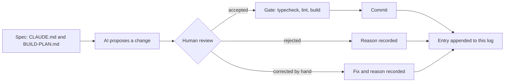

# AI log

How AI was used to build CHOWLY, written while the work happens. Each entry records what
was asked for, what was accepted, what was rejected and why, and what had to be corrected
by hand. The rejections and corrections are the useful part, so they are recorded when
they occur, never reconstructed later.

> [!NOTE]
> **Media placeholder.** A short screen recording of one propose, review, decide loop
> belongs here as `docs/media/ai-log-loop.gif`. It gets recorded in Phase 3, once there is
> an interface to show.

## How an entry gets here



Every commit in every phase appends an entry below, in commit order. The gate is
`npm run typecheck && npm run lint && npm run build`, run before each commit.

<details>
<summary>Entry format</summary>

Each per-commit entry has four fields:

| Field | What goes there |
|---|---|
| Asked for | The instruction as given, in one or two lines |
| Accepted | What the AI proposed that went in unchanged |
| Rejected | What was proposed and turned down, with the reason |
| Corrected by hand | What had to be fixed after the AI produced it, and why |

Decisions made before the first commit use a shorter form: proposed, decided, why.

</details>

## Decisions made before the first commit

### 1. Prisma codegen under `npm ci --ignore-scripts`

- **Proposed:** drop `--ignore-scripts` so Prisma's postinstall hook can generate the client.
- **Decided:** keep the flag. The build script became `prisma generate && next build`.
- **Why:** `--ignore-scripts` is a supply-chain control that stops every dependency's
  install hook, not only Prisma's. Moving codegen into the build keeps that control and
  makes the generate step explicit and visible in the build log.

### 2. A proxy that renders context as images

- **Proposed:** a token-saving proxy that compresses conversation context into PNG images
  before it reaches the model.
- **Decided:** rejected for this project.
- **Why:** prices are integer kobo. A character-level transcription error on a price
  (8500 read as 6500) is still a valid integer, so it passes typecheck, lint and build
  undetected. The saving is not worth a silent money error.

### 3. The `caveman-compress` skill

- **Proposed:** install the full caveman skill bundle as shipped, which includes
  `caveman-compress`.
- **Decided:** removed from every install location before this build started.
- **Why:** its function is rewriting memory files such as `CLAUDE.md` into compressed
  form. `CLAUDE.md` here is a graded deliverable and the rulebook for the remaining
  sessions, so a tool whose job is to rewrite it should not be reachable at all.

### 4. SSH `IdentitiesOnly`

- **Proposed:** push with the machine's default SSH setup, where the agent offers
  whichever key it holds first.
- **Decided:** a dedicated host alias with `IdentitiesOnly yes`, a dedicated key, and a
  repo-local `user.email`.
- **Why:** this machine holds several GitHub identities. With agent key selection, the
  first key the agent offers wins, and a push can carry the wrong identity. The alias
  makes the identity explicit and checkable before every push.

### 5. Deployment first, not last

- **Proposed:** the build plan put Vercel deployment at step 22, after every feature.
- **Decided:** a deploy gate right after the scaffold and security headers, before Prisma.
- **Why:** the pipeline (install command, build script, headers) is proven while the app
  is two files. Any pipeline failure then has two files of suspects, not twenty commits.

## Entries

### Commit 0: `docs: start the ai log with decisions made before the first commit`

- **Asked for:** create this file, seed it with the five decisions above, append at every
  later commit.
- **Accepted:** the structure above: a diagram of the loop, a collapsible entry format, a
  media placeholder, and the five decisions in proposed, decided, why form.
- **Rejected:** nothing.
- **Corrected by hand:** nothing.
- **Gate:** not runnable yet. There is no `package.json` before the scaffold commit, so
  typecheck, lint and build do not exist. The scaffold is the first gated commit.

### Commit 1: `chore: scaffold next.js app with typescript and tailwind`

- **Asked for:** create-next-app with App Router, TypeScript, Tailwind v4, no src directory
  and ESLint. Delete all starter boilerplate in the same commit. Add `typecheck`, set
  `build` to `prisma generate && next build`, strict tsconfig with `noUncheckedIndexedAccess`
  and `noImplicitAny`, animejs pinned exactly, and a page that renders only the CHOWLY name
  on `--enamel-deep` in `--chalk`.
- **Accepted:** Next 15.5.25 through `create-next-app@15`, run in a scratch directory
  because the tool refuses a directory that already holds `CLAUDE.md`, `prisma/` and
  `.githooks`. The generated config files were copied in and the repo's own `.gitignore`
  kept. `animejs` 4.5.0 exact. Prisma CLI and client pinned to 6.19.3 exact and installed
  in this commit, since the build script calls `prisma generate` and the schema is already
  in the repo, so no stub was needed. `*.tsbuildinfo` added to `.gitignore` because
  `tsc --noEmit` with `incremental` writes `tsconfig.tsbuildinfo`.
- **Rejected:** scaffold defaults that would have shipped something generic: the Geist font
  pair, the demo page, the five SVGs in `public/`, the default favicon, the template README
  and the placeholder metadata. `next build --turbopack` (the 15.5 scaffold default) was
  dropped for the plain `next build` the spec names. Prisma 8.0.0-rc.12, the registry's
  `latest`, was rejected: the 7 and 8 lines removed `url` and `directUrl` from the
  datasource block and deprecated the `prisma-client-js` generator, all of which the
  provided schema uses, so taking it would have meant editing a schema this commit must
  not touch.
- **Corrected by hand:** nothing in the committed files. Two process corrections: the first
  gate run captured no exit codes (a bash-only variable under zsh) and was re-run; the
  Playwright plugin wanted Google Chrome, which is not installed, so the visual check used
  Playwright's cached Chromium through a small script instead. A power loss interrupted
  the run after the gate had passed; the commit was made after re-verifying every file
  and re-running the gate.
- **Verified:** typecheck, lint and build all exit 0, and `npm ci --ignore-scripts`
  followed by the build proves the Vercel install path. Headless Chromium computed the
  body background as `rgb(18, 58, 94)` (`#123a5e`) and the text as `rgb(242, 239, 230)`
  (`#f2efe6`), with CHOWLY as the only visible text. One console 404 remains,
  `/favicon.ico`, because the default icon was removed and the designed one belongs with
  the design tokens commit.
- **Finding for the motion phase:** `animejs` 4.5.0 exports both `spring` and
  `createSpring` from `dist/modules/easings/spring/index.d.ts` with the same signature,
  `(parameters?: SpringParams): Spring`. `CLAUDE.md` prefers `createSpring`; both exist in
  this version.

### Commit 2: `chore: configure security headers`

- **Asked for:** Content-Security-Policy, `X-Content-Type-Options: nosniff`,
  `Referrer-Policy: strict-origin-when-cross-origin` and `X-Frame-Options: DENY` in
  `next.config.ts`. The CSP must still allow next/font, and any relaxation is to be named,
  never widened silently.
- **Accepted:** static headers from `headers()` on `/(.*)`, so the document and every
  static asset carry them. Production CSP: `default-src 'self'`, `script-src 'self'
  'unsafe-inline'`, `style-src 'self' 'unsafe-inline'`, `img-src 'self' data: blob:`,
  `font-src 'self'`, `connect-src 'self'`, `object-src 'none'`, `base-uri 'self'`,
  `form-action 'self'`, `frame-ancestors 'none'`, `upgrade-insecure-requests`.
  Development adds `'unsafe-eval'` to `script-src` and `ws://localhost:*` to
  `connect-src` for Fast Refresh, keyed on `NODE_ENV`, so production carries neither.
- **Relaxations, named:** `script-src 'unsafe-inline'`, because Next.js hydrates the App
  Router through inline scripts and a static header cannot carry a per-request nonce.
  `style-src 'unsafe-inline'`, for inline style attributes (the countdown ring sets its
  stroke offset that way) and the style tags Next.js injects in development. next/font
  needed nothing: Bricolage Grotesque was loaded temporarily through `next/font/google`,
  the browser fetched it from `/_next/static/media/` on this origin with a 200,
  `document.fonts` reported it loaded, and Chromium raised no violation. The experiment
  was reverted with git before the commit.
- **Rejected:** a nonce-based CSP through middleware, which would remove `'unsafe-inline'`
  from `script-src`. Rejected for this commit because the spec places the headers in
  `next.config.ts` and a nonce needs per-request middleware. Recorded as the upgrade path
  once route handlers exist.
- **Corrected by hand:** nothing in the committed file. One process correction: the
  recovery gate's `next build` ran while the dev server was starting, both write `.next`,
  and the dev server answered 500 with `ENOENT` on `_buildManifest.js` until restarted.
  The rule from that: never run the build while `next dev` is up.
- **Verified:** `curl -I` against `next dev` shows all four headers. `next start` on port
  3001 shows all four on the document and on a JS chunk. Headless Chromium reported zero
  CSP violations in both modes, and the only console error is the known favicon 404.
  Vercel's preview toolbar loads from `vercel.live` and will be blocked by `script-src` on
  preview URLs; production is unaffected.
- **Deploy gate:** branch pushed after this commit. Connecting the repo to Vercel, setting
  the install command to `npm ci --ignore-scripts` and confirming the URL are manual steps.

### Commit: `chore: override postcss and deepmerge-ts above their advisories`

- **Asked for:** audit the five vulnerabilities `npm ci --ignore-scripts` reported on the
  fresh scaffold, classify each by severity, directness and reach, say whether a fix
  exists without a breaking major, and stop for a ruling. No `npm audit fix --force`.
- **Finding:** five npm entries, two real advisory chains. One: `deepmerge-ts` 7.1.5
  (high, stack exhaustion on recursive object graphs) reached through `prisma` and
  `@prisma/config`. Two: `postcss` 8.4.31 (two high, two moderate: arbitrary `.map` file
  reads through `sourceMappingURL` comments and a `</style>` escape in stringified
  output), pinned by Next 15.5.25 as a nested dependency. The `next`, `prisma` and
  `@prisma/config` entries only inherit from those two.
- **Reach, and how it was proven:** neither chain reaches the production runtime.
  Requiring `@prisma/client` loads only `runtime/library.js`, and neither `deepmerge-ts`
  nor `@prisma/config` appears in Node's module cache afterwards; the word deepmerge does
  not occur in either runtime file, and the lock only marked `prisma` as non-dev because
  `@prisma/client` names the CLI as an optional peer. For postcss, Next requires it from
  `dist/build/` files only and nothing under `dist/server/` does, so `next start` never
  loads it. Both chains run on the build machine: the Prisma CLI during `prisma generate`
  and migrations, postcss during CSS compilation. Their inputs are authored in this repo.
- **Rejected:** npm's own fixes, because both are semver-major: `next` 16.3.4, or
  `prisma` 6.12.0, which is a downgrade to before `@prisma/config` adopted deepmerge-ts.
  No Prisma release, including the 8.0.0 release candidate, had moved off the
  vulnerable range.
- **Accepted (the ruling):** npm `overrides` pinning `postcss` to `^8.5.26` and
  `deepmerge-ts` to `^8.0.0`. Tested first in a scratch copy: audit clean, Prisma
  validate and generate clean, Next build clean. Next 16 itself ships postcss 8.5.23, so
  the 8.5 line is proven inside Next's CSS pipeline. deepmerge-ts 8 is ESM like 7 and only
  raises the Node floor to 16.9.
- **Corrected by hand:** nothing.
- **Verified:** after `rm -rf node_modules && npm ci --ignore-scripts`, the exact Vercel
  install command, the output line is `found 0 vulnerabilities`. Resolved on disk:
  postcss 8.5.28 with no nested copy under `next/`, deepmerge-ts 8.0.2. Gate green.
- **Maintenance note:** overrides pin transitive versions and go stale silently. Nothing
  warns when `next` or `prisma` moves to a version that no longer needs them, or that
  needs a different one. Both overrides get re-checked whenever either parent is bumped,
  and removed the moment the parent's own pin is clean.

### Commit 3: `feat: connect prisma to neon with the first migration`

- **Asked for:** `.env` with `DATABASE_URL` (Neon pooled), `DIRECT_URL` (Neon direct),
  `SESSION_SECRET` and `STAFF_PIN`; a committed `.env.example` with every key present and
  every value blank; confirmation that `.env` is ignored; the first migration, with the
  generated SQL for Order and Payment reported.
- **Accepted:** `.env.example` committed with the four keys blank and a one-line comment
  each. `.env` is ignored by the `.env` rule and `.env.example` is un-ignored by the
  `!.env.example` negation, both confirmed with `git check-ignore`. The human wired the
  real values; the AI checked them for presence and shape only (character counts, the
  `-pooler` host segment on the pooled string and its absence on the direct one) and
  never printed them. Migration `20260903160256_init` was created and applied with
  `prisma migrate dev` over `DIRECT_URL`.
- **Deltas realised by this migration:** 1, `MenuItem.prepTimeMinutes INTEGER NOT NULL`.
  2, `Order.waitMinutes INTEGER NOT NULL`. 3, `waiterId`, `chefId` and `bartenderId` as
  nullable `TEXT` with `ON DELETE SET NULL`. 4, `OrderStatus` enum of exactly PLACED,
  SERVED and PAID, so a delayed state has nowhere to be stored. 5, `placedAt`, `servedAt`
  and `paidAt` as `TIMESTAMP(3)`. 6, `OrderItem.unitPriceKobo`, `subtotalKobo` and
  `prepTimeMinutes` as snapshot columns. 7, every money column `INTEGER`. 8, the unique
  index `Payment_orderId_key`. 9, `isPretend BOOLEAN NOT NULL DEFAULT true`. 11, the
  unique index `Customer_sessionToken_key`. Delta 10's `CHECK` is the next commit, since
  Prisma cannot express it.
- **Rejected:** the build plan's message `feat: add prisma schema and connect neon`,
  because the schema was already committed in `5775a14` and this commit does not touch
  it. A message claiming otherwise would misdescribe the history the assignment grades.
  No schema stub was ever needed for the same reason.
- **Corrected by hand:** nothing.
- **Verified:** `prisma migrate status` reports the database in sync. A Prisma client
  query over the pooled `DATABASE_URL`, the path the app will use, returned PostgreSQL
  18.6, the thirteen tables, and the applied migration row. Gate green.

### Commit 4: `feat: add rating score check constraint`

- **Asked for:** an empty migration carrying the hand-written
  `ALTER TABLE "Rating" ADD CONSTRAINT rating_score_range CHECK (score BETWEEN 1 AND 5);`
  as its own commit, with proof that the database rejects a score of 0 and of 6.
- **Accepted:** `prisma migrate dev --create-only --name rating_score_check` produced the
  empty file, the SQL was written by hand with a comment tying it to delta 10, and
  `prisma migrate dev` applied it. Delta 10's reason: Prisma cannot express a check
  constraint, and a range that only Zod enforces would leave any other write path free
  to store a 0 or a 9. The database is the last line, not the first.
- **Rejected:** nothing.
- **Corrected by hand:** nothing.
- **Verified:** `pg_constraint` on Neon lists `rating_score_range` as
  `CHECK (((score >= 1) AND (score <= 5)))`. Three scripts each inserted a throwaway
  customer and order, then a rating, inside a transaction ending in `ROLLBACK`. Score 0
  and score 6 both failed with `new row for relation "Rating" violates check constraint
  "rating_score_range"`. Score 3 ran to `Script executed successfully`. Row counts after
  all three: 0 customers, 0 orders, 0 ratings. Gate green.

### Commit 5: `feat: seed restaurant, menu, staff and prep times`

- **Asked for:** one restaurant, The Golden Gate, 13 Ubah Street, Berger, Lagos. Two
  menus, food and drinks, around fourteen items reusing the coursework six and extending
  with dishes that fit a Lagos kitchen, all prices in kobo, prep times genuinely varied
  from about 4 for a poured drink to about 22 for a grilled cut. Three chefs, three
  bartenders and three waiters on this one restaurant. Idempotent.
- **Assumption, flagged for review:** the coursework prices are naira, so Grilled Steak
  8500 is stored as 850000 kobo. Read as kobo they would be a steak at 85 naira, which
  no Lagos kitchen charges, so the naira reading was taken and every price is stored
  times one hundred.
- **Accepted:** fourteen items, eight on the kitchen menu and six on the bar, with prep
  times 22, 20, 18, 15, 14, 12, 10, 8 and 6, 5, 5, 4, 4, 4. Every row carries a stable id
  such as `item_grilled_steak` and is written with `upsert`, which is what makes the seed
  idempotent and lets a later edit to a price or prep time land by re-running it. The
  runner is `node prisma/seed.mts`, with no extra dependency, because Node 24 strips
  types natively.
- **Rejected:** a `tsx` or `ts-node` dependency for the seed, since Node runs the file as
  is. A wipe-and-reload seed (`deleteMany` then `createMany`), because it is not
  idempotent in any useful sense and would break `OrderItem` foreign keys once real
  orders reference the items. The `.ts` extension for the seed, after Node warned it had
  to re-parse the file as an ES module because package.json declares no module type;
  the file became `seed.mts`, which states its module type, and the tsconfig `include`
  gained `**/*.mts` so the gate still typechecks it.
- **Corrected by hand:** nothing.
- **Verified:** three seed runs, each reporting the same counts: 1 restaurant, 2 menus,
  14 items, 3 chefs, 3 bartenders, 3 waiters. A read-back query through the pooled URL
  returned every item with its kobo price and prep time, and a GROUP BY on item names
  found no duplicates. `tsc --listFilesOnly` includes the seed and `eslint` lints it
  without warnings. Gate green.

## Phase 2: the data layer

### Commit 6: `feat: add zod schemas and money helpers`

- **Asked for:** a Zod schema for every request shape, rejecting unknown keys.
  `formatNaira(kobo)`. The wait time in one server-side place, unit tested:
  `max(prepTime) + 3 * (itemCount - 1)`.
- **Accepted:** `lib/schemas.ts` with strict objects for order creation, staff assignment,
  complaint, rating and payment, plus a cuid check for order ids and a `parseWith` helper
  that turns the first issue into a sentence a person can act on. An unrecognised key
  gets its own wording, since a posted price is the case that matters. `lib/money.ts`
  formats integer kobo as naira with grouped thousands and shows kobo only when there
  are any. `lib/wait-time.ts` holds `calculateWaitMinutes`, capped at 90, and the derived
  delay check (`isOrderDelayed`, `dueAt`) so delta 4 has exactly one implementation.
  Tests run on Node's built-in runner (`node --test`), and the test files are `.mts`
  importing `.ts` sources, which needed `allowImportingTsExtensions` in tsconfig.
- **Interpretation, flagged:** `itemCount` is units, not lines, so two steaks and three
  zobo count as five. Each extra unit is kitchen load whether or not it is a new dish.
- **Rejected:** a test framework dependency (vitest or jest), because the runner in Node
  24 covers assertion, grouping and TypeScript without a package. `Intl.NumberFormat`
  for naira, because ICU output differs between Node builds and browsers and a money
  string should not depend on which one formatted it.
- **Corrected by hand:** the cap test. The AI wrote it as twenty steaks expecting the cap,
  but 22 + 3 * 19 is 79, under the cap, so the test asserted the wrong number and failed
  on first run. It now uses forty units (139 before the cap) and also pins the 79 case
  just below it. The function was right; the test was not.
- **Verified:** 16 tests pass, including a client posting `priceKobo` on a line and
  `totalKobo` plus `waitMinutes` at the top level, both rejected with the field named.
  Gate green.

### Commit 7: `feat: add customer session cookie`

- **Asked for:** a signed, httpOnly, sameSite=lax cookie holding an opaque token, the
  customer row created on first visit, never localStorage.
- **Accepted:** `lib/session-token.ts` signs a 32-byte random token with HMAC-SHA256 over
  `SESSION_SECRET` using Web Crypto, and verifies with a constant-time compare.
  `middleware.ts` mints the cookie on a visitor's first request, on the edge runtime,
  with a matcher that skips static assets. `lib/session.ts` maps the verified token to a
  Customer row: `getCustomer` is read-only for server components, `requireCustomer` is
  for route handlers and creates the row on first use with an upsert on the unique
  `sessionToken`, or answers 401 when nothing verifies. The customer id is never read
  from the request. `lib/prisma.ts` holds the client singleton, `lib/http.ts` a small
  `HttpError` and `handle` wrapper, and `GET /api/session` returns the customer so the
  behaviour is testable now and the UI can show the table later.
- **Interpretation, flagged:** the cookie is minted on the first visit with no database
  work, and the row is created on the first API call that needs an identity. The edge
  runtime cannot run Prisma, and page views by crawlers should not write rows. From the
  customer's side it is the same thing: a refresh keeps the identity either way.
- **Rejected:** `localStorage`, because injected script can read it. Node's
  `crypto.timingSafeEqual` for the cookie compare, because the same code must run on the
  edge runtime, so a constant-time loop over the hex strings is used instead;
  `timingSafeEqual` is kept for the staff PIN, which only runs on Node. The `server-only`
  package, in favour of a comment, to avoid a dependency for one import.
- **Corrected by hand:** the double Set-Cookie. The first cut had both the middleware and
  `requireCustomer` minting a session, and the curl check on an API-first request showed
  two Set-Cookie headers carrying different tokens, with only header order making the
  created row match the cookie the browser would keep. The middleware is now the only
  minting site. It forwards the signed value to the handler in a request header that it
  deletes from every incoming request first, so a client cannot supply it, and the
  handler verifies that header's signature exactly as it verifies the cookie.
- **Verified:** 20 unit tests pass, including tampered token, tampered signature, wrong
  secret and malformed values. Against the dev server with a cookie jar: an API-first
  request gets exactly one Set-Cookie (`HttpOnly; SameSite=lax; Max-Age=2592000; Path=/`)
  and a row; the next request with that cookie returns the same id and no Set-Cookie; a
  client-sent `x-chowly-session` header with no cookie is ignored; a tampered cookie is
  replaced with a fresh identity; a page visit's cookie is reused by the API call after
  it. The seven test customers were deleted from Neon afterwards. Gate green. `secure`
  is set only in production, which is the one attribute curl against localhost cannot
  show; check it on the live URL.

### Commit 8: `feat: add menu api`

- **Asked for:** `GET /api/menu`, grouped by menu type, unavailable items excluded.
- **Accepted:** one query with the restaurant, its menus ordered by type (so the kitchen
  comes before the bar) and only `available: true` items. Each item carries `priceKobo`
  for arithmetic and `price` already formatted, so the client never formats money. No
  session is needed to read the menu and nothing is written, so it stays outside the
  customer lookup.
- **Rejected:** nothing.
- **Corrected by hand:** nothing.
- **Verified:** against the dev server the response carries The Golden Gate, 8 kitchen
  items and 6 bar items with formatted prices and prep times. Setting Puff puff to
  unavailable in Neon dropped the count to 13 with the item absent; restoring it brought
  back 14. The security headers from Commit 2 are present on the JSON response. Gate
  green.

### Commit 9: `feat: add order placement api`

- **Asked for:** `POST /api/orders` accepting item ids, quantities and a table number
  only. Prices, subtotals, the total and `waitMinutes` computed server-side from the
  database, price and prep time snapshotted onto each line, a posted price rejected.
- **Accepted:** the strict schema from Commit 6 does the rejecting before any database
  work, and the error names the field. Repeated ids merge into one line. Items are
  loaded by id with `available: true`, so an item pulled from the menu between the
  customer's page load and their order is refused with a message to reload. Each line
  stores `unitPriceKobo`, `subtotalKobo` and `prepTimeMinutes` from the row just read
  (delta 6). The total is the sum of those subtotals and the wait comes from
  `calculateWaitMinutes` over those prep times (delta 2). The order and the customer's
  latest table number are written in one transaction. `lib/orders.ts` holds the single
  presenter every order route returns, with `isDelayed` and `dueAt` derived at read
  time (delta 4). `lib/rate-limit.ts` counts in the database, five orders per session
  per ten minutes, so the limit holds across serverless instances.
- **Interpretation, flagged:** the reference is sequential and human readable, `CHW-0001`
  onwards, taken from the order count and retried on the unique constraint if two orders
  land in the same instant. A random suffix would never collide but reads worse on a
  ticket.
- **Rejected:** an in-memory rate limiter, because each Vercel function instance would
  keep its own counter and the limit would be theatre. A per-request `new PrismaClient`,
  in favour of the singleton from Commit 7.
- **Corrected by hand:** nothing.
- **Verified:** against the dev server: steak plus mojito at table 7 returned 201 with
  `CHW-0001`, wait 25 (22 + 3), total 1,250,000 kobo shown as ₦12,500, and both lines
  carrying their snapshotted price and prep time. A line with `priceKobo` and a body with
  `totalKobo` and `waitMinutes` both returned 400 naming the fields. An unknown item id,
  quantity 0, an empty ticket and a non-JSON body each returned 400 with a usable
  message. A request with no cookie at all was still placed, on the identity the
  middleware minted for that same request. Jollof twice on one ticket became a single
  line of three with wait 18. The sixth order in ten minutes returned 429. The session's
  table number updated to 7. Gate green.

### Commit 10: `feat: add order detail api with derived delay`

- **Asked for:** `GET /api/orders/[id]` with an ownership check against the session and
  `isDelayed` derived at read time, never stored.
- **Accepted:** the ownership check is inside the query, `where: { id, customerId }`,
  so there is no window between finding the order and checking who owns it. A miss is
  a 404 whether the id is malformed, unknown, or someone else's, so the endpoint never
  confirms that another table's order exists. The id is validated as a cuid before any
  database work. `isDelayed` and `dueAt` come from the presenter in `lib/orders.ts`,
  which computes them from `placedAt` and `waitMinutes` at the moment of the read.
- **Rejected:** a 403 for someone else's order, because it would leak that the id is
  real. A separate ownership check after the fetch, because a combined query cannot be
  bypassed by a later edit that forgets the check.
- **Corrected by hand:** nothing.
- **Verified:** against the dev server: the placing browser read `CHW-0001` with
  `isDelayed: false` and a `dueAt` 25 minutes after placement; a second browser with its
  own cookie, and a request with no cookie, both got 404; `1 OR 1=1` and a well-formed
  unknown cuid both got 404. Backdating the order's `placedAt` by 30 minutes in Neon made
  the same read return `isDelayed: true` with no other change, and the Order table's
  column list has no delay column. Gate green.

## Phase 3: waiter, complaint, payment

### Commit 11: `feat: add waiter assignment api`

- **Asked for:** `GET /api/waiter/orders` for the rail. `PATCH /api/orders/[id]/assign`
  recording waiter, chef and bartender and setting SERVED with `servedAt`. Gated by
  `STAFF_PIN` compared with `crypto.timingSafeEqual`.
- **Accepted:** `lib/staff-pin.ts` reads the `x-staff-pin` header and compares it with
  `timingSafeEqual` over equal-length buffers; a wrong-length PIN still runs a compare
  against the expected value before returning false, so the length check is not itself
  an early exit. The rail returns every PLACED and SERVED order oldest first, with the
  derived delay, plus the waiter, chef and bartender lists in the same response so the
  pick lists need no second call. Paid orders have left the floor and are not listed.
  Assign takes the strict body, refuses anything but a PLACED order with a 409 that
  names the current state, checks all three staff ids exist, and writes the assignment,
  SERVED and `servedAt` in one update.
- **Honest statement for the document:** the role switch is UI convenience, because the
  assignment forbids logins. The PIN is the boundary. A PIN typed into a browser is as
  secret as the people who know it, and that is what the no-login rule allows.
- **Decision, flagged:** the rail GET is PIN-gated as well as the mutation, since it
  lists every table's order and the spec only named the PATCH. Lift it if the rail is
  meant to be public.
- **Rejected:** nothing.
- **Corrected by hand:** nothing.
- **Verified:** with three fresh orders on the dev server: no PIN, a wrong PIN of the
  same length, and a wrong-length PIN each got 401; the right PIN got the three orders
  and three of each staff role; assign with an extra `status` key got 400 naming it, an
  unknown chef got 400, no PIN got 401; a valid assign returned SERVED with `servedAt`
  and the three names; assigning again got 409 "already served"; a garbage id got 404.
  Gate green.

### Commit 12: `feat: add complaint and rating apis`

- **Asked for:** POST complaint and POST rating, both ownership-checked, the rating
  upsert-safe against the unique constraint, both rate limited per session.
- **Accepted:** ownership is part of each query. A complaint is refused with 409 unless
  the order is late, where late means still PLACED past the promised wait or served
  after it (`isOrderLate` in `lib/wait-time.ts`, unit tested, paying does not erase
  lateness). The UI will only show the entry point once the ring has crossed, and the
  server enforces the same rule, so the complaint is earned on both sides. The rating is
  an upsert on the unique `orderId`, so rating again changes the score, and the reply is
  201 the first time and 200 after. Zod bounds the score first, the check constraint
  from Commit 4 is the last line. Limits are counted in the database: five complaints
  and ten ratings per session per ten minutes.
- **Decision, flagged:** a rating is accepted at any point after placing, not only after
  serving, since the assignment lets the rating stand on its own.
- **Rejected:** nothing.
- **Corrected by hand:** nothing.
- **Verified:** a complaint on an on-time order got 409; after backdating the order 30
  minutes in Neon the same complaint got 201 with `isDelayed: true`; the other browser
  got 404; a two-character description got 400. Scores 6, 0 and 3.5 got 400 with the
  bound named; 4 got 201; 5 on the same order got 200 with the score changed and still
  one row; the other browser got 404. Complaints two to five got 201 and the sixth got
  429. Gate green.

### Commit 13: `feat: add pretend payment api`

- **Asked for:** `POST /api/orders/[id]/pay` in one `prisma.$transaction`, inserting the
  payment with `isPretend: true`, flipping status to PAID and setting `paidAt`. A second
  call returns the existing payment rather than erroring or duplicating.
- **Accepted:** ownership in the query, and the order must be SERVED, since a customer
  pays after being served. The amount is the order's stored total, never anything from
  the body, and the strict schema takes only the method. The transaction inserts the
  payment and flips the status together. If a payment already exists the call returns
  it with 200. If two calls race, the unique `Payment.orderId` (delta 8) makes the loser
  fail with P2002 inside its transaction, which rolls back its status update, and the
  handler answers with the payment the winner wrote. Delta 9: the row says pretend.
- **Rejected:** allowing payment while PLACED. It would let an order leave the rail
  unserved, and the story is order, wait, serve, pay.
- **Corrected by hand:** nothing.
- **Verified:** paying a PLACED order got 409; the other browser paying a served order
  got 404; a bad method and a posted `amountKobo` got 400. The owner's first call got
  201 with PAID, `paidAt`, and a payment of the stored 300,000 kobo marked pretend; the
  second call got 200 with the same payment id, the original method kept, one row. On a
  third order, two calls fired in the same instant with `Promise.all` returned 201 and
  200 carrying the same payment id, and Neon holds exactly one payment for it. Paid
  orders vanished from the rail. Gate green.
- **Postcss re-check, now that route handlers exist:** the audit in the overrides commit
  proved `next start` never loads postcss. Route handlers on Vercel run as serverless
  functions from a different bundle, so the check was repeated against Next's per-route
  file traces (`route.js.nft.json`), which list every file shipped with each function.
  The order and payment routes trace 64 files each with zero references to postcss or
  deepmerge, no server trace anywhere mentions either, and no compiled file under
  `.next/server` contains the string postcss. The conclusion holds: both chains are
  build-time only, and after the overrides they are patched versions anyway.

## Phase 4: the interface

### Design plan, reviewed before building

The brief fixes the direction, so the plan is about executing it as a decision rather than
a default.

- **Palette:** the seven tokens from `CLAUDE.md`, unchanged. Two derived values only:
  `--ink` is the rim colour used as text on chalk, so edges and type are one material,
  and `--ink-soft` for secondary text on chalk. Flame is spent on time and nothing else.
- **Type:** Bricolage Grotesque with the `opsz` and `wdth` axes loaded, used wide (wdth
  112) for the restaurant name and the countdown and tighter (wdth 92) for section
  heads. Instrument Sans for everything else. Tabular figures on the countdown.
- **Layout concept:** the customer screen is a table seen from above. The deep speckled
  ground is the tabletop, the dishes are chalk plates with the rim hairline, and the cart
  is a tray along the bottom edge. The order page is one plate in the centre with the
  countdown ring as the dish. The waiter side is a rail of paper tickets.

```
  CHOWLY                         [ Customer | Waiter ]
  The Golden Gate
  13 Ubah Street, Berger, Lagos
  Kitchen
  ( plate ) ( plate ) ( plate )
  ( plate ) ( plate ) ( plate )
  Bar
  ( plate ) ( plate ) ( plate )
  ================ tray: 3 items, ₦12,500, Place order ================
```

- **Radii mean something:** plate 28px (a bowl), tray 14px, button 8px (a stamp), ticket
  4px (paper). No single radius on everything.
- **Separation:** the rim hairline only. No shadows, no left-edge bars, no glass.
- **Copy:** sentence case, a button names what happens ("Place order", then "Placed").

Reviewed against the generic defaults: not cream with terracotta and a serif, not
near-black with an acid accent, not a card kit with one radius and a grey shadow, no
eyebrow labels, no middle dots, no arrows. Every choice above traces to enamelware or to
the data on the plate. One thing to watch: the plates grid could drift toward a SaaS
card grid, so plates get the large bowl radius, the rim and the speckle, and no two
surfaces share a radius unless they are the same kind of thing.

### Commit 14: `feat: add enamel design tokens and typography`

- **Asked for:** the token block into `app/globals.css`, Bricolage Grotesque and
  Instrument Sans via `next/font/google`, the enamel rim and speckle as reusable
  utilities.
- **Accepted:** the seven tokens on `:root` under the brief's own names, mapped into
  Tailwind's colour namespace so `bg-chalk` and `text-flame` exist. Utilities that say
  what a thing is: `enamel` (chalk, ink, rim), `rim`, `speckle-deep` and `speckle-chalk`
  (inline SVG flecks, so they need no request and stay within `img-src 'self' data:`),
  `plate`, `tray`, `stamp` and `ticket` for the four radii, `display-wide` and
  `display-tight` for the two width settings, `tabular` for the countdown. Both fonts
  loaded with `next/font/google`, Bricolage with its `opsz` and `wdth` axes as the
  installed declaration allows. `app/icon.svg`, a chalk plate with the rim on the deep
  ground, replaces the 404 the probe had been logging. A visible focus ring in flame on
  the ground and enamel-mid on chalk.
- **Rejected:** Tailwind theme tokens for the fonts and radii. The first draft declared
  them in `@theme inline` under the same names as the raw `:root` tokens, which reads as
  a self-reference and would have inlined the variables away; the raw tokens stay on
  `:root` and the shapes are named utilities instead. A CSS `prefers-reduced-motion`
  blanket rule that zeroes every transition, because the anime.js scopes carry their own
  reduced-motion branch and the blanket rule would also kill the deliberate opacity
  fallback.
- **Corrected by hand:** nothing.
- **Verified:** Chromium reports the heading in Bricolage Grotesque with
  `"opsz" 96, "wdth" 112` at weight 600, the body in Instrument Sans, the speckle SVG as
  the body background image over the deep ground, `icon.svg` served as `image/svg+xml`
  and linked from the head, and no console messages at all. Screenshot reviewed. Gate
  green.

### Commit 15: `feat: add role switch`

- **Asked for:** a persistent customer and waiter switch, honest about being UI
  convenience and not auth. The waiter side prompts for the PIN once per session.
- **Accepted:** the role is the route. `/` is the customer and `/waiter` is the waiter,
  and the switch in the site header is a pair of links styled as one enamel two-segment
  control with the active segment filled, so the state survives refresh through the URL
  and nothing pretends to be a login. The caption under it says so in one sentence. The
  PIN lives in React state in a provider at the root layout: switching roles and back
  keeps it, a reload asks again. The gate on `/waiter` checks the PIN against the rail
  endpoint, which compares in constant time server-side, and only renders the waiter
  view after a 200.
- **Rejected:** `localStorage` and `sessionStorage` for the PIN, because both are readable
  by any script on the page. Storing the role in a cookie or storage, because the URL
  already holds it and is shareable. A 403 body message that reveals whether the PIN was
  close, in favour of one message for missing and wrong alike.
- **Corrected by hand:** the browser check, not the code. The first script waited on any
  `role="alert"` and matched a region Next injects, so it read an empty string while the
  request was still in flight; re-checking against the form's own error id read the
  message.
- **Verified:** in Chromium the home page marks Customer current and `/waiter` marks
  Waiter current. A wrong PIN shows "That PIN was not accepted. Check it with the manager
  and try again." with `aria-invalid` on the field and the gate still up. The right PIN
  reveals the waiter content. Going to Customer and back does not prompt again; a reload
  does. Both storages are empty afterwards. The one console error is the 401 the wrong
  PIN produced. Gate green.

### Commit 16: `feat: add menu browsing with entrance sequence`

- **Asked for:** the menu grid with the single orchestrated load sequence: `createDrawable`
  rims, `splitText` on the restaurant name, `stagger` from centre. Nothing else animates
  unprompted.
- **Accepted:** `lib/menu.ts` holds `getMenu()`, and the home page is a server component
  that reads it straight from the database and hands real plates to the client board,
  so the first paint has something to draw. Each plate is a chalk, speckled, bowl-radius
  surface whose rim is an SVG rect drawn in with `svg.createDrawable`; the name is split
  into characters with `splitText`; a `createTimeline` runs rims, then name, then the
  section heads, then the plates settling with `stagger(45, { from: "center" })`. All of
  it lives in one `createScope` with `mediaQueries: { reduceMotion }`, reverted on
  unmount so strict mode's double mount leaves nothing behind. With reduced motion on,
  every part is a single 200ms opacity change and the name is never split.
- **Decision, flagged:** `app/api/menu/route.ts` still carries its own copy of the menu
  query rather than calling `getMenu()`. Moving it is a change of more than ten lines to
  an existing file, which the editing rule reserves for the human to approve. The two
  copies are identical today; approve the refactor and the route becomes one line.
- **Rejected:** a CSS rule zeroing all transitions under reduced motion, because the
  scope already carries the branch and the rule would also flatten the deliberate
  opacity fallback. Hover transitions on plates and a per-section fade, because the brief
  allows exactly one unprompted sequence.
- **Corrected by hand:** two defects the browser check exposed. The settled screenshot
  showed plates with no rim: the rim SVG came before the plate body in the DOM, so the
  opaque chalk body painted over it; the SVG now sits above the body. The reduced-motion
  read showed the rect's `draw` attribute at `0 0`, meaning invisible: `createDrawable`
  initialises every rim to nothing drawn, and it was being created before the
  reduced-motion branch returned; it is now created only on the animated path. A third,
  smaller one: `calc()` inside an SVG `width` attribute is not reliable, so the rect is
  sized through CSS geometry properties instead.
- **Verified:** in Chromium at 0.35 seconds the rims are part-drawn (`draw` around
  `0 0.003`) and four characters of the name are in; at 3.5 seconds all 14 plates and
  rims are at opacity 1 with `draw` at `0 1` and all 17 characters visible. With reduced
  motion emulated, 0.45 seconds in, all 14 plates and rims are visible, no plate carries
  a transform, and the name has zero split spans. No horizontal overflow at 390px. No
  console errors. Screenshots reviewed. Gate green.

### Commit: `style: draw the rims in chalk before the plates settle`

- **Asked for:** nothing; a refinement from reviewing the mid-sequence screenshot.
- **Why:** the rims drew in ink over the deep ground, dark on dark, so the opener of the
  one orchestrated sequence was nearly invisible. Enamel is seen chalk-first, so the
  rims now draw in chalk and take their ink colour as the plates settle under them.
- **Rejected:** widening the stroke or adding a glow to make the ink read on the ground;
  a glow is on the banned list and a wider rim stops being a hairline.
- **Verified:** Chromium reads the rim stroke as chalk (`rgb(242, 239, 230)`) at 0.6
  seconds and as ink (`rgb(10, 31, 51)`) once settled. Gate green.

### Commit 17: `feat: add cart and order submission`

- **Asked for:** a motion path arc on add, a `createSpring` badge, and a timeline that
  folds the cart into a printed ticket on submit.
- **Accepted:** `lib/cart.ts` holds the cart shape and its sums, display only. The tray
  sits along the bottom edge, always shows the badge so an added item has somewhere to
  land, and says what to do when empty. On add, a chalk disc is created at the button,
  flown along a quadratic SVG path built from the button and badge rectangles with
  `svg.createMotionPath`, removed on arrival, and the badge lands with
  `createSpring({ stiffness: 320, damping: 13 })`. Plates that are on the tray show a
  stepper in place of the button. On submit the body posts item ids, quantities and the
  table number only, and on 201 a `createTimeline` folds the tray to nothing, unfolds a
  paper ticket carrying the reference, the promised minutes and the total, and slides it
  away before the order page opens. Under reduced motion the disc is never created, the
  badge blinks, and the ticket step is skipped for an immediate navigation. Everything
  runs inside one `createScope` with the reduced-motion query and is reverted on
  unmount.
- **Rejected:** a client-side wait time preview on the tray, because the wait is
  computed in exactly one server-side place and a preview would be a second one.
  Letting the browser's native "fill out this field" tooltip handle an empty table
  number, because it does not say where the number is; the form is `noValidate` and
  the message is "Enter the number printed on your table."
- **Corrected by hand:** nothing in the code beyond the validation copy above.
- **Verified:** in Chromium the empty tray reads "Nothing on the tray yet. Add a dish to
  start an order." Adding steak created one flyer, caught mid-flight at a point between
  plate and tray, removed after landing with the badge mid-spring (transform 1.0037 and
  settling); badge 1, total ₦8,500. Plus and minus moved the badge and total to 2 and
  ₦17,000 and back. Steak plus mojito read ₦12,500. Placing the order produced the
  ticket "Order CHW-0001. Placed. The kitchen promised 25 minutes. ₦12,500" over a
  folded tray, then navigated to `/order/<id>`, which is a 404 until the next commit.
  Under reduced motion no flyer was created and submit navigated straight away. Test
  rows were deleted from Neon afterwards. Gate green.
- **Not verifiable headlessly:** the feel of the arc and the spring. The numbers say the
  disc travelled and the badge overshot, not whether it reads as an item landing on a
  tray.

### Commit 18: `feat: add live countdown ring`

- **Asked for:** the hero. SVG `stroke-dashoffset` from real elapsed time against
  `waitMinutes`, computed from `placedAt` so it survives a refresh. Flame on time, pepper
  past the wait, leaf when served.
- **Accepted:** `/order/[id]` renders on the server for the browser that placed the
  order, with the same combined ownership query the API uses, and 404s for anyone else.
  A styled not-found page replaces Next's generic one, since a link to another table's
  order lands there. The client view polls `/api/orders/[id]` through SWR every three
  seconds with the server render as fallback, so the ring settles to leaf the moment the
  waiter marks the order served, without a refresh. The ring itself ticks once a second
  from `Date.now()` against `placedAt`: it drains through the promised wait in flame,
  holds full in pepper with a `+mm:ss` overrun once elapsed passes the wait, and holds
  full in leaf reading "Served" or "Paid". Digits are Bricolage wide with tabular
  figures. The ring does not know the client clock on the server, so it renders `--:--`
  until mounted and fills within a frame.
- **Rejected:** a timer started on mount, because a refresh would restart it; the ring
  reads the clock against `placedAt` every tick. A stored delay flag, again, because
  `ringState` derives it exactly as the server does.
- **Corrected by hand:** a hydration mismatch found by the browser check. The status
  line formatted the placed time with `toLocaleTimeString`, and the server produced
  "10:38" while the browser produced "10:38 AM", so React discarded the server tree.
  Clock times now render only after mount, and the sentence reads without them until
  then. A second read of the served ring caught the stroke mid-fade; sampling after the
  600ms transition confirmed leaf.
- **Verified:** in Chromium, with the order placed from the page's own session: the ring
  read 24:53 in flame with the offset growing over two seconds; after a reload it
  continued from 24:45 rather than restarting; with `placedAt` backdated 30 minutes it
  read +05:05 in pepper with "past the 25 minutes promised"; after the waiter assignment
  went in through the API it turned to "Served" in leaf through the poll alone, with the
  waiter, chef and bartender named. A second browser opening the order address got the
  styled 404, and so did a malformed id. No console errors after the fix. Screenshots
  reviewed. Test rows deleted. Gate green.

### Commit 19: `feat: add waiter ticket rail`

- **Asked for:** SWR at 3 seconds, `createDraggable` tickets from Placed to Served, with
  keyboard and button equivalents for the same action. The assignment dialog records
  chef and bartender.
- **Accepted:** the rail polls `/api/waiter/orders` with the PIN header every three
  seconds and re-prompts for the PIN if the server stops accepting it. Tickets are paper:
  small radius, a perforated top edge, the reference and table, the lines, elapsed
  against promised, a pepper "Late" tag from the derived delay, and a complaint count.
  Three paths reach one dialog: a "Mark served" button on every placed ticket, Enter or
  Space on a focused ticket, and a drag. The drag is `createDraggable` on the x axis
  inside the Placed column with container friction, so a ticket can be pulled toward
  the Served column and springs back on release through the release spring; releasing
  past forty-five percent of the column width opens the dialog. The draggables live in
  a `createScope` with the reduced-motion query and are not created at all when it
  matches, leaving the button and keyboard paths. The dialog is a native `<dialog>`, so
  focus trapping and Escape come free, with three labelled selects filled from the rail
  response. Paid orders are not on the rail.
- **Rejected:** a drop that marks served without the dialog, because requirement 3 is
  that the waiter records who cooked and who mixed, so a drop opens the dialog and
  never skips it. A custom modal, in favour of the native element. Storing the PIN
  anywhere but memory.
- **Corrected by hand:** a nesting mistake caught on review before the gate: the drag
  wrapper and the ticket inside it shared a class, so the draggable query would have
  created draggables inside draggables; the wrapper has its own class now. And an
  improvement the browser check prompted: the served ticket first waited for the next
  poll to move, which on a slow connection left it sitting in Placed after the toast
  said served, so the dialog now hands the PATCH response to the rail and the ticket
  moves at once, with the poll confirming.
- **Verified:** in Chromium: an empty rail shows "No tickets on the rail. Orders placed
  from the menu appear here within a few seconds." Three orders placed from a customer
  session appeared through the poll. Enter on the focused first ticket opened "Serve
  CHW-0001", and after choosing the three names it moved to Served as soon as the PATCH
  answered. The button opened the dialog, Cancel closed it, and serving through it moved
  the second ticket. A short drag opened nothing and the ticket sprang back to a
  transform of zero; a long drag opened the dialog for the third ticket and the ticket
  sprang back; Escape closed it. With reduced motion emulated the ticket did not move
  under the pointer and the button remained. No console errors. Screenshots reviewed.
  Gate green.
- **Not verifiable headlessly:** the spring feel on release and the grab cursor. The
  transform readings prove the return, not how it looks.

### Commit 20: `feat: add complaint and rating flow`

- **Asked for:** the complaint entry point appears only once the ring has crossed into
  delay. The rating is a one to five control that submits with the complaint or on its
  own.
- **Accepted:** the order view derives lateness from the same rule as the server:
  still waiting past the promised time, or served after it. Only then does the "Running
  late" section render, in pepper, saying how far past the promise the order is and
  that the manager sees the complaint on the rail. Sending posts the complaint, then
  the score as its own request if one was picked, so the two endpoints stay
  independent and the database keeps one rating per order. "How was it?" renders on
  every order with five numbered stamps; the selected run takes pepper up to 2, enamel
  at 3 and leaf from 4, so the colour says what the number means. Rating again reads
  "Change rating" and upserts. Complaints already sent are listed above the form, and
  the rail shows a complaint count on the ticket.
- **Rejected:** star icons, in favour of numbered stamps in the enamel palette. Hiding
  the rating until the order is served, because the assignment lets it stand on its
  own.
- **Corrected by hand:** a type error the gate caught after the browser run had passed:
  the presenter's complaint dates are `Date` objects and the client receives strings.
  A single `SerializedOrder` type in `lib/orders.ts` now describes the JSON shape, and
  both client views use it instead of their own partial versions.
- **Verified:** in Chromium: an on-time order shows no complaint section and the rating
  section reads "Rate the order, on its own or with a complaint." Rating without a score
  says "Pick a score from 1 to 5 first." A 4 with a comment saved as one row and the
  intro changed to "You rated this 4 of 5"; changing to 5 kept one row with score 5 and
  the stamps in leaf. With `placedAt` backdated 20 minutes against a 12 minute promise,
  the section appeared reading "8 min 4 s past it"; an empty send said what to write; a
  complaint with a score of 2 produced "Complaint sent", one listed complaint, one row in
  Neon, the rating changed to 2 with the stamps in pepper, and the rail response carried
  the complaint on the ticket. No console errors. Screenshot reviewed. Gate green.

### Commit 21: `feat: add payment and receipt`

- **Asked for:** the pay button, the stamp animation, the receipt. Pretend legible on the
  button, on the receipt and in the record. The ring goes quiet.
- **Accepted:** the payment panel renders only once the order is served, headed with the
  stored total and a sentence that says no money moves. Three method stamps, then
  "Pay now (pretend)". The request carries the method and nothing else. On success the
  PATCH-style response replaces the SWR data at once, the panel gives way to the
  receipt, and the ring settles on leaf reading "Paid". The receipt is paper with both
  edges perforated: the lines, the total from the payment row, "Paid by mobile money",
  and "Pretend payment. No money moved, and the record is marked pretend." driven by the
  row's `isPretend`. The PAID stamp lands once, on the payment that just happened, with
  `animate` inside a `createScope` carrying the reduced-motion query: a scale and a
  slight rotate settle with `outBack`, or a plain opacity change when the query
  matches. On a later visit the stamp is simply there.
- **Rejected:** any treatment that could pass for a real checkout: no card fields, no
  processing spinner theatre, no success confetti. A stamp with letter spacing, since
  a tracked-out label is on the banned list; the stamp is the word in caps and nothing
  more.
- **Corrected by hand:** nothing.
- **Verified:** in Chromium: the panel was absent on a placed order and appeared through
  the poll once the waiter served it, reading "Pay ₦11,500" with the pretend sentence.
  Paying by mobile money produced the stamp mid-landing with its scale in progress, then
  the ring on "Paid", the panel gone and the receipt reading the two lines, the total,
  the method and the pretend sentence. Neon holds one payment with `isPretend: true`
  and the stored total of 1,150,000 kobo, and the order is PAID. After a reload the
  stamp is static and the status line reads "Paid at 10:53." Under reduced motion the
  stamp carried rotation only and faded in. No console errors. Screenshots reviewed.
  Gate green.
- **Not verifiable headlessly:** whether the stamp reads as a rubber stamp landing. The
  transform samples prove scale and rotation ran, not the feel.

## Phase 4b: the redesign

The Phase 4 interface was judged competent and forgettable, which the brief calls a
failure. The bar is that a person opens the live URL and reacts before reading a word.
Four things are fixed: motion safety, no AI-default tells, 390px and keyboard, and the
API and behaviour. Everything else is open, enamelware included.

### Step 1: three art directions

**1. Signwriter.** World: a bukka off Ubah Street at dusk, its plywood signboard freshly
painted, the day's menu chalked on slate under one bulb. Material: painted plywood and
chalk on slate. Type: Alfa Slab One for everything painted or chalked, the fat slab sign
painters cut by hand, set with a hard offset shade in a second colour; Karla for the
small print. Palette: board blue-green `#0E4D64`, sign yellow `#F5C33B`, sign red
`#C4321C`, plywood cream `#EFE3C6`, slate `#1F2A26`, chalk `#F3EFE4`. Unlike any other
restaurant app because the menu is not laid out, it is lettered: every name and price is
painted or chalked, wobble included, and the wait is chalk tally marks wiped away.

**2. The Pass.** World: the pass of a hotel kitchen on Berger at nine at night, a brass
rail, heat lamps, thermal tickets curling in the heat. Material: brushed steel, brass,
thermal paper, heat. Type: Fraunces, the variable serif with its soft and wonk axes, for
the name and the big numbers; IBM Plex Mono for everything a printer would print.
Palette: steel `#3A3D40`, brass `#B08A3E`, heat amber `#F2A93B`, thermal cream
`#F4EEDD`, char red `#C9362A`, print soot `#1B1A18`. Unlike any other restaurant app
because the customer stands on the kitchen side of the pass: their order is a ticket
under a heat lamp, and the lamp is the clock, its light warming toward red as the order
runs late.

**3. Cast Enamel.** World: the shelf above a Lagos kitchen stove, enamel bowls and trays
stacked, chipped at the rims from years of use. Material: enamel over pressed steel,
with the chips showing the metal. Type: Bricolage Grotesque on its width axis, as an
element; Instrument Sans for the rest. Palette: the seven tokens plus chip metal
`#3A3F44` and rust `#8A4B2A`. Unlike any other restaurant app because the dishes are
bowls, drawn, set down on one tray at the angles a hand leaves them, and time is a pot
on the stove that boils over.

They are three worlds: a sign painter's board, a kitchen pass, a shelf of enamel. Each
gets the menu screen built for real on the seeded data, with its own entrance and its
own add-to-order motion, before any of them is chosen.

### Step 2: the three menu screens, built

Each direction was built as a real menu screen on the seeded data, with its own
entrance and add-to-order motion, at `/directions/signwriter`, `/directions/pass` and
`/directions/enamel`, and screenshotted at 1440 and 390 into `docs/directions/`. The
entrance choreography in all three collapses to an opacity change under reduced motion,
which was checked with the query emulated. None can scroll sideways at 390. Corrections
during the build: anime.js function values declare optional parameters, so per-letter
rotations are written as a `[from, to]` pair of such functions; The Pass overflowed at
390 because its lamps hang past the edge, so the panel clips sideways; Cast Enamel's chip
paths hydrated with a mismatch because `Math.sin` differs in its last digits between Node
and Chromium, so the coordinates are rounded.

### Step 3: the critique and the choice

The full critique, with the screenshots, is `docs/directions/README.md`. The decision:

- **Signwriter, rejected.** It wins the first three seconds outright, and its type is
  lettering rather than a label. But the chalkboard menu is the most worn trope in cafe
  design, the hard-offset sign treatment is a fashion that would date, and the world
  stops at the menu: chalk tallies are a metaphor a person must be told about, a second
  chalkboard for the waiter is a classroom not a kitchen, and payment has no material of
  its own. It has no answer for the wait or the rail.
- **Cast Enamel, rejected.** Its one real idea, the bowl sized by prep time, is honest
  information design. Everything else is the existing app with the plates rounded off:
  the same palette, type and ground, so it carries the exact "forgettable" risk that
  started this phase. Scattered circles on a dark ground read as a bubble interface, the
  tray rim is a caption rather than a perception, the bowls are diagrams not drawings,
  and the rail would be a dashboard with a texture.
- **The Pass, chosen.** It is the only direction where the subject, time under pressure,
  is the material: the heat lamp is the clock, so a late order changes the light of the
  whole screen. Every screen has a place in one world, since the customer's ticket, the
  rail and the receipt are three states of the same thermal paper. And it takes the
  real risk, a steel kitchen one step from the banned dark-with-one-accent default,
  answered with three warm materials, halftone light and torn paper instead of gradients
  and glow. Its derivative parts are named in the critique: the receipt aesthetic is a
  known microsite trope, Fraunces is the serif of the moment, halftone is print
  nostalgia. The build will have to earn its way past them with the lamp as the clock,
  which none of those tropes has.

### Step 4, commit: `feat: switch the tokens and chrome to the pass`

- **Asked for:** the whole application in The Pass, with two amendments: the three
  prototypes stay behind `/directions` with an index, noindex and off the nav; and the
  lamp clock cools and dims rather than alarms, continuously, with contrast holding at
  both extremes and a single slow step under reduced motion.
- **Accepted:** `app/globals.css` replaces the enamel tokens with steel, brass, soot,
  ink, char and served, plus the heat system: one custom property, `--heat`, running
  from 1 (a lamp just switched on) to 0 (a lamp on far too long), and every colour that
  belongs to the lamp mixed from a warm and a cool end by that number with `color-mix`,
  so the paper, the pool colour and the pool opacity move together from a single value.
  Paper glides over one second per tick, and two seconds under reduced motion. Utilities
  for brushed steel, thermal paper with print ruling, torn edges top, bottom and both,
  brass bars and plates, the display and print type, and stamped buttons. The root
  layout loads Fraunces with its axes and IBM Plex Mono and drops the enamel families.
  The header is the brass rail with the name on a hanging plate and the roles as two
  tags on rings, with the same honest caption. `/directions` is an index of the three
  prototypes with `robots: noindex, nofollow`, and each prototype page carries the same;
  the Cast Enamel prototype now loads its own fonts since the root no longer does.
- **Contrast, checked at the extremes, not the average:** ink on paper 12.95 fresh and
  10.71 fully aged; secondary ink 5.86 and 4.84; paper text on steel 9.43; brass on steel
  5.51; soot on brass 5.43. Two failures found and fixed before anything was built on
  them: char red and served green as small text on paper fell to 3.70 and 3.49 on aged
  paper, so text uses darker ink versions and the bright versions are kept for large
  stamps only. (Corrected in the next entry: the figures first written here were typed
  before the script ran for the ink variants. The measured values are char-ink 5.45 and
  served-ink 4.81 on aged paper, both passing, and paper text on the bright button faces
  measures 4.48 and 4.22, both failing, so button faces use the ink variants too.) Text directly on a lamp pool fails at warm heat (3.17,
  brass 1.85), so the rule is that no text ever sits on a pool: pools hang above the
  name and behind paper, never behind type.
- **Rejected:** a red late state. The late end of the range is a cooler, dimmer straw
  over aged paper, a lamp that has been on too long, not a fire. Removing the
  temperature shift under reduced motion; it stays, as a single two-second step on
  state change, because it is the app's central idea.
- **Corrected by hand:** nothing.
- **Transitional state, stated plainly:** the old enamel screens still exist for two
  commits and render unstyled until each is rebuilt in turn. Every commit builds.
- **Verified:** Fraunces and IBM Plex Mono load, the heading computes as Fraunces with
  `SOFT 100, WONK 1, opsz 144`, the index carries `noindex, nofollow`, no sideways
  scroll at 390. Gate green.

### Step 4, commit: `feat: rebuild the menu as the pass`

- **Asked for:** moment one, the first three seconds, and moment two, committing the
  order.
- **Accepted:** the prototype's menu promoted to the real screen with the real cart and
  the real POST. Three lamps hang from the header's rail (one at 390), the name warms
  into the steel in Fraunces, the two thermal strips drop off the rail and print, and the
  customer's own ticket feeds up from a printer slot at the bottom. Tapping a line
  punches its hole and prints the count, and a new line feeds up on the ticket. Firing
  the order posts item ids, quantities and the table only, and on 201 the ticket is
  torn off the printer, swings up toward the rail, settles with a small overshoot and
  fades, and the order page opens. Under reduced motion every entrance is a plain fade
  and the tear is skipped. The button says what a kitchen says: fire the order.
- **Rejected:** a fourth lamp over the role tags, since a pool behind text fails the
  contrast rule from the previous entry; the lamps sit between the plate and the tags
  and the two outer ones are hidden at 390. Any text on a lamp pool.
- **Corrected by hand:** the contrast figures in the previous entry, which were typed
  before the script ran for the ink variants; the entry now carries the measured values
  and the button faces use the ink variants.
- **Verified:** in Chromium at 0.7 seconds two lamps are on and the strips are still
  hidden; settled, three lamps, all 14 lines, the slot up, and the strips resting at
  their small opposite tilts. Two steaks and a mojito printed on the ticket at ₦21,000,
  the minus brought it to ₦12,500, firing with no table said where the number is, and
  firing with table 7 read "fired as CHW-0004", caught the ticket mid-tear, and landed
  on the order page. 390 has no sideways scroll and one lamp. Reduced motion shows
  everything with no strip transform. Four tabs land on the first line with the char
  focus ring. No console errors. Screenshots in `docs/screens/menu-*`. Gate green.

### Step 4, commit: `feat: light the order ticket with the lamp clock`

- **Asked for:** moment three. Time is the condition of the whole screen, slow and
  continuous, cooling or dimming as the order runs late, never an alarm, contrast held at
  the extremes, and one slow step under reduced motion.
- **Accepted:** `components/pass/heat.ts` is the one place the lamp is computed. From
  `placedAt` and `waitMinutes` on every tick: heat runs 1 to 0.55 across the promised
  minutes, then on toward 0 over a second promise's worth of time and settles. It only
  ever falls while an order is placed, which a unit test walks minute by minute. Served
  holds at 0.75, warm and steady; paid goes to 0.1 and the stylesheet takes the pool to
  six percent, the lamp out. The screen carries `--heat` as an inline custom property
  and the stylesheet mixes the pool colour, the pool opacity and the paper from it with
  `color-mix`, so one number moves the whole screen. The pool also shrinks with the
  promised minutes. The ticket is thermal paper on a brass spike, torn top and bottom,
  with the reference, the table, the digits set in Fraunces at ticket-width, the lines
  and the total; a late ticket curls by half a degree over two seconds. Under reduced
  motion `computeHeat` returns one value per state and the transitions are two seconds,
  so the idea stays and the glide goes. The 404 is a blank ticket on an empty spike.
- **Rejected:** any red in the late state beyond the digits themselves in char ink;
  the late end of the range is straw over aged paper. A timer started on mount.
- **Corrected by hand:** the derived colours did not move at all in the first browser
  run: `--lamp`, `--paper` and `--lamp-opacity` were declared on `:root`, where a custom
  property resolves with the root's own heat of 1 and is inherited already mixed. They
  are declared on the `.heat` element now, beside the inline heat, and move. Inline
  transitions on the ticket and the pool were overriding the reduced-motion duration,
  so they live in the stylesheet. And the in-page contrast reader had parsed oklab
  strings as RGB; it reads through a canvas now.
- **Verified, measured in Chromium:** paper rgb(244,238,221) and an amber pool at 0.60
  on a fresh order; rgb(240,232,213) and 0.49 with fifteen of twenty-five minutes used;
  rgb(235,226,204) and 0.38 five minutes late with "+05:04" in char ink; rgb(228,217,191)
  and a straw pool at 0.20 at the floor. Contrast at that floor: ink 10.71, secondary
  ink 4.84, the late digits 5.45. Served through the poll: 0.75 and "Served"; paid
  through the poll: the pool at 0.06 and "Paid" at 4.91 on the paper. Heat fell between
  two reads two seconds apart. Under reduced motion heat stayed at 1 through half the
  promise and stepped to 0.25 when late with a two second transition. A stranger gets
  "Nothing on this spike". No sideways scroll at 390. No console errors. Screenshots in
  `docs/screens/order-*`. 27 unit tests. Gate green.

### Step 4, commit: `feat: print the complaint slip and punch the rating`

- **Asked for:** the complaint entry point only once the ring has crossed, and the one to
  five rating with the complaint or on its own, in the world of the pass.
- **Accepted:** the rating is punched into the ticket like a rail ticket: five holes, one
  to five, punching a number punches every hole up to it, and the holes show the steel
  behind the paper. "Punch it in" posts to the rating endpoint, which upserts, so
  punching again changes the score. The complaint is a tear-off slip printed below the
  lines only once the order is late, still waiting past the promise or served after it,
  the same rule the server enforces; it sends the description, then the punched score as
  its own request if one was chosen. Slips already sent print above the form. The
  composition lives in a client `OrderScreen`, since a render function cannot cross the
  server boundary.
- **Rejected:** star icons, in favour of punched holes, which are what a ticket takes.
  Coloured punches: a hole has no colour, so the score's meaning is carried by the
  confirmation text, char ink for 1 and 2 and served ink above.
- **Corrected by hand:** the lamp on the order ticket was invisible in the previous
  commit's screenshots even though its pool measured correctly. The ticket's 250px top
  margin collapsed through `main`, so `main` itself started 250px lower and the lamp,
  absolutely positioned at its top, sat on the ticket's top edge behind the paper; the
  brass wedge at the top of those tickets was the bell. The offset is padding on `main`
  now, the lamp hangs from a brass drop rod on wide screens, and every state was
  re-shot: the lamp sits at 120px and the ticket at 370px.
- **Verified:** in Chromium an on-time order shows no slip and "Punch a number. On its
  own, or with a complaint slip." Punching without a number says so. A 4 with a note
  stored one row with four holes punched. Backdated twenty minutes against a twelve
  minute promise the slip printed, reading "8 min 4 s past it"; an empty slip said what
  to write; a slip with a score of 2 read "Slip sent. It is on the rail.", listed once,
  one complaint row, the rating changed to 2. At 390 the late ticket has no sideways
  scroll and four tabs reach the slip's textarea. No console errors. Screenshots in
  `docs/screens/order-*` re-shot with the lamp in place. Gate green.

### Step 4, commit: `feat: settle the ticket and print the receipt`

- **Asked for:** moment five, payment and receipt. The last thing anyone sees.
- **Accepted:** once the order is served the ticket prints a SETTLE section with the
  stored total, three method stamps and "Settle the ticket (pretend)", with the pretend
  sentence above it. The request carries the method only. On success the response
  replaces the SWR data at once: the lamp goes out (the stylesheet drops the pool to six
  percent for the paid state), the digits read "Paid" in served ink, and a second ticket,
  the receipt, feeds out below the first with the lines, the total from the payment row,
  the method, and "PRETEND PAYMENT. No money moved, and the record is marked pretend."
  driven by the row's `isPretend`. The PAID stamp lands once, in bright char at stamp
  size, which is large text and holds 3.7:1 on aged paper; under reduced motion the
  receipt and the stamp fade in. On a later visit the stamp is simply there. One
  refinement from reviewing the late ticket against the amendment: the late digits were
  set in char ink, which read as the red alert the brief forbids, so the digits count in
  ink at every state and only the plus sign is red. Lateness is told by the light and
  the paper.
- **Rejected:** anything that could pass for a checkout: no card fields, no spinner
  theatre, no confetti. Red digits.
- **Corrected by hand:** nothing.
- **Verified:** in Chromium: no settle section on a placed order; the section appeared
  through the poll after the waiter served it, reading "SETTLE ₦11,500" with the lamp
  at 0.5; settling by mobile money caught the stamp mid-landing (scale in progress,
  opacity rising), then the pool at 0.06, the state paid, the settle section gone and
  the receipt reading the two lines, the total, the method and the pretend sentence.
  Neon holds one payment, `isPretend: true`, 1,150,000 kobo, and the order is PAID.
  After a reload the stamp is static and the digits read "Paid". No sideways scroll at
  390. Under reduced motion the stamp carried rotation only and faded in. No console
  errors. Screenshots in `docs/screens/order-settle-*` and `order-receipt-*`. Gate
  green.

### Step 4, commit: `feat: hang the rail`

- **Asked for:** moment four, the waiter's rail. Service under pressure; a kitchen, not
  a dashboard.
- **Accepted:** the waiter station is a steel panel with a brass plate, and the PIN is
  checked against the rail endpoint as before. The pass is two brass rails. On the top
  rail every placed order hangs on a spike under its own small lamp, and each ticket
  carries its own heat computed from its own `placedAt`, so a ticket that has hung past
  its promise sits under a cooler, dimmer light on aged paper beside a fresh one under
  amber. The ticket prints the reference, the table, the lines, the time against the
  promise with a plus sign once past it, and a SLIPS count when complaints have come in.
  The served rail below holds tickets that have come off the pass. Three paths mark an
  order served and all open one steel dialog: the button on every ticket, Enter or Space
  on a focused ticket, and a pull. The pull is `createDraggable` on the y axis with the
  ticket's own resting spot as its bounds, so any pull meets friction and springs back
  on release, and a deliberate pull of 120px of actual travel opens the dialog. Under
  reduced motion no draggable is created and the other two paths carry the action. The
  rails scroll sideways inside themselves at 390 while the page never does. The served
  ticket moves from the PATCH response and the poll confirms it.
- **Rejected:** a drop that serves without the dialog, since requirement 3 is that the
  waiter records who cooked and who mixed. A red "Late" tag; the light and a plus sign
  say it.
- **Corrected by hand:** two, both from the browser run. The first drag container was
  the whole top rail, so a short pull stayed within bounds and never sprang back, and a
  long pull never travelled far enough through friction to cross a threshold measured
  against the served rail; the bounds are now the ticket's own spot and the threshold a
  fixed pull. The lamp bells overlapped the rail labels, which now sit above the bars.
- **Verified:** in Chromium a wrong PIN says so; the right PIN opens an empty pass
  reading "Nothing on the pass. Orders fired from the menu hang here within a few
  seconds." Three fired orders hung under lamps through the poll, and the backdated one
  reached heat 0.000 beside two at 0.99. Enter on the focused first ticket opened
  "Serve CHW-0001" and the ticket moved to the served rail as soon as the PATCH
  answered. The button opened and Cancel closed the dialog. A short pull opened nothing
  and returned to a transform of zero; a long pull opened the dialog for the right
  ticket and returned to zero; Escape closed it. At 390 the page has no sideways scroll
  and the rail scrolls inside itself. Under reduced motion the ticket did not move
  under the pointer and the button remained. The one console error is the 401 the
  wrong PIN produced. Screenshots in `docs/screens/waiter-*`. Gate green.
- **Not verifiable headlessly:** the feel of the spring on release, the grab cursor, and
  touch dragging on a phone, which was not exercised at all.

### Step 4, commit: `feat: add the soundscape, off by default`

- **Asked for:** a soundscape if it serves the moments, off by default with a visible
  toggle.
- **Accepted:** four cues, synthesised with Web Audio so nothing is fetched and the
  CSP stays as it is: a thermal head buzzing when a line prints on the ticket, paper
  tearing along the serration when the order is fired, a metallic tick when a ticket is
  spiked on the rail or a number is punched, and a low thud when the PAID stamp comes
  down, timed to land with the stamp. The switch is a tag on the rail beside the roles,
  reading "Sound off" or "Sound on" with `aria-pressed`. Nothing plays and no audio
  context exists until a person switches it on; switching on plays the printer once so
  they hear what they chose. The choice is kept in localStorage, which is a convenience
  and not an identity, so the rule about the session cookie does not apply.
- **Rejected:** ambient loops (a kitchen hum, a lamp buzz), because they would play with
  nothing to answer and the brief asks for sound that serves a moment.
- **Corrected by hand:** nothing.
- **Verified:** in Chromium the tag reads "Sound off" with `aria-pressed="false"` and
  zero audio contexts exist; adding a line with sound off creates none. Switching on
  reads "Sound on", creates one context and stores the choice; adding a line with sound
  on raises no error; the choice survives a reload; switching off stores off. Gate
  green.
- **Not verifiable headlessly:** the sounds themselves. The cues are synthesised, so
  their character (a buzz, a tear, a tick, a thud) has to be heard.

### Step 4, commit: `docs: screenshot every screen and state of the pass`

- **What shipped:** the whole application in The Pass, every screen and state, on the
  API and data unchanged from Phase 3. The five moments as built: the lamps switching on
  over the steel and the strips dropping and printing; the ticket tearing off the
  printer when the order is fired; the lamp as the clock, cooling and dimming the whole
  screen as the order runs late, with the slip printing once the promise is past; the
  rail with tickets on spikes under their own lamps and three ways to serve one; and
  the lamp going out as the receipt tears off under the stamp. Sound off by default
  behind a visible tag. The three direction prototypes remain at `/directions` behind an
  index, marked noindex, as evidence of the choice; the critique that rejected two of
  them is in `docs/directions/README.md` and in the Step 3 entry above.
- **Corrected by hand across the step, in order:** contrast figures typed before the
  script ran; button faces under 4.5:1; derived heat colours declared on `:root` and
  never moving; inline transitions overriding the reduced-motion duration; an oklab
  string read as RGB; the lamp hidden behind the ticket by a collapsed margin; red late
  digits against the amendment; drag bounds that never sprang back; lamp bells over the
  rail labels; the header colliding at phone width; a lamp bell over the name plate.
  Each was found by a measurement or a screenshot, not by reasoning.
- **Not verifiable headlessly, for the human to check on the live URL:**
  1. The feel of the entrance: lamps on one at a time, the name warming in, strips
     dropping and printing. Then with Reduce Motion on, everything should simply fade.
  2. The tear on firing: the ticket pulled up off the printer, swinging toward the
     rail, then the order page. Reduced motion: straight to the order page.
  3. The lamp clock in real time. Fire one Zobo (a four minute promise) and watch the
     pool shrink and cool over four minutes with no step; at 4:00 the plus sign should
     appear and the slip print with no refresh, and nothing should flash or redden.
     With Reduce Motion on, the light should stay warm until 4:00, then take one slow
     step to its cooled state.
  4. Serving from a second tab: the customer's ticket should go to "Served" within
     three seconds and the lamp should steady.
  5. The pull on the rail with a mouse, and with a finger on a phone: a short pull
     springs back, a deliberate pull opens the dialog and springs back. Touch was not
     exercised at all.
  6. The stamp and the thud: settle a served ticket with sound on.
  7. The four sounds: their character can only be heard.
  8. Phone layouts beyond the captures here, in a real browser with its own chrome.
  9. Keyboard: tab through every screen and confirm the focus ring shows on steel (lamp
     amber) and on paper (char red).
  10. Production: the fonts self-hosted, no CSP violations in the console, and the
      session cookie showing Secure.
- **Flagged for the human:** `CLAUDE.md` still describes the enamelware direction and
  its tokens under "Design direction"; it is the rulebook and a graded file, so it is
  not edited here. Phase 5 links `/directions` from the README and the AI-used section.

### Between phases: the rulebook and the banned-visuals audit

- **CLAUDE.md:** the Design direction section now describes The Pass, with the token
  block matching `app/globals.css`. The enamelware direction moved intact under a
  Superseded heading with one line on why it was replaced, so the rulebook carries its
  own lineage.
- **Audit of the built CSS**, run against `.next/static/css` after a production build,
  by grep and a hue pass over every colour literal rather than by reasoning: one honest
  hit and three false ones. The honest hit was the thermal paper's print ruling, a
  `repeating-linear-gradient` with hard stops drawing a one pixel line every 28px, in the
  app's paper utility and in the Pass prototype; it drew no colour transition, but the
  check is the grep, so it is an SVG pattern now like the steel grain, and the rebuilt
  stylesheet contains zero gradient functions. The false ones: `backdrop-filter` appears
  once, inside Tailwind's transition-property list, with no such rule declared anywhere;
  a `.filter` rule and a `.ring, .shadow` rule exist because Tailwind's scanner picked
  those words up as candidate classes from code comments, and their variables are empty
  and no element uses them. Every `box-shadow` in the build is a hard offset with zero
  blur (`4px 4px 0`, `2px 2px 0`, inset one-pixel edges) and both `text-shadow` rules
  are hard offsets; no `rgba(0,0,0,.1)` exists. Forty distinct colour literals, none
  with a hue between 240 and 300 degrees at any saturation above ten percent, and no
  oklch or oklab literal at all. The lamp pools are dots and the steel is lines.

## Phase 5: Night Service, the decided design

### The brief

- **Decided:** the design handoff at `docs/design-ref/design_handoff_chowly_night_service/`,
  direction 1c, Night Service. High fidelity: colours, type, spacing and radii matched
  closely, the conventional structure kept. On top of it: paper as surface detail
  borrowed from The Pass repaired, anime.js throughout but restrained, real photography,
  warm normal copy. Two corrections to CLAUDE.md. Sound removed wherever it survives.
  The role switch diagnosed and fixed.
- **This branch** was cut from main plus the handoff, so it does not carry the
  directions branch. The server-side pieces that matter to the product come across by
  file: the fail-closed staff pin flag, the demo endpoint the verification script uses
  to make an order late, the error class split that lets the tests run under Node, and
  the CSP fix that keeps `upgrade-insecure-requests` out of development so Safari can
  load a plain-http dev server.
- **Photography, decided with the user:** self-hosted licensed photographs, not
  illustration. The app's own CSP is `img-src 'self' data: blob:`, so every image is
  downloaded, cropped and served from the repo; the source and licence of each is
  recorded in `docs/PHOTOGRAPHY.md`.

### Commit: `chore: carry the server fixes over and remove the sound feature`

- The staff pin check is on unless `STAFF_PIN_REQUIRED` is exactly `false`; the demo
  endpoint answers 404 unless `DEMO_CONTROLS` is exactly `true`; `HttpError` lives in
  `lib/errors.ts`; the CSP sends `upgrade-insecure-requests` outside development only.
  The sound module, its tag and its four cue calls are gone.
- **Correction:** that commit went in with lint red. ESLint had started scanning the
  handoff's generated `support.js` under `docs/design-ref`, which is a reference bundle,
  not code. The next commit ignores `docs/**` in the lint config. Recorded because the
  rule is gate green before each commit and this one was not.

### Commit: `feat: the menu, the money and the numbers the handoff specifies`

- **The seed** now carries the handoff's ten dishes with its exact descriptions, prices
  and prep times, in three menus: Mains and Soups (both `FOOD`) and Drinks. The first
  seed's menu keeps its id so its items stay attached; the four dishes that left the
  menu are marked unavailable rather than deleted, because old orders point at them.
  The staff are the handoff's: chefs Emeka Obi, Tunde Bello and Amaka Nwosu, bartenders
  Ify Chukwu and Sade Balogun, and Ada Okafor first among the waiters so the staff pill
  reads "Ada O.". A bartender no order had ever named was removed on the second run;
  the first run kept him because a test order still pointed at him.
- **The promise is the longest prep time in the order**, as the handoff states, in
  place of the earlier formula that added three minutes per extra unit. The tests
  changed with it and the sample order (jollof 12, catfish 20, two chapman 4) promises
  20 minutes.
- **VAT at 7.5%** is added server-side, rounded to whole naira so nothing on a receipt
  carries decimals: ₦17,500 becomes ₦1,313 and ₦18,813, the handoff's figures. The
  subtotal is read back from the lines and VAT is the difference, so nothing is stored
  twice and old orders read as VAT zero.
- **Order numbers** are sequential from 1001 and show as "#1042"; the earlier
  `CHW-0007` form is gone. **Receipt numbers** are the payment's place in the sequence
  of payments, four digits. **Lines read back in the order they were added**, which is
  how the handoff lists the sample order.
- **The menu shows in the handoff's order**, which is neither by name nor by price, so
  a small list in `lib/menu-order.ts` ranks it; anything not listed comes after. The
  staff chips follow the same idea. Each item carries its photo path.
- **A route for the session's own orders** (`GET /api/orders/mine`) lets the Order and
  Pay tabs find the current order after a reload; ownership is the query.
- **Payment methods.** The handoff offers Card, Bank transfer and Cash at the till; the
  schema's enum is `CARD`, `MOBILE_MONEY` and `CASH` and the schema is not to be
  simplified. Bank transfer maps to `MOBILE_MONEY`, and the receipt says "Paid by bank
  transfer". Recorded as a mapping, not a match.

### Commit: `feat: the photography, licensed and self-hosted`

- **Decided with the user:** photographs, not illustration. Eleven were chosen from
  candidates found through the Wikimedia Commons API and Openverse, viewed on contact
  sheets, and picked for the handoff's treatment: dark, close, warm, the plate filling
  the circle. Each was downloaded at 1024 or 2048 wide, cropped square and
  centre-weighted (the room to 390 by 452 at two times), resized with `sips`, and
  re-encoded. One CSS treatment sits over all of them so eleven sources read as one
  shoot. Source, author and licence for each are in `docs/PHOTOGRAPHY.md`; four are
  CC BY or public domain, seven are CC BY-SA, and the cropped files stay under their
  sources' licences.
- **Rejected:** the CC0 jollof (busy with coleslaw), the CC0 steak frites (a branded
  plate rim inside the crop), the CC0 pepper soup (mostly yam), the CC0 zobo (a tub).
  Nothing from a Lagos restaurant exists under an open licence, so the room is a
  candlelit table elsewhere, chosen for its light.
- **Why not remote images:** the app's CSP is `img-src 'self' data: blob:`, so a CDN
  image would never load. Everything is served from `public/photos/`, 552 KB in all.

### Commit: `feat: night service foundation`

- Tokens in `app/globals.css` verbatim from the handoff, the derived alphas included;
  Newsreader and Space Grotesk through `next/font`; the app as a 430px column centred on
  the same ground; the shared chrome (header, pill, chips, tab bar, the fixed foot);
  the paper utilities (fibre, the printed rule, the perforation, the torn foot, the
  stamp, struck numerals); the clock helpers that write times the way the design does
  ("9:04 pm", "3 Sep 2026, 9:38 pm"); and the hooks: the menu in the client cache with
  a preload, the session's orders, one order with its clock derived from `placedAt`,
  the rail kept while it revalidates, the cart kept for the session.
- **The Pass's styles moved** to `app/directions/legacy.css` under a layout that loads
  Fraunces and Plex there and nowhere else, so the three phase 4b prototypes still
  render as artefacts while the product carries none of it.
- **Corrected during verification:** `next/font` refuses an `axes` list alongside a
  fixed weight, so Newsreader loads as a variable font and the stylesheet pins 400. The
  first dev server answered 500 on every page until then.

### Commit: `feat: build the eight screens of night service`

- Landing, menu with the cart bar and the order sheet, order placed and running late
  with the report and rating sheets, live orders, one order open, tables, the waiter's
  menu, pay, and the receipt. Copy is the handoff's own. The word pretend appears on the
  pay button and once on the receipt and nowhere else; the walkthrough counts it on
  every screen. No explanatory callouts.
- **Where the handoff had no screen:** the order review before placing (the handoff's
  "View order" leads straight to a placed order), the report and rating sheets, the
  Tables tab, and the waiter's Menu tab. Each is built from the same parts as the
  screens beside it and adds no new language. "Email receipt" is not built: there is no
  email to send it to, and a dead control is worse than a missing one. "Start over" on
  the paid state was a prototype affordance and is not built; paid shows the receipt.
- **What the stepper derives.** The data holds placed, served and paid. "In the kitchen"
  is done two minutes after placing; "Ready to serve" says about the promised time,
  "Any moment" once late, and the served time once served.
- **The staff pill** shows the first waiter in the roster, and marking an order served
  records that waiter with the chosen chef and bartender. There is no login, so the
  pill is the session's waiter, not a signed-in one; the handoff does not design a
  choice and one was not added.
- **Paper, as surface detail.** The order card, the pay summary, the waiter rows and the
  receipt carry the fibre; the divider inside cards is the printed rule; totals and
  every price sit struck into the surface; the receipt alone gets the perforation, the
  torn foot and the stamp. The grid, the row heights, the gutters, the tab bar and the
  type scale are the handoff's; no paper idea moved any of them.
- **Motion.** One entrance per screen, once per session. Menu rows stagger in; the add
  control morphs from a 38px circle to the stepper pill, width and colour gliding; the
  cart bar rises the first time an item lands and its count and total tick. The ring's
  `stroke-dashoffset` is set from the clock every second and glides between ticks; ochre
  to late red is a two-second crossfade on the ring, the numerals, the pill, the tab and
  the stepper. A step completing swells its dot once. New waiter rows slide in on the
  poll; a status change recolours in place; nothing pulses. Paying prints the receipt:
  the card feeds down from the perforation, the lines come in, the stamp lands last.
  Every scope declares the reduced-motion query and degrades to a fade.
- **Corrected during verification, from the frames:** the menu rows vanished after a
  category switch and the late screen's note and actions never appeared, both because
  an inline zero opacity waited for an entrance that only ran at mount; elements that
  arrive later now animate in when they arrive. The lines on the order card read back
  by price, not as added; fixed in the data commit.

### Commit: `docs: replace the design direction with night service`

- CLAUDE.md now carries Night Service and its tokens, type, spacing, motion and
  photography rules, with The Pass under Superseded beside the enamelware and its
  history kept. The middle-dot rule is amended: the handoff joins meta strings with them
  on purpose and those stay; the ban was on decoration.

### The role switch, diagnosed again and fixed here

- **Cause, measured on the previous build:** the guest side was a `force-dynamic`
  server page that waited on the database before sending HTML and then replayed a
  two-second entrance every time; the waiter side rendered an empty shell and waited on
  an API that makes seven sequential database round trips. Felt: 1.3s and 2.3 to 3.2s.
- **Fix:** no page carries server data; the menu, the session's orders and the live
  list live in the client cache, are preloaded on the landing before either button is
  pressed and again when a tab is hovered or focused, the menu API is cached for thirty
  seconds, and every entrance plays once per session.
- **Measured on this production build, tap to visible content:** landing to menu
  553ms (the row stagger is most of it), menu to order 57ms, waiter to menu 132ms, back
  to orders 50ms, the waiter list cold 325ms. The APIs themselves take 1.4 to 1.9
  seconds from this machine to Neon; the switch no longer waits on them.

### Commit: `feat: swap the share-alike photographs for permissive ones`

- **Asked for:** replace every CC BY-SA photograph with CC0, public domain or CC BY, so a
  grader never has to think about share-alike; a straight swap under the same
  treatment; and where no good permissive option exists for a dish, say which rather
  than settle for a weak image.
- **Correction first:** the log said seven of the first eleven were share-alike. It was
  eight: the room, catfish, egusi, jollof, eggs benedict, pepper soup, chapman and zobo.
- **Swapped, seven of the eight,** after a second search of Wikimedia Commons and
  Openverse filtered to permissive licences and a contact sheet of thirty-nine
  candidates: the room is now a restaurant at dusk from Unsplash via Commons (CC0);
  catfish a grilled tilapia with pepper and onions from Flickr (CC BY 2.0); egusi a
  close CC0 shot; jollof a dark bowl with grilled chicken and plantain by Fatimah Bello
  (CC0), which is the best food image in the set; eggs benedict from Flickr (CC BY 2.0);
  chapman by Eugene Eric Kim (CC BY 2.0); zobo by Fatimah Bello (CC0). Each is cropped
  and treated exactly as before.
- **Not swapped, and flagged:** goat pepper soup. The only permissive candidates are a
  CC BY 4.0 shot where the bowl sits under a plate of yam and reads murky once cropped
  (the crop was made and looked at), and a CC0 shot that is mostly yam. The share-alike
  image stays in place with its attribution until the user decides between the three
  options written in `docs/PHOTOGRAPHY.md`.
- **Also:** the landing animated a table line that does not exist when the link carries
  no table, which WebKit reported as a warning; it animates only when present now.

### Commit: `docs: the README and the submission document, against what shipped`

- **Brought onto this branch** from the directions branch, where they were written for
  The Pass, and rewritten against Night Service and the eleven photographs, with the
  real production URL, https://chowly-theta.vercel.app, which was given by the user and
  had never been recorded anywhere in the repository.
- **README:** a new animated header, the ring emptying and turning late red in SVG with
  a reduced-motion fallback; the Mermaid ERD of the final schema; the promise and the
  VAT in LaTeX; collapsible setup, environment and scripts; the video placeholder; the
  credits pointer; the eight screens with three frames.
- **Submission document:** the no-authentication section moved to the top and the flag
  named; the phase table with the side branch; the framework preset caught on the
  two-file deploy; the eleven deltas as implemented, VAT and the numeric order number
  included; how AI was used, leading with the rejections and the corrections the brief
  named (the proxy, the audit fixes, the Prisma pin, the gradient the grep found, the
  Safari-only CSP failure and the WebKit probe, the double Set-Cookie) and the ones from
  this phase; every feature step by step with the derived delay, the complaint gate and
  payment idempotency; the walkthrough on the live URL with the role switch.
- **Production, checked:** the live menu API already returns Mains, Soups and Drinks
  with the ten dishes at the handoff's prices and none of the four retired ones, because
  the seed ran against the shared database. The deployed interface is still The Pass
  reading that data until this branch is merged and deployed.

### Correction: `fix: the staff pin seam is off unless STAFF_PIN_REQUIRED is exactly true`

- **What happened.** The waiter side of the production deployment was locked: the live
  orders API answered 401 with the PIN message. The seam was fail-closed, on unless the
  variable was exactly `false`, and the variable had never been set on Vercel. That was
  my design, argued as the safe default, and it broke the product's one stated rule: no
  gate anywhere, every screen open to anyone with the URL.
- **Fix.** Inverted. The seam is on only when `STAFF_PIN_REQUIRED` is exactly `true`;
  absent, empty, `false` or anything else leaves the waiter routes open. The tests are
  rewritten for the new truth table, the special 401 wording in the client is gone,
  `.env` and `.env.example` keep `false` so the intent is written down, and the
  rulebook, the README and the submission document say the same thing.
- **Production.** Still locked until this branch is deployed, because the code that is
  live is the old seam. Reported to the user with the production responses before and
  after the push.

## Phase 5b: repair

### The verdict

- **Two reports described work that was invisible or misdescribed.** The waiter side of
  production was locked by a fail-closed default that contradicted a repeated
  instruction. Nearly every animation was gated once per session or once per order, so
  on any revisit nothing moved. The paper treatment was imperceptible. Placing an order
  and marking one served, the two most important actions, had no motion at all, and the
  ring stepped once a second under a CSS transition. From here the evidence is crops
  and frames across the motion, captured on the deployed URL in Chromium and WebKit, and
  prose is not evidence.

### Commit: `feat: motion that plays every visit and answers every action`

- **The gating is gone.** `once.ts` is deleted; every entrance plays on every visit:
  the landing, the menu rows, the order screen, the pay screen, the receipt print.
- **Placing an order answers the tap.** The lines on the sheet leave upward one by one
  while the request runs, the totals dim, and on success the sheet lifts away and the
  Order tab opens with the ring drawing in; on failure the lines return and the error
  prints. Found by frames: the first version waited for the network round trip before
  anything moved, so eight frames across the tap showed only a dimmed button.
- **Mark as served answers the press.** The pill settles and its fill dims on the press,
  and on success it drains from the filled pill to the outline that records the time,
  the clock line crossfades and the chips fade back. Same finding, same fix.
- **The waiter's order screen, the Tables tab and the waiter's menu tab enter piece by
  piece**; rows that appear later slide in from the right. **Choosing a payment method**
  swells the row and springs the dot; the fill crosses over 220ms. Choosing a chef, a
  bartender or a score swells the chip.

### Commit: `feat: the ring, driven from placedAt by one animation`

- One value, elapsed over promised, drives the arc and the tone. On mount the arc draws
  in from empty to where the clock is, then one linear anime.js animation sweeps it
  continuously to the end of the crossfade, computed from `placedAt`, so a refresh lands
  exactly where the clock is. Below the promise the arc empties in ochre; from the
  promise to two minutes past it the arc closes again while ochre crosses to red; past
  that it holds. The tone is written to one CSS variable the numerals, the pill, the tab
  and the stepper read, so nothing on the screen can disagree with the ring. Under
  reduced motion the arc and the tone are set once per state and step slowly.
- Also corrected: the stepper showed "In the kitchen" at two minutes after placing even
  when the order was served inside two minutes, so the times ran backwards.

### Commit: `feat: paper that reads on a phone`

- The fibre was raised in two steps, each looked at as a crop at phone scale. The first
  step read as a grid of dots; the tile is now larger and irregular, flecks of three
  sizes and short fibres at many angles. The rule is two pixels of uneven weight with
  small breaks. The struck numerals carry a bone hairline above them, ink sitting on the
  surface, in place of a drop shadow that vanished into the ground.

### Correction: `fix: restore the receipt's stamp border and torn foot`

- The paper rewrite replaced the whole paper block of the stylesheet and dropped two
  rules with it: the stamp's border and the receipt's torn foot. The after-crop of the
  receipt from production showed "PAID" as bare text. Restored. Found by the crop, not
  by any check; the gate does not know what a stamp looks like.
- **Also recorded:** the commit named "the ring, driven from placedAt by one animation"
  carries the motion changes to the landing, menu, waiter and pay screens as well,
  because a failed `git add` of an already-deleted file aborted the commit that should
  have held them, and the next commit swept the staged files up. It is pushed, and
  `main` is not amended. The paper commit is as named.

### Correction: `fix: the ring's offset is written once, then owned by the animation`

- The frame logs from production showed it: in Chromium the offset at one-second
  samples was never a multiple of the per-second step, so anime was sweeping, but React
  was also rewriting the inline offset every second from its own clock, a small step
  backwards on every tick. In a WKWebView, where the ticker did not run at all, the
  offset moved only in those per-second steps. React now writes the offset once per
  order and the animation owns it from there.
- The WKWebView finding also invalidates my earlier WebKit motion frames: they were
  taken in a view whose animation frames never ran. The WebKit evidence is redone in
  Playwright's WebKit build, where they do.

## Phase 5c: completing the app, in the order given

### Commit: `feat: reports and the waiter's own name reach the staff record`

- **Reports were invisible to staff.** The live-orders row now carries a count in late
  red, and the order-open screen shows every report's text and time, and the rating if
  one was given, on a card headed "From the table". Requirement 4 was half-built.
- **The waiter was hard-coded to the first name on the roster.** Whoever is on the floor
  now picks themselves: the header pill reads "Who's serving?" until they do, opens the
  roster as a sheet, and the choice is kept for the session in sessionStorage, which is
  the right place for a preference and the wrong one for identity, of which there is none
  by design. The order-open screen carries a Waiter field beside Chef and Bartender,
  defaulting to that choice, and "Mark as served" waits until someone is chosen.
  Requirement 3 records who served as well as who cooked and mixed.
- Two concerns in one commit because they share the waiter screens file.

### Commit: `feat: rate any served order, and a stepper the data can vouch for`

- **Rating** is offered on every served order, on time or late, and on the receipt; once
  given, the receipt and the order screen show it, and the button reads "Change your
  rating".
- **"In the kitchen" at two minutes was invented**; the data holds placed, served and
  paid and nothing between. The stepper is those three now, each with its real time or
  what it waits for. The handoff drew four; a fabricated state in a graded app is worse
  than three honest ones.

### Commit: `feat: every order of the session stays reachable`

- **Order history and two open orders.** The Order and Pay tabs mean the order the guest
  chose, kept for the session, else the newest still open, else the newest paid. With
  more than one open order the Order tab shows a chip per order to switch between them.
  Every other order of the session is listed under "Earlier orders" with its time, its
  count, its state and its total, and opens by its own address, `/order/{id}`, which the
  API answers only for the session's own orders. A paid order and its receipt stay one
  tap away for as long as the session lasts.
- **After paying** the receipt offers "Order something else" beside "Rate your order",
  and the Order tab of a served order offers "Pay", of a paid one "See the receipt" and
  "Order something else". The handoff's "Email receipt" stays unbuilt: no email exists.

### Commit: `feat: the table, asked at the door`

- With no `?table=` on the link the landing asks for the table under the two buttons: a
  small field, "It is on the card on your table", kept for the session on Keep or on
  tapping "I'm a guest", which refuses to leave without one and says why. Once known it
  reads "You're at table 12" with Change. The menu's table pill opens the same question
  as a sheet, and the order sheet still shows the table before placing.

### Commit: `feat: a dish that sold out is named and taken off the order`

- The server reads every requested dish whether available or not, refuses a sold-out
  one by name ("Zobo has just sold out and has been taken off your order.") with the ids
  in the body, and the client removes those lines, refreshes the menu, and prints the
  sentence on the sheet; the rest of the order stays and can be placed. The menu now
  refreshes every thirty seconds and on focus, so a sold-out dish leaves the list
  without a reload. Errors can now carry structured details beside their sentence.

### Commit: `feat: loading shows the shape of the screen`

- Every loading state was a line of text ("Loading the menu.", "Finding your order.",
  "Opening the floor"). Each screen now shows its own shape in a surface tone that
  breathes slowly: the menu's chips and dish rows with the round photo and the add
  circle, the order's ring, three steps and items card, the pay summary with three
  method rows and the button, the live list's four cards, the open order's card and
  three fields. Under reduced motion the shapes hold still. The SWR keys moved to one
  small module so the placement store below could share them without a cycle.

### Commit: `feat: a screen says when it is offline and when it is back`

- The browser's own online and offline events, plus whether the last poll failed after
  data had arrived, decide whether a screen is stale. A stale screen shows a bar under
  its header: "Offline since 9:31. Showing the orders as of then." The live list's
  subtitle stops saying "Five open" on its own and says "As of 9:31 · Five open". When
  the connection returns every key revalidates and the bar says "Back online.
  Refreshed." for three seconds, then leaves. The bar is on the menu, the order, the
  pay screen, the live list, the open order, the table board and the 86 board.

### Commit: `feat: placing and serving answer at once`

- Placing took about three and a half seconds against the live database, and the sheet
  sat there. Now the tap builds a provisional order on the client, with the promise
  from the same formula the server uses (the longest prep time, capped), the sheet
  tears away, and the Order tab opens with the ring already sweeping and a small
  "Sending to the kitchen" line under the caption. The request runs from a store
  outside React, so it survives the navigation. When the kitchen's order lands it
  replaces the provisional one in place: the arc carries on from where it is instead
  of drawing in again, and the header gains its number.
- Failure is shown on that same screen: "The kitchen did not get this order", the
  reason, "Your order is kept on the menu", with Try again and Back to the menu. The
  kept order is never cleared until the kitchen has it. A dish that sold out under the
  order is named in the reason and taken off both the kept order and the retry.
- Marking as served flips the order to served on the rail at once, with the chosen
  staff, and the pill drains as before; the server's answer replaces it or, on a
  refusal, the order is put back the way it was and the reason is printed. Verified
  locally with the request held for two seconds and with a forced 500.
- Rejected on the way: clearing the cart when the tap happens. It made a refusal lose
  the order. The store edits the kept order in sessionStorage and the menu re-reads it.

### Commit: `feat: the table board and the 86 board`

- The Tables tab was the live list again, sorted by table. It is now the floor by
  table: one card per table with every order of the last twelve hours, oldest first,
  each with its number, count, total and state, and what the table still has to pay,
  with the night's outstanding total in the subtitle. The waiter API now includes
  orders paid in the last twelve hours for this; the live list leaves them out.
- The waiter's Menu tab was the guest menu with nothing to do. It is now the 86 board:
  every dish on the card with a switch, "On" or "Sold out". Taking a dish off shows at
  once, is rolled back with the reason if the server refuses, removes the dish from the
  guests' menu within thirty seconds, and refuses by name any order still carrying it.
  Retired dishes stay in the database for the orders that name them and are not on
  the board. New route: `GET` and `PATCH /api/waiter/menu`, strict Zod, behind the
  same staff seam as the rail.
- Commits are per concern, but the guest screens carry the loading shapes, the
  connection bar and the optimistic placement in one file each, so the three commits
  land the shared modules first and the screens with the placement.

### Part 4 evidence, from production, Chromium and WebKit

Captured against https://chowly-theta.vercel.app on 2026-09-04 at 390 wide, in headless
Chromium and in Playwright's WebKit 26.5, with a script that drives a guest tab and a
waiter tab through every fix. The frames, the states and the crops are in
`docs/screens` (see its README); the page's own reports at each frame are below. The
four test orders of each run were deleted afterwards.

**Placing answers at once** (`motion/*/place-optimistic-*`). The POST was held 2.5 s
by the browser on top of the real latency. Chromium, captured again after the entrance
fix below, from the tap: +33ms still on the menu with the provisional order already
selected; by +1841ms on `/order`, state `sending`, title "Your order", ring offset 0.82
and sweeping (2.77, 3.01, 3.26, 3.49, 3.74 at +5904ms); +6242ms state `waiting`, title
"Order #1001", ring 1.46 and sweeping on (1.70, 1.95, 2.19, 2.44, 2.68), and the ring
and the items card logged at opacity 1 on every frame through the change. WebKit,
captured again once the checkpoint noted at the end of this entry had lifted: the
same shape, the ring and the items card at opacity 1 on every frame through the
change; the frame reports are in `docs/screens/motion/webkit/`'s sheet. The offset steps from 3.74 to 1.41 when the kitchen's
order lands because its `placedAt` is the server's, two and a half seconds after the
provisional one; the arc does not redraw from empty, it is corrected by the clock it
is meant to follow. The failure path, with the POST aborted: the same screen reads "Not
sent", the card says "The kitchen did not get this order. Check the connection and try
again. Your order is kept on the menu.", Try again placed it as #1002, and the Order
tab then showed two chips, #1002 and #1001, switching in place.

**Serving answers at once** (`motion/*/serve-optimistic-*`). The PATCH held 2 s.
Chromium: +24ms after the press the pill already reads "Served at 7:51 am" and the
button is gone; it holds through +3107ms and after the server answers. WebKit: the
same from +21ms. With the server forced to answer 500: no "Served at" was shown during
the request (the optimistic flip was put back before the alert), the button came back,
and the alert printed the server's sentence.

**Offline and back** (`states/q-offline-*`, `motion/*/back-online-*`). With the
browser offline for four and a half seconds: the order screen's bar read "Offline since
7:50 am. Showing your order as of then."; the live list's subtitle read "As of 7:51 am
· Two open" and its bar "Offline since 7:51 am. Showing the orders as of then." On
reconnecting, both showed "Back online. Refreshed." from the first frame (+41ms and
+48ms) through +1.4 s, and the bar was gone by +2.8 s. WebKit: the same.

**The loading shapes** (`states/q-skeleton-*`): the menu, the order, the pay screen,
the live list and the open order, each caught with its API held 3 s, each showing its
own shape.

**The door** (`states/q-landing-table*`): without `?table=` the landing asked; tapping
"I'm a guest" with the field empty printed "Enter the number on the card on your
table." and stayed at `/`; after Keep it read "You're at table 12" with Change, and the
menu's pill opened the same question as a sheet.

**The roster** (`motion/chromium/picker-sheet-*`, `states/q-live-*`): the pill read
"Who's serving?"; the sheet entered over 300ms (opacity 0.39, 0.97, 1); after choosing,
the pill read "Ada O." on both screens and the open order's waiter chip followed it.

**Rating and the receipt** (`states/q-order-rated`, `q-receipt-rated`): #1002, served
on time, was rated 4 of 5 from the order screen; the order read "You rated it 4 of 5."
and so did the receipt, beside "Order something else". The paid order's screen offered
"See the receipt" and listed #1001 under "Earlier orders" with its time, count, state
and total.

**The 86 board and the sold-out refusal** (`motion/chromium/86-toggle-*`,
`states/q-86-*`, `q-place-soldout`, `q-menu-without-zobo`): Zobo switched to "Sold
out" on the first frame after the tap, the subtitle read "One sold out"; the guest,
who had Zobo and Chapman on the order from before, placed and got "Zobo has just sold
out and has been taken off your order." with the kept order reduced to Chapman; Try
again placed #1003 with Chapman alone; the guest's Drinks then listed Chapman, Mojito
and Merlot 2018 only. Switched back: "Everything is on".

**The table board** (`states/q-tables`): "One table to settle · ₦9,138 outstanding";
Table 12 with #1001 Served 7:51 am, #1002 Paid 7:52 am, #1003 Just placed, and
"₦9,138 to pay". The live list showed two rows, the paid one gone.

**The report reaching the waiter** (`states/q-live-report-count`,
`q-waiter-order-report`, Chromium only): a four-minute Zobo order, #1004, ran late; the
guest sent "The zobo has not come and we are about to leave."; the live row read
"1 report" in red beside "1 min late", and the open order showed it in full under
"From the table" with its time, 7:56 am.

### Commit: `fix: the order screen does not enter twice when the kitchen's order lands`

- Caught by the placement frames above, not by the walk: at the frame where the
  kitchen's order replaced the provisional one (place-optimistic-15 in Chromium) the
  ring, and two frames later the items card, dipped to half opacity and came back. The
  entrance is keyed on the order id so that it plays once per order, and the id
  changes from `pending:…` to the real one. The entrance now knows when it is the same
  screen carrying on, as the ring already did, and leaves the pieces where they are.
  The placement frames were captured again in both browsers after the fix.

**Vercel's security checkpoint.** Part way through the re-capture every request to
production, from curl and from the headless browsers alike, got a 403 with
`x-vercel-mitigated: challenge` and a "Vercel Security Checkpoint" page: Vercel's
automatic mitigation, most likely tripped by this session's capture traffic from one
address (two full runs, each polling the rail every three seconds from several tabs,
plus a deploy poll). A real browser passes it in about four seconds with a spinner and
lands on CHOWLY; Chromium passed it once its automation flag was hidden, and the
Chromium frames above are from after it. Playwright's WebKit did not pass it, with or
without the cookie from the Chromium pass. Nothing in the app changed; the checkpoint
is at the edge, before the app. It lifted on its own about forty minutes after the
traffic stopped, and the WebKit placement frames were captured again then. If it is
ever there when the link is opened for grading, the spinner page is what a visitor
sees for a few seconds first.


## Five concerns after the Part 4 repair

**Where the code of these five actually landed.** While the five were being finished
in the working tree, the brand assets were committed from the same tree with
everything in it, as `b511fc2 docs: add the brand mark, app icon and brand guidelines`.
That commit therefore carries the code of all five concerns below, and the commit
named `feat: bottled water, a one-minute dish` carries only this log. The headings
below keep the messages the five commits would have had, so the concerns stay
readable one by one; `main` is not rewritten, because that is not done here without
being asked.

### Commit: `fix: fields at 16px so Mobile Safari does not zoom the page`

- **Diagnosis before the change.** The viewport meta is right:
  `width=device-width, initial-scale=1, viewport-fit=cover`. Under real device
  emulation in both engines (iPhone 13 at 390, iPhone SE at 320, Pixel 5 at 393, with
  touch and the device pixel ratio), no element sits past the right edge and the
  document is never wider than the viewport on the landing, the menu, the order or the
  live list, and `visualViewport.scale` is 1 throughout. What is wrong is the fields:
  the table number at the door was 14px, the table fields on the menu and the order
  sheet 14.5px, the report and the rating note 14.5px. Mobile Safari zooms the page in
  when a field under 16px takes focus and does not zoom back out on blur, which leaves
  the page wider than the screen and draggable: the stray tap that zooms is the tap on a
  field. Fix: every field at 16px, with a floor in the stylesheet so a future field
  cannot drift, `touch-action: manipulation` on the body so a double tap on a control
  is a tap and not a zoom (pinch zoom stays), and `overflow-x: hidden` as a belt.
  `maximum-scale=1` was not used: it would also stop a person zooming on purpose.
- **Why the 390 screenshots did not catch it.** They were taken in a desktop viewport
  resized to 390, which ignores the viewport meta and has no touch, so nothing about a
  phone's zoom behaviour was in the frame. And the trigger lives only in Mobile Safari:
  Playwright's WebKit with iPhone emulation, used from here on, shares the engine but
  not that heuristic, so it cannot reproduce the zoom either. What it can verify is the
  trigger's absence: every field reports a computed 16px, and the scale stays 1 after
  a field is tapped.

### Commit: `feat: a sold-out dish stays on the card, greyed`

- The menu API left an unavailable dish out, so a dish taken off on the 86 board
  vanished from the guests' list. Now every dish on the card is returned with
  `available`, and the row stays: greyed to 45 percent, the price and minutes still
  there, a "Sold out" tag where the add circle was, nothing to tap. Retired dishes
  still stay off the card. A line already on the order when the kitchen runs out shows
  "Sold out" on the sheet with Remove, and the add path refuses the dish. The API route
  now reads through the same `getMenu()` the earlier direction pages use.

### Commit: `feat: the bill, settled at the table`

- Payment stays where the assignment puts it, at the end, before the guest leaves; what
  changed is the screen. "Your bill", "Served 9:26 pm · settle when you are ready", and
  the bill as it is brought to a table: the table and the order number, when it was
  placed and served, the lines with the price each when there is more than one, the
  total struck into the paper under "To pay", and who served, cooked and mixed. The
  three ways to settle each say what happens next. On Pay the other two step back while
  the payment is taken, then the bill lifts away and the receipt prints where it was.

### Commit: `feat: the pot above the ring`

- A pot in the ring's tone above the ring: a body, two handles, a lid with a knob, drawn
  as lines in SVG. Three wisps of steam rise on their own periods (3.4, 4.3 and 5.1
  seconds), each fading in at the bottom and out at the top, so no loop is ever seen to
  restart. The ring keeps the time; the pot is what makes the wait feel alive. Late, the
  pot's line reddens with the ring's tone, the lid sits ajar, and the steam comes
  fuller and faster. Served, the steam thins away over a second and a half and the lid
  settles. Under reduced motion the pot is still and there is no steam. No shake, no
  pulse, no glow; the lid ajar is a state, not a rattle.

### Commit: `feat: bottled water, a one-minute dish`

- Bottled water, ₦1,000, one minute, under Drinks: a real menu item, seeded like the
  others, on the card in the design order after Zobo. The promise is the longest prep
  time in the order, so an order of only water is late in one minute and fully red
  three minutes after placing; no other prep time moved. Photograph: "Bottle of Water"
  by Jiafei Slay Queen on Wikimedia Commons, CC0, cropped square and treated like the
  rest; the credit is in `docs/PHOTOGRAPHY.md`. Seeded on production the same day.

## The tab flicker, and the brand

### Commit: `fix: switching tabs is navigation, not an entrance`

- **Diagnosis, on frames before anything changed.** Under iPhone emulation, with a
  marker set on the mounted panel and the page scrolled, a tab press was captured at
  60ms. Every switch mounted a new panel (`main` lost its marker), scrolled to 0, and
  showed no skeleton (the data was cached), so it was neither a layout shift nor a load.
  What flickered was the entrance replaying: on Order the ring read opacity 1.00 at
  +90ms, then 0.10 at +212ms, 0.64, 0.90, 0.98; the steps 0.40 at +697ms, 0.90; the
  items card 0.57 at +1050ms, 0.91, 0.99: a top-to-bottom fade over 1.3 seconds, with a
  frame at full opacity before the timeline dropped everything to zero. On Menu the rows
  went 0.00, 0.26, 0.78, 0.99 over 460ms. That is the glitch: a remount plus an
  entrance keyed to the mount, plus the one-frame flash from setting the parts to 1
  before animating them from 0.
- **Fix.** The tab bar marks a press; a screen that mounts within 1.5 seconds of one
  reads the mark before its first paint (a layout effect) and sets its parts in place
  with nothing to animate. Fresh loads, the door and a placed order still get the one
  entrance. The pre-timeline set to full opacity is gone everywhere. Verified locally in
  both engines: after the fix every part reads 1.00 from the first frame after the
  press (+68ms Chromium, +39ms WebKit) on Order to Menu, Menu to Order, Order to Pay,
  Pay to Order, and Orders to Tables on the waiter side; a reload of Order still enters
  (ring at 0.69 mid-fade). The scroll still starts at the top, as a new page should.

### Commit: `feat: the mark and the wordmark, in the app`

- The mark is used from the file: `lib/brand.ts` holds the numbers of
  `public/brand/mark.svg` and `lib/brand.test.mts` reads the file and fails if they
  differ, so it can never be redrawn by hand. Ochre on the dark ground only; never the
  ring's tone, because the brand allows no other pairing. The wordmark is a span in
  Newsreader from next/font, all caps, tracked 0.15em, bone. Horizontal lockup above the
  title in every header and in the waiter chrome; stacked on the landing between the
  room and the restaurant's name.
- **A rule that cannot hold at header size.** The brand says the mark sits at 46
  percent of the wordmark's cap height, and that the mark is never below 16px. At a
  12px wordmark the cap height is about 8px, which would put the mark at under 4px. The
  header lockup keeps the 16px minimum beside a 12px wordmark; the README header, where
  the wordmark is 118px, follows the 46 percent rule exactly (36px). Both are stated
  here rather than fudged.
- The mark animates once, on first arrival at the landing: the arc draws in with the
  ring's ease and the dot lands last, 1.5 seconds in all; a session flag keeps it from
  repeating, and reduced motion leaves it still. Frames: `mark-draw-*` under
  `docs/screens/motion/`.

### Commit: `feat: icons, a social card, titles and a manifest`

- Favicon (`icon.svg` and a 32px PNG), apple-touch-icon at 180 and the manifest's 192
  and 512, all rendered from `public/icon.svg`. The Open Graph and Twitter card is the
  stacked lockup with the one-line promise and the restaurant. Before this every route
  was titled "CHOWLY" with one description; now each names itself under a template,
  "Menu · CHOWLY", "Your order", "Your bill", "Live orders", "Order", "Tables",
  "Kitchen menu", with its own line. `manifest.json` carries the name, the icons and
  `#14120F`.

### Commit: `docs: the mark in the README header`

- The old header set CHOWLY as SVG text in Newsreader, which GitHub renders in Georgia.
  The wordmark is now outlines, drawn from the Newsreader 400 file with fontTools at
  118px and 0.15em, beside the mark at 46 percent of its cap height; the ring keeps its
  animation. The tagline stays as text, since the rule is for the wordmark.

### Commit: `fix: ochre for time and action only, late red for the late state only`

- **The audit.** Every use of ochre and late red outside the tokens was listed. Ochre
  on prices, totals, the ring, the pot, the active tab, the primary action, the served
  time, "to pay" on the table board and the mark: all time, money or action, kept.
  Ochre on the confirmation notices ("Sent. A manager will come over.", "Thanks for
  rating.") and on the rating scores: neither, changed to bone. Late red on the late
  state, the report count and the report label: the late state and what it produces,
  kept. Late red on the offline bar, and ochre on its "Back online": a status, not the
  late state, changed to bone on the outline. Late red on error messages (a refused
  order, a failed save, a missing table number): kept, and reported as a judgement
  call: the brand names the token "the late state only", and an error is the one other
  thing this app has to be able to shout; if that reading is wrong they become bone in
  one class. No italics, no tracked-out all-caps labels: the wordmark is the only
  uppercase setting, and the landing's address is tracked 0.01em, which is not an
  eyebrow.

### Evidence for the tab fix and the brand, from production

Captured against https://chowly-theta.vercel.app under iPhone 13 emulation, in Chromium
and in WebKit, after the deploy carried "Tables · CHOWLY" and the manifest.

- **Tab switches** (`motion/*/tab-*`, sheets `chromium-tabs.png`, `webkit-tabs.png`).
  With the page scrolled and the panel marked, each press mounted a new panel at the
  top, and every part of the new screen read opacity 1.00 on the first frame and every
  frame after: Order to Menu at +87ms (Chromium) and +66ms (WebKit), Menu to Order at
  +64ms and +50ms with the pot, the ring, the steps and the items all at 1.00, Order to
  Pay at +62ms and +49ms with the bill and the methods at 1.00, Pay to Order at +63ms
  and +50ms; Orders to Tables on the waiter side, ten frames, the first card at 1.00
  throughout. A reload of Order still entered (the ring caught at 0.62 and 0.97 mid
  fade). The sheet carries the same switches before the fix, from the dev server, for
  the comparison: the rows and the ring fading in top to bottom.
- **The mark** (`motion/*/mark-draw-*`, sheets `chromium-mark.png`, `webkit-mark.png`).
  First arrival: the arc's dash offset ran 104 at +269ms, 43 at +671ms, 3 at +1050ms,
  then the dot landed (Chromium); WebKit 37 at +116ms, 11 at +350ms, 2 at +557ms. A
  reload drew nothing: the mark was simply there.
- **Out of the app.** `/manifest.json` 200 as JSON, `/opengraph-image.png` 200 as PNG
  at 1200 by 630, `/apple-icon.png`, `/icon.svg` and `/icon.png` 200; the landing's
  head carries the manifest link, `og:title`, `og:description`, `og:url`, `og:image`
  with its size, `og:type` and `twitter:card summary_large_image`; the tables route is
  titled "Tables · CHOWLY". `states/brand-*` and `q5-crop-brand-*` are the lockups in
  place on the landing, the menu header and the waiter chrome.

## The splash

### Commit: `feat: the splash, the arc as a progress ring`

- **Direction 1e**, from the splash handoff bundle, read in full first. Its onboarding
  target was ignored: CHOWLY has no onboarding, the guest is seated, so the splash
  hands off to the landing and the table. Its `icon.svg` was ignored too; it carries a
  large embedded metadata blob and `public/icon.svg` is the clean one. The wireframe's
  Helvetica and its monospace caption were not used: the wordmark is Newsreader per
  `docs/BRAND.md`, the caption "Loading the menu" is Space Grotesk in sentence case,
  the ground is `#14120F`, the track is the ring's own track token.
- **Real progress, not a timer.** Three signals, weighted: the fonts resolving
  (`document.fonts.ready`, a quarter), the menu request settling (the SWR preload's
  promise, which now returns it, nearly half), and the first screen's photographs
  decoding (`img.decode()` on the landing's images, the rest, counted one by one). The
  arc's dashoffset is 136 times the part still to come, animated to each new value
  over 420ms, so the fill moves in the uneven steps the signals actually arrive in.
  The dot rides the head: a group about the mark's centre rotated by 250 degrees
  times the progress, from the arc's start at 55 degrees. Ready means every signal
  has landed and 800ms have passed; a four second ceiling lets the splash leave on a
  slow network, marked `data-ceiling` in the DOM and honest about it: the arc then
  completes because the splash is leaving, and the page underneath shows its own
  loading shapes. Then the dot goes on from 250 to 305 degrees, which lands it in the
  gap at 0 degrees, the mark's resting state, the caption fades, the handoff event
  fires, the landing's entrance rises under a 520ms dissolve. Fast start: about 1.8
  seconds in all.
- **Cold start only, once per session.** The splash sets a session cookie at the
  handoff, and the landing page reads it on the server, so a warm start renders the
  door with no splash and nothing flashes in either direction; the route is dynamic
  for that reason. It also marks the mark as drawn, so the landing's own arc does not
  draw again under it. Tab presses never see it: the tab fix and this do not meet.
- **Same mechanic as the ring.** Dasharray the path's length, dashoffset the part
  still to come; the ring on the order screen empties the way this fills. The ring's
  own length is its circumference, 515, and the mark's arc is 136, the number the
  handoff gives; both are the number their path measures.
- **Reduced motion.** The stylesheet holds the arc full and the dot parked from the
  first paint, the progress is only recorded, and the handoff is a plain cross-fade.

### Evidence for the splash, from production

Captured against https://chowly-theta.vercel.app under iPhone 13 emulation, in a fresh
context each time so the cold start is real, in Chromium and in WebKit; the frames are
70ms apart and each one logs the phase, the progress, the painted dashoffset, the
head's rotation and the three signals. Sheets `chromium-splash.png`,
`webkit-splash.png` and `chromium-splash-reduced.png`.

- **The fill is the load.** Chromium, from the first frame: fonts landed first
  (progress 0.03, offset 131.9, head 7 degrees), the photographs next (0.41, offset
  79.8, head 103 degrees at +240ms), the menu last (0.55 held from +470ms while the
  request ran, then 0.67 at +930ms): three uneven steps, each one a signal arriving.
  WebKit: 0.03, 0.40, 0.55 held from +380ms, the menu at +780ms.
- **The park.** Once every signal had landed and the floor had passed, the dot went on
  from the head of the fill to the gap: Chromium 167 degrees at +930ms, 296 at +1180ms,
  305 with the offset at 0.0 at +1420ms; WebKit 187, 292, 305 at +1170ms. That is the
  mark's resting state, the arc full and the dot at 0 degrees.
- **The handoff.** The splash's opacity fell from 1.00 to 0.06 over the next 600ms
  while the room under it rose from 0.00 to 0.98 and the name to 1.00 (Chromium,
  +1420ms to +2000ms); WebKit 0.81 then 0.00 while the room went 0.65 then 0.99. Then
  the splash was gone and the doors finished their own entrance. About 1.5 seconds
  from the first paint in Chromium, 1.4 in WebKit, inside the 1.2 to 1.8 target. The
  first paint itself came about a second after the request in both engines, which is
  the dynamic landing's cold function on Vercel: the cookie that stops the splash from
  repeating is read on the server, so the door renders on a function rather than from
  the static cache. The splash markup is in that HTML, so what a person sees first is
  the splash, not a blank.
- **Once per session.** The `chowly-splash` cookie was set at the handoff in both
  engines; a reload in the same context rendered the door with no splash and its own
  entrance; a tab press to Order afterwards showed no splash and the order in place.
- **Reduced motion.** The painted offset was 0.0 and the head 305 degrees on every
  frame while the signals were still arriving (the progress was only recorded), then a
  plain cross-fade: splash 0.97 with the room at 0.33 (Chromium, +1930ms), gone by
  +2760ms. In WebKit the very first frame, +770ms, showed the arc empty for one
  capture before the stylesheet's rule took hold; every frame after was still.

## The static door, and the way home

### Commit: `perf: the door pre-renders; the warm start is decided before first paint`

- Reading the warm-start cookie with `cookies()` made `/` a dynamic route, so every cold
  start waited on a Vercel function before its first byte. Measured from here before
  the change, six requests, the first after the function had gone idle: 1.53 s, then
  0.75, 0.72, 0.70, 0.72, 0.71 s; the static `/menu` alongside answered in 0.46 to
  0.51 s, which is the round trip to the region itself.
- The trade taken: the door is pre-rendered again (the build lists `○ /`), splash
  markup and all, and the warm start is decided by an inline script placed as the first
  thing in `<body>` in the root layout. A classic parser-blocking script runs before
  any element after it is parsed, let alone painted, so the check is guaranteed to run
  before first paint: it reads the cookie and sets `data-warm` on the document, and one
  stylesheet rule hides the splash. The CSP already carries `script-src 'unsafe-inline'`
  for Next's own hydration, so nothing changed there. The splash component then unmounts
  in its first effect, and the landing reads the same mark to decide whether to wait for
  a handoff. Hydration is told to ignore the attribute on `<html>`.
- Going home later in the same session is a client-side navigation, which never re-runs
  the inline script, so the splash marks the document warm itself at the handoff; the
  same rule hides any later mount of the splash before its first frame.
- **First byte, measured on production.** Before, six requests with the function idle
  first: 1.53 s, then 0.75, 0.72, 0.70, 0.72, 0.71 s, every one `x-vercel-cache: MISS`
  with `cache-control: private, no-cache, no-store`. After, twelve requests: median
  0.457 s, fastest 0.436 s, slowest 0.973 s, every one `x-vercel-cache: HIT` with
  `cache-control: public, max-age=0, must-revalidate`; `/menu`, which has always been
  static, measured 0.436 s median in the same run, so the door now answers at the speed
  of the static route rather than the function's.
- **The warm start is measured, not claimed.** An init script installed before any page
  script records the document at its first animation frame, which is at or before first
  paint. Production, both engines. Cold: `warm=null`, the splash in the DOM with
  `display: flex`, visible. Warm reload of the same context: `warm="1"`, the splash in
  the DOM with `display: none`, not visible, and across the whole first 900ms the probe
  never once caught it displayed. A fresh context is cold again. The first attempt at
  this evidence was wrong and was thrown away: it read the DOM at `commit`, before the
  body had parsed, so it recorded "no splash" on a cold start and then caught the splash
  on the reload, which is the opposite of what happens. The recorder replaced the guess.

### Commit: `feat: the lockup goes home`

- The horizontal lockup in every header, guest and waiter, is now `<a href="/">`, mark
  and wordmark together, named "CHOWLY, home", with a 44px tall target (the row is 16px;
  the link's padding reaches above and below it without moving the layout) and a
  visible focus ring in ochre for a keyboard. Being a real link it middle-clicks and
  long-presses as one. The landing's stacked lockup is not a link: the landing is home.
- **Measured on production, both engines.** The link reports `A href="/"`, accessible
  name "CHOWLY, home", a box of 98 by 44 (the 44 is the requirement), not nested inside
  another link or button, and not overlapping the header pill.
- **The focus ring.** Chromium: Tab from a page with nothing focused reaches the lockup
  on the first hop, `:focus-visible` matches, and the computed outline is
  `solid rgb(210, 162, 76) 2px`, the ochre. WebKit: Tab does not reach it in eight
  hops, because macOS Safari keeps links out of the tab order unless "Press Tab to
  highlight each item" is switched on; that is the platform's setting, not the app's.
  When the link does take focus in WebKit, `:focus-visible` matches, so the same rule
  applies there. The first run of this check was wrong and was redone: it focused the
  link programmatically first and then pressed Tab, which moved the ring past the link
  and measured nothing.
- **An order in flight.** Verified rather than assumed, in both engines: with the
  placement request held three and a half seconds, the lockup was tapped while the Order
  tab still read "Sending to the kitchen" and the cart still held the line. The door
  opened with no splash, the placement kept running from its store outside the screen,
  and the Order tab afterwards showed "Order #1001", state waiting, with the bottled
  water line and its total. Nothing is lost by going home. Home from the waiter side
  reaches the door in both engines too.

### Commit: `fix: the splash is cold start only, and nothing under it is reachable`

An adversarial review of the splash, the static door and the home link, run as four
reviewers over the diff with every finding then put to three independent verifiers,
found five real defects. All five were reproduced by hand before being fixed.

- **The splash played on a navigation to the door.** The only thing stopping it was the
  `data-warm` attribute, which the inline script sets from the cookie. Someone who
  opened `/menu` or `/waiter` directly, which is exactly what the walkthrough tells a
  facilitator to do, had no cookie, so tapping the lockup home mounted a running splash
  in the middle of their session. Fixed by deciding on the path the bundle first ran at:
  a cold start is the browser loading the door itself, so a splash can only run when
  `window.location.pathname` was `/` when the JavaScript first executed, and a document
  runs it at most once. Verified: deep link to `/waiter`, tap the lockup, no splash;
  the same from `/menu`; and going home again after a real cold start, no splash.
- **The landing beneath the splash was reachable.** The overlay covers the screen, so
  pointer events were caught, but the landing is fully mounted underneath and its two
  doors are only at `opacity: 0`, which does not remove an element from the tab order.
  Two presses of Tab landed on "I'm a waiter" under the cover. The landing is now
  `inert` while the splash is up, set before the first paint so there is no window at
  all, and released at the handoff and on unmount. Verified: two Tabs now leave the
  focus on the body and Enter does nothing.
- **Leaving mid-flight kept running.** The cleanup paused the interval and the fill but
  nothing created inside the leave path: the park tween, the caption fade, the dissolve
  and a deferred timer all survived an unmount, so navigating away during the park still
  fired the handoff event and wrote the cookie from another screen. Every animation is
  now collected and paused, and the settle refuses to run once cancelled.
- **The mark was claimed before the splash knew it would run.** The layout effect wrote
  `chowly-mark-drawn` unconditionally, so a warm start got neither the splash nor the
  landing's own draw. It is written only when the splash actually takes the run.
- **The load restarted under reduced motion.** The reduced-motion hook returns false on
  the first render and the true value from an effect, and the splash's effect depended
  on it, so it tore down and re-ran, restarting the floor timer and all three signals.
  The setting is now read synchronously inside the effect, which no longer depends on
  it. Verified: progress climbs 0.00, 0.55, 1.00 and never restarts.
- The deferred `data-warm` write that the review also flagged is gone: the document's
  own state now says whether the splash has run, so there is no window in which a
  freshly mounted splash is hidden mid-run.

### Commit: `fix: the lockup does not move the header, and its ring is not clipped`

The same review, on two further dimensions, found four more, all measured before and
after rather than argued.

- **The link was adding 8px to every header.** `inline-flex` makes the anchor an
  inline-level box, so the line box around it carries the font's leading. Measured on
  the menu and the waiter list: header 112.5px tall with the title's top at y=48. With
  `flex w-fit` instead: 104.5px and y=40, which is the header block the design pins at
  `14px 22px 16px`. The 8px the review predicted, to the pixel.
- **The focus ring was clipped off the top of the screen.** The target reaches 44px by
  padding out from a 16px row and pulling the margin back, so its box starts at the very
  top of the header; a ring drawn 4px outside it sat at y = -5. The ring is now drawn
  2px inside the box, which is never clipped and still marks the real target, so what a
  keyboard sees is the area that is actually tappable.
- **`pr-2` pushed the lockup off the gutter** in the back-variant header, where the
  lockup is the right-hand item and the design puts it on the 22px gutter. Removed; the
  target is 90 by 44, still past the minimum.
- **The tab-press window outlived the tap.** Pressing a tab and then tapping the lockup
  within 1.5 seconds left the mark set, so the next screen opened after the door could
  skip its entrance. The lockup clears it: going home is an arrival, not a tab press.
- Two more from the review, both taken: the cookie is written with `Secure` over HTTPS,
  and the stale comment in `lib/splash.ts` claiming the server decides the splash was
  corrected, since an inline script decides it now.

### The nine fixes, verified on production

Every one re-tested against https://chowly-theta.vercel.app under iPhone 13 emulation,
in Chromium and in WebKit, in a fresh browser context per case. Both engines agreed on
every line.

| Case | Result |
|---|---|
| Deep link to `/waiter`, then tap the lockup home | The splash never appears; the door arrives |
| Deep link to `/menu`, then tap the lockup home | The splash never appears; the room is already at full opacity |
| A real cold start at `/` | At the first animation frame the splash is in the DOM, `display: flex`, visible |
| While the splash is up | The landing carries `inert`; two presses of Tab leave the focus on the body and Enter does nothing |
| When the splash settles | `inert` released, the cookie written |
| Going home again in the same document | The splash never appears |
| Reduced motion | Progress climbs and never restarts: 0.00, 0.55, 1.00 in Chromium; 0.00, 0.30, 0.55, 1.00 in WebKit |
| The header | 104.5px tall, the title's top at y=40, the link 90 by 44 at the 22px gutter, `display: flex`, identical in both engines |
| The focus ring | Chromium: reached by Tab, `:focus-visible` matches, `solid rgb(210, 162, 76)`, drawn at y=2, not clipped. WebKit: Tab does not reach links, which is macOS Safari's own setting; the rule applies when the link is focused |

### The review that found them

The nine fixes above came from a deliberate adversarial pass rather than from reading
the diff again. Four reviewers were run over it in parallel, each with a different lens:
server rendering and hydration, the splash's lifecycle and races, the link and its
accessibility, and cross-cutting regressions and project rules. Every finding was then
put to three independent verifiers, each with its own lens (correctness, does it
actually reproduce, is it already handled elsewhere), told to try to refute it and to
default to refuted when uncertain; a finding survived only on two of three.

Sixty-seven agents, no errors. Twenty-one findings raised, sixty-three verdicts,
fifty-two refutations, eleven survivors, which deduplicate to thirteen distinct defects.
The refutation rate is the point: without it the list would have been three times
longer and mostly wrong. Three dimensions independently found the same highest-severity
defect from different directions, which is the strongest signal in the run.

All thirteen were reproduced by hand before being fixed, and re-tested on the deployed
app in both engines afterwards. Two of the verifiers also corrected the finding they
were checking: one pointed out that the first Tab reaches "I'm a guest", which refuses
to leave without a table, and the second reaches "I'm a waiter", which does not, so the
escape from under the splash reproduced either way; the fix covers both.

## The order and pay flow

### Commit: `feat: a served order leads to the bill`

- A served order offered "Rate your order" under the ring and nothing else; the only way
  to pay was a button below the items card, past the stepper and off the first screen.
  Payment is the end of the story and a graded requirement, so it is now the primary
  action in the place the eye already is: under the ring, "Settle the bill whenever you
  are ready", then a filled "Pay ₦1,075" carrying the amount, with rating below it as an
  outline. The button at the foot no longer repeats it; a served order offers only
  "Order something else" there, and a paid one "See the receipt".

### Commit: `fix: the steam actually reads as steam`

- **Diagnosed by looking at frames, not at the code.** Two faults, both invisible from
  reading it. First, anime.js writes `style.transform`, and on an SVG element a style
  transform overrides the `transform` attribute completely, so the `translate(x, base)`
  that placed each wisp across the pot was thrown away the moment the animation started:
  all five collapsed into a single column well above and to the left of the pot. Each
  wisp now sits in its own `<g>` that carries the placement, and the animation moves the
  path inside it. Second, the rise took the wisps far outside the viewBox, which clips by
  default, so most of the travel was cut off; the svg is `overflow: visible` and the
  steam trails off into the padding above, which is empty.
- With that fixed the steam was raised until it reads at 390 on a phone: five wisps
  instead of three, stroke 3 instead of 2, peak opacity 0.85 instead of 0.55, a 34 unit
  rise, a small sideways drift each, and periods of 3.2 to 4.6 seconds so it is calm.
  Each fades in low and out at the top, and the five are out of phase, so there is no
  moment where the loop restarts. Late: fuller and about a third faster.

### Commit: `feat: the vessel matches the order and changes when it is served`

- The pot stayed a pot after serving, which says the food is still cooking. The vessel
  now matches what was ordered and changes when the order does.
- **Food**: a pot simmering, and on serving the lid lifts and swings away while the pot
  fades, and a plated dish arrives underneath with a slight overshoot; the steam stops
  climbing and settles into a low, slow drift over the food. It is a sequence, not a
  swap: four hundred and sixty milliseconds of lid, four hundred of pot, five hundred
  and twenty of plate, overlapping.
- **Drinks**: a glass being poured. The pour is a dashed line whose dash offset slides
  by exactly one period, so the flow never shows a seam, and it runs faster when the
  drink is late. On serving the pour stops, the level rises to full and the glass gives
  one small bob.
- **A mixed order takes the food vessel**, which I agree with: the drink is usually down
  long before the kitchen is done, so the food is what the guest is actually waiting on.
  The rule is one line on the server, where the order is presented, rather than a guess
  on the client: an order is food if any of its lines belongs to a menu of type FOOD.
  `orderInclude` now reads each line's menu type and `presentOrder` returns `kind`, so
  the screen is told what it is looking at. The provisional order the client builds
  while a placement is in flight uses the same rule against the menu it already has, so
  the vessel does not change when the real order lands.
- The footprint is unchanged: the same 120 by 96 box above the ring, so the layout does
  not move. Late still reddens, because the line is the ring's tone. Under reduced
  motion there is no steam, no pour and no transition, just the vessel in the state the
  order is in; verified for both kinds in both states.
- **The transition would not reproduce in the test harness at first, and the cause was
  the harness, not the app.** Driving the waiter's button from a second page left the
  guest's window unfocused, and an unfocused window has its timers throttled, so the
  guest never polled the change in. The evidence now serves over the same open route
  the waiter's button calls, from the guest's own page, so the guest stays focused and
  the transition is captured as it really runs.
