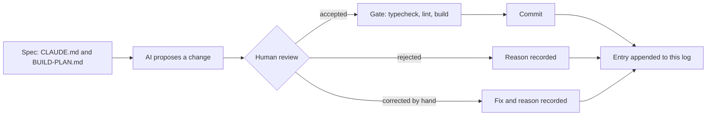

# AI log

How AI was used to build CHOWLY, written while the work happens. Each entry records what
was asked for, what was accepted, what was rejected and why, and what had to be corrected
by hand. The rejections and corrections are the useful part, so they are recorded when
they occur, never reconstructed later.

> [!NOTE]
> **Media placeholder.** A short screen recording of one propose, review, decide loop
> belongs here as `docs/media/ai-log-loop.gif`. It gets recorded in Phase 3, once there is
> an interface to show.

## How an entry gets here



Every commit in every phase appends an entry below, in commit order. The gate is
`npm run typecheck && npm run lint && npm run build`, run before each commit.

<details>
<summary>Entry format</summary>

Each per-commit entry has four fields:

| Field | What goes there |
|---|---|
| Asked for | The instruction as given, in one or two lines |
| Accepted | What the AI proposed that went in unchanged |
| Rejected | What was proposed and turned down, with the reason |
| Corrected by hand | What had to be fixed after the AI produced it, and why |

Decisions made before the first commit use a shorter form: proposed, decided, why.

</details>

## Decisions made before the first commit

### 1. Prisma codegen under `npm ci --ignore-scripts`

- **Proposed:** drop `--ignore-scripts` so Prisma's postinstall hook can generate the client.
- **Decided:** keep the flag. The build script became `prisma generate && next build`.
- **Why:** `--ignore-scripts` is a supply-chain control that stops every dependency's
  install hook, not only Prisma's. Moving codegen into the build keeps that control and
  makes the generate step explicit and visible in the build log.

### 2. A proxy that renders context as images

- **Proposed:** a token-saving proxy that compresses conversation context into PNG images
  before it reaches the model.
- **Decided:** rejected for this project.
- **Why:** prices are integer kobo. A character-level transcription error on a price
  (8500 read as 6500) is still a valid integer, so it passes typecheck, lint and build
  undetected. The saving is not worth a silent money error.

### 3. The `caveman-compress` skill

- **Proposed:** install the full caveman skill bundle as shipped, which includes
  `caveman-compress`.
- **Decided:** removed from every install location before this build started.
- **Why:** its function is rewriting memory files such as `CLAUDE.md` into compressed
  form. `CLAUDE.md` here is a graded deliverable and the rulebook for the remaining
  sessions, so a tool whose job is to rewrite it should not be reachable at all.

### 4. SSH `IdentitiesOnly`

- **Proposed:** push with the machine's default SSH setup, where the agent offers
  whichever key it holds first.
- **Decided:** a dedicated host alias with `IdentitiesOnly yes`, a dedicated key, and a
  repo-local `user.email`.
- **Why:** this machine holds several GitHub identities. With agent key selection, the
  first key the agent offers wins, and a push can carry the wrong identity. The alias
  makes the identity explicit and checkable before every push.

### 5. Deployment first, not last

- **Proposed:** the build plan put Vercel deployment at step 22, after every feature.
- **Decided:** a deploy gate right after the scaffold and security headers, before Prisma.
- **Why:** the pipeline (install command, build script, headers) is proven while the app
  is two files. Any pipeline failure then has two files of suspects, not twenty commits.

## Entries

### Commit 0: `docs: start the ai log with decisions made before the first commit`

- **Asked for:** create this file, seed it with the five decisions above, append at every
  later commit.
- **Accepted:** the structure above: a diagram of the loop, a collapsible entry format, a
  media placeholder, and the five decisions in proposed, decided, why form.
- **Rejected:** nothing.
- **Corrected by hand:** nothing.
- **Gate:** not runnable yet. There is no `package.json` before the scaffold commit, so
  typecheck, lint and build do not exist. The scaffold is the first gated commit.

### Commit 1: `chore: scaffold next.js app with typescript and tailwind`

- **Asked for:** create-next-app with App Router, TypeScript, Tailwind v4, no src directory
  and ESLint. Delete all starter boilerplate in the same commit. Add `typecheck`, set
  `build` to `prisma generate && next build`, strict tsconfig with `noUncheckedIndexedAccess`
  and `noImplicitAny`, animejs pinned exactly, and a page that renders only the CHOWLY name
  on `--enamel-deep` in `--chalk`.
- **Accepted:** Next 15.5.25 through `create-next-app@15`, run in a scratch directory
  because the tool refuses a directory that already holds `CLAUDE.md`, `prisma/` and
  `.githooks`. The generated config files were copied in and the repo's own `.gitignore`
  kept. `animejs` 4.5.0 exact. Prisma CLI and client pinned to 6.19.3 exact and installed
  in this commit, since the build script calls `prisma generate` and the schema is already
  in the repo, so no stub was needed. `*.tsbuildinfo` added to `.gitignore` because
  `tsc --noEmit` with `incremental` writes `tsconfig.tsbuildinfo`.
- **Rejected:** scaffold defaults that would have shipped something generic: the Geist font
  pair, the demo page, the five SVGs in `public/`, the default favicon, the template README
  and the placeholder metadata. `next build --turbopack` (the 15.5 scaffold default) was
  dropped for the plain `next build` the spec names. Prisma 8.0.0-rc.12, the registry's
  `latest`, was rejected: the 7 and 8 lines removed `url` and `directUrl` from the
  datasource block and deprecated the `prisma-client-js` generator, all of which the
  provided schema uses, so taking it would have meant editing a schema this commit must
  not touch.
- **Corrected by hand:** nothing in the committed files. Two process corrections: the first
  gate run captured no exit codes (a bash-only variable under zsh) and was re-run; the
  Playwright plugin wanted Google Chrome, which is not installed, so the visual check used
  Playwright's cached Chromium through a small script instead. A power loss interrupted
  the run after the gate had passed; the commit was made after re-verifying every file
  and re-running the gate.
- **Verified:** typecheck, lint and build all exit 0, and `npm ci --ignore-scripts`
  followed by the build proves the Vercel install path. Headless Chromium computed the
  body background as `rgb(18, 58, 94)` (`#123a5e`) and the text as `rgb(242, 239, 230)`
  (`#f2efe6`), with CHOWLY as the only visible text. One console 404 remains,
  `/favicon.ico`, because the default icon was removed and the designed one belongs with
  the design tokens commit.
- **Finding for the motion phase:** `animejs` 4.5.0 exports both `spring` and
  `createSpring` from `dist/modules/easings/spring/index.d.ts` with the same signature,
  `(parameters?: SpringParams): Spring`. `CLAUDE.md` prefers `createSpring`; both exist in
  this version.

### Commit 2: `chore: configure security headers`

- **Asked for:** Content-Security-Policy, `X-Content-Type-Options: nosniff`,
  `Referrer-Policy: strict-origin-when-cross-origin` and `X-Frame-Options: DENY` in
  `next.config.ts`. The CSP must still allow next/font, and any relaxation is to be named,
  never widened silently.
- **Accepted:** static headers from `headers()` on `/(.*)`, so the document and every
  static asset carry them. Production CSP: `default-src 'self'`, `script-src 'self'
  'unsafe-inline'`, `style-src 'self' 'unsafe-inline'`, `img-src 'self' data: blob:`,
  `font-src 'self'`, `connect-src 'self'`, `object-src 'none'`, `base-uri 'self'`,
  `form-action 'self'`, `frame-ancestors 'none'`, `upgrade-insecure-requests`.
  Development adds `'unsafe-eval'` to `script-src` and `ws://localhost:*` to
  `connect-src` for Fast Refresh, keyed on `NODE_ENV`, so production carries neither.
- **Relaxations, named:** `script-src 'unsafe-inline'`, because Next.js hydrates the App
  Router through inline scripts and a static header cannot carry a per-request nonce.
  `style-src 'unsafe-inline'`, for inline style attributes (the countdown ring sets its
  stroke offset that way) and the style tags Next.js injects in development. next/font
  needed nothing: Bricolage Grotesque was loaded temporarily through `next/font/google`,
  the browser fetched it from `/_next/static/media/` on this origin with a 200,
  `document.fonts` reported it loaded, and Chromium raised no violation. The experiment
  was reverted with git before the commit.
- **Rejected:** a nonce-based CSP through middleware, which would remove `'unsafe-inline'`
  from `script-src`. Rejected for this commit because the spec places the headers in
  `next.config.ts` and a nonce needs per-request middleware. Recorded as the upgrade path
  once route handlers exist.
- **Corrected by hand:** nothing in the committed file. One process correction: the
  recovery gate's `next build` ran while the dev server was starting, both write `.next`,
  and the dev server answered 500 with `ENOENT` on `_buildManifest.js` until restarted.
  The rule from that: never run the build while `next dev` is up.
- **Verified:** `curl -I` against `next dev` shows all four headers. `next start` on port
  3001 shows all four on the document and on a JS chunk. Headless Chromium reported zero
  CSP violations in both modes, and the only console error is the known favicon 404.
  Vercel's preview toolbar loads from `vercel.live` and will be blocked by `script-src` on
  preview URLs; production is unaffected.
- **Deploy gate:** branch pushed after this commit. Connecting the repo to Vercel, setting
  the install command to `npm ci --ignore-scripts` and confirming the URL are manual steps.

### Commit: `chore: override postcss and deepmerge-ts above their advisories`

- **Asked for:** audit the five vulnerabilities `npm ci --ignore-scripts` reported on the
  fresh scaffold, classify each by severity, directness and reach, say whether a fix
  exists without a breaking major, and stop for a ruling. No `npm audit fix --force`.
- **Finding:** five npm entries, two real advisory chains. One: `deepmerge-ts` 7.1.5
  (high, stack exhaustion on recursive object graphs) reached through `prisma` and
  `@prisma/config`. Two: `postcss` 8.4.31 (two high, two moderate: arbitrary `.map` file
  reads through `sourceMappingURL` comments and a `</style>` escape in stringified
  output), pinned by Next 15.5.25 as a nested dependency. The `next`, `prisma` and
  `@prisma/config` entries only inherit from those two.
- **Reach, and how it was proven:** neither chain reaches the production runtime.
  Requiring `@prisma/client` loads only `runtime/library.js`, and neither `deepmerge-ts`
  nor `@prisma/config` appears in Node's module cache afterwards; the word deepmerge does
  not occur in either runtime file, and the lock only marked `prisma` as non-dev because
  `@prisma/client` names the CLI as an optional peer. For postcss, Next requires it from
  `dist/build/` files only and nothing under `dist/server/` does, so `next start` never
  loads it. Both chains run on the build machine: the Prisma CLI during `prisma generate`
  and migrations, postcss during CSS compilation. Their inputs are authored in this repo.
- **Rejected:** npm's own fixes, because both are semver-major: `next` 16.3.4, or
  `prisma` 6.12.0, which is a downgrade to before `@prisma/config` adopted deepmerge-ts.
  No Prisma release, including the 8.0.0 release candidate, had moved off the
  vulnerable range.
- **Accepted (the ruling):** npm `overrides` pinning `postcss` to `^8.5.26` and
  `deepmerge-ts` to `^8.0.0`. Tested first in a scratch copy: audit clean, Prisma
  validate and generate clean, Next build clean. Next 16 itself ships postcss 8.5.23, so
  the 8.5 line is proven inside Next's CSS pipeline. deepmerge-ts 8 is ESM like 7 and only
  raises the Node floor to 16.9.
- **Corrected by hand:** nothing.
- **Verified:** after `rm -rf node_modules && npm ci --ignore-scripts`, the exact Vercel
  install command, the output line is `found 0 vulnerabilities`. Resolved on disk:
  postcss 8.5.28 with no nested copy under `next/`, deepmerge-ts 8.0.2. Gate green.
- **Maintenance note:** overrides pin transitive versions and go stale silently. Nothing
  warns when `next` or `prisma` moves to a version that no longer needs them, or that
  needs a different one. Both overrides get re-checked whenever either parent is bumped,
  and removed the moment the parent's own pin is clean.

### Commit 3: `feat: connect prisma to neon with the first migration`

- **Asked for:** `.env` with `DATABASE_URL` (Neon pooled), `DIRECT_URL` (Neon direct),
  `SESSION_SECRET` and `STAFF_PIN`; a committed `.env.example` with every key present and
  every value blank; confirmation that `.env` is ignored; the first migration, with the
  generated SQL for Order and Payment reported.
- **Accepted:** `.env.example` committed with the four keys blank and a one-line comment
  each. `.env` is ignored by the `.env` rule and `.env.example` is un-ignored by the
  `!.env.example` negation, both confirmed with `git check-ignore`. The human wired the
  real values; the AI checked them for presence and shape only (character counts, the
  `-pooler` host segment on the pooled string and its absence on the direct one) and
  never printed them. Migration `20260903160256_init` was created and applied with
  `prisma migrate dev` over `DIRECT_URL`.
- **Deltas realised by this migration:** 1, `MenuItem.prepTimeMinutes INTEGER NOT NULL`.
  2, `Order.waitMinutes INTEGER NOT NULL`. 3, `waiterId`, `chefId` and `bartenderId` as
  nullable `TEXT` with `ON DELETE SET NULL`. 4, `OrderStatus` enum of exactly PLACED,
  SERVED and PAID, so a delayed state has nowhere to be stored. 5, `placedAt`, `servedAt`
  and `paidAt` as `TIMESTAMP(3)`. 6, `OrderItem.unitPriceKobo`, `subtotalKobo` and
  `prepTimeMinutes` as snapshot columns. 7, every money column `INTEGER`. 8, the unique
  index `Payment_orderId_key`. 9, `isPretend BOOLEAN NOT NULL DEFAULT true`. 11, the
  unique index `Customer_sessionToken_key`. Delta 10's `CHECK` is the next commit, since
  Prisma cannot express it.
- **Rejected:** the build plan's message `feat: add prisma schema and connect neon`,
  because the schema was already committed in `5775a14` and this commit does not touch
  it. A message claiming otherwise would misdescribe the history the assignment grades.
  No schema stub was ever needed for the same reason.
- **Corrected by hand:** nothing.
- **Verified:** `prisma migrate status` reports the database in sync. A Prisma client
  query over the pooled `DATABASE_URL`, the path the app will use, returned PostgreSQL
  18.6, the thirteen tables, and the applied migration row. Gate green.

### Commit 4: `feat: add rating score check constraint`

- **Asked for:** an empty migration carrying the hand-written
  `ALTER TABLE "Rating" ADD CONSTRAINT rating_score_range CHECK (score BETWEEN 1 AND 5);`
  as its own commit, with proof that the database rejects a score of 0 and of 6.
- **Accepted:** `prisma migrate dev --create-only --name rating_score_check` produced the
  empty file, the SQL was written by hand with a comment tying it to delta 10, and
  `prisma migrate dev` applied it. Delta 10's reason: Prisma cannot express a check
  constraint, and a range that only Zod enforces would leave any other write path free
  to store a 0 or a 9. The database is the last line, not the first.
- **Rejected:** nothing.
- **Corrected by hand:** nothing.
- **Verified:** `pg_constraint` on Neon lists `rating_score_range` as
  `CHECK (((score >= 1) AND (score <= 5)))`. Three scripts each inserted a throwaway
  customer and order, then a rating, inside a transaction ending in `ROLLBACK`. Score 0
  and score 6 both failed with `new row for relation "Rating" violates check constraint
  "rating_score_range"`. Score 3 ran to `Script executed successfully`. Row counts after
  all three: 0 customers, 0 orders, 0 ratings. Gate green.

### Commit 5: `feat: seed restaurant, menu, staff and prep times`

- **Asked for:** one restaurant, The Golden Gate, 13 Ubah Street, Berger, Lagos. Two
  menus, food and drinks, around fourteen items reusing the coursework six and extending
  with dishes that fit a Lagos kitchen, all prices in kobo, prep times genuinely varied
  from about 4 for a poured drink to about 22 for a grilled cut. Three chefs, three
  bartenders and three waiters on this one restaurant. Idempotent.
- **Assumption, flagged for review:** the coursework prices are naira, so Grilled Steak
  8500 is stored as 850000 kobo. Read as kobo they would be a steak at 85 naira, which
  no Lagos kitchen charges, so the naira reading was taken and every price is stored
  times one hundred.
- **Accepted:** fourteen items, eight on the kitchen menu and six on the bar, with prep
  times 22, 20, 18, 15, 14, 12, 10, 8 and 6, 5, 5, 4, 4, 4. Every row carries a stable id
  such as `item_grilled_steak` and is written with `upsert`, which is what makes the seed
  idempotent and lets a later edit to a price or prep time land by re-running it. The
  runner is `node prisma/seed.mts`, with no extra dependency, because Node 24 strips
  types natively.
- **Rejected:** a `tsx` or `ts-node` dependency for the seed, since Node runs the file as
  is. A wipe-and-reload seed (`deleteMany` then `createMany`), because it is not
  idempotent in any useful sense and would break `OrderItem` foreign keys once real
  orders reference the items. The `.ts` extension for the seed, after Node warned it had
  to re-parse the file as an ES module because package.json declares no module type;
  the file became `seed.mts`, which states its module type, and the tsconfig `include`
  gained `**/*.mts` so the gate still typechecks it.
- **Corrected by hand:** nothing.
- **Verified:** three seed runs, each reporting the same counts: 1 restaurant, 2 menus,
  14 items, 3 chefs, 3 bartenders, 3 waiters. A read-back query through the pooled URL
  returned every item with its kobo price and prep time, and a GROUP BY on item names
  found no duplicates. `tsc --listFilesOnly` includes the seed and `eslint` lints it
  without warnings. Gate green.

## Phase 2: the data layer

### Commit 6: `feat: add zod schemas and money helpers`

- **Asked for:** a Zod schema for every request shape, rejecting unknown keys.
  `formatNaira(kobo)`. The wait time in one server-side place, unit tested:
  `max(prepTime) + 3 * (itemCount - 1)`.
- **Accepted:** `lib/schemas.ts` with strict objects for order creation, staff assignment,
  complaint, rating and payment, plus a cuid check for order ids and a `parseWith` helper
  that turns the first issue into a sentence a person can act on. An unrecognised key
  gets its own wording, since a posted price is the case that matters. `lib/money.ts`
  formats integer kobo as naira with grouped thousands and shows kobo only when there
  are any. `lib/wait-time.ts` holds `calculateWaitMinutes`, capped at 90, and the derived
  delay check (`isOrderDelayed`, `dueAt`) so delta 4 has exactly one implementation.
  Tests run on Node's built-in runner (`node --test`), and the test files are `.mts`
  importing `.ts` sources, which needed `allowImportingTsExtensions` in tsconfig.
- **Interpretation, flagged:** `itemCount` is units, not lines, so two steaks and three
  zobo count as five. Each extra unit is kitchen load whether or not it is a new dish.
- **Rejected:** a test framework dependency (vitest or jest), because the runner in Node
  24 covers assertion, grouping and TypeScript without a package. `Intl.NumberFormat`
  for naira, because ICU output differs between Node builds and browsers and a money
  string should not depend on which one formatted it.
- **Corrected by hand:** the cap test. The AI wrote it as twenty steaks expecting the cap,
  but 22 + 3 * 19 is 79, under the cap, so the test asserted the wrong number and failed
  on first run. It now uses forty units (139 before the cap) and also pins the 79 case
  just below it. The function was right; the test was not.
- **Verified:** 16 tests pass, including a client posting `priceKobo` on a line and
  `totalKobo` plus `waitMinutes` at the top level, both rejected with the field named.
  Gate green.

### Commit 7: `feat: add customer session cookie`

- **Asked for:** a signed, httpOnly, sameSite=lax cookie holding an opaque token, the
  customer row created on first visit, never localStorage.
- **Accepted:** `lib/session-token.ts` signs a 32-byte random token with HMAC-SHA256 over
  `SESSION_SECRET` using Web Crypto, and verifies with a constant-time compare.
  `middleware.ts` mints the cookie on a visitor's first request, on the edge runtime,
  with a matcher that skips static assets. `lib/session.ts` maps the verified token to a
  Customer row: `getCustomer` is read-only for server components, `requireCustomer` is
  for route handlers and creates the row on first use with an upsert on the unique
  `sessionToken`, or answers 401 when nothing verifies. The customer id is never read
  from the request. `lib/prisma.ts` holds the client singleton, `lib/http.ts` a small
  `HttpError` and `handle` wrapper, and `GET /api/session` returns the customer so the
  behaviour is testable now and the UI can show the table later.
- **Interpretation, flagged:** the cookie is minted on the first visit with no database
  work, and the row is created on the first API call that needs an identity. The edge
  runtime cannot run Prisma, and page views by crawlers should not write rows. From the
  customer's side it is the same thing: a refresh keeps the identity either way.
- **Rejected:** `localStorage`, because injected script can read it. Node's
  `crypto.timingSafeEqual` for the cookie compare, because the same code must run on the
  edge runtime, so a constant-time loop over the hex strings is used instead;
  `timingSafeEqual` is kept for the staff PIN, which only runs on Node. The `server-only`
  package, in favour of a comment, to avoid a dependency for one import.
- **Corrected by hand:** the double Set-Cookie. The first cut had both the middleware and
  `requireCustomer` minting a session, and the curl check on an API-first request showed
  two Set-Cookie headers carrying different tokens, with only header order making the
  created row match the cookie the browser would keep. The middleware is now the only
  minting site. It forwards the signed value to the handler in a request header that it
  deletes from every incoming request first, so a client cannot supply it, and the
  handler verifies that header's signature exactly as it verifies the cookie.
- **Verified:** 20 unit tests pass, including tampered token, tampered signature, wrong
  secret and malformed values. Against the dev server with a cookie jar: an API-first
  request gets exactly one Set-Cookie (`HttpOnly; SameSite=lax; Max-Age=2592000; Path=/`)
  and a row; the next request with that cookie returns the same id and no Set-Cookie; a
  client-sent `x-chowly-session` header with no cookie is ignored; a tampered cookie is
  replaced with a fresh identity; a page visit's cookie is reused by the API call after
  it. The seven test customers were deleted from Neon afterwards. Gate green. `secure`
  is set only in production, which is the one attribute curl against localhost cannot
  show; check it on the live URL.

### Commit 8: `feat: add menu api`

- **Asked for:** `GET /api/menu`, grouped by menu type, unavailable items excluded.
- **Accepted:** one query with the restaurant, its menus ordered by type (so the kitchen
  comes before the bar) and only `available: true` items. Each item carries `priceKobo`
  for arithmetic and `price` already formatted, so the client never formats money. No
  session is needed to read the menu and nothing is written, so it stays outside the
  customer lookup.
- **Rejected:** nothing.
- **Corrected by hand:** nothing.
- **Verified:** against the dev server the response carries The Golden Gate, 8 kitchen
  items and 6 bar items with formatted prices and prep times. Setting Puff puff to
  unavailable in Neon dropped the count to 13 with the item absent; restoring it brought
  back 14. The security headers from Commit 2 are present on the JSON response. Gate
  green.

### Commit 9: `feat: add order placement api`

- **Asked for:** `POST /api/orders` accepting item ids, quantities and a table number
  only. Prices, subtotals, the total and `waitMinutes` computed server-side from the
  database, price and prep time snapshotted onto each line, a posted price rejected.
- **Accepted:** the strict schema from Commit 6 does the rejecting before any database
  work, and the error names the field. Repeated ids merge into one line. Items are
  loaded by id with `available: true`, so an item pulled from the menu between the
  customer's page load and their order is refused with a message to reload. Each line
  stores `unitPriceKobo`, `subtotalKobo` and `prepTimeMinutes` from the row just read
  (delta 6). The total is the sum of those subtotals and the wait comes from
  `calculateWaitMinutes` over those prep times (delta 2). The order and the customer's
  latest table number are written in one transaction. `lib/orders.ts` holds the single
  presenter every order route returns, with `isDelayed` and `dueAt` derived at read
  time (delta 4). `lib/rate-limit.ts` counts in the database, five orders per session
  per ten minutes, so the limit holds across serverless instances.
- **Interpretation, flagged:** the reference is sequential and human readable, `CHW-0001`
  onwards, taken from the order count and retried on the unique constraint if two orders
  land in the same instant. A random suffix would never collide but reads worse on a
  ticket.
- **Rejected:** an in-memory rate limiter, because each Vercel function instance would
  keep its own counter and the limit would be theatre. A per-request `new PrismaClient`,
  in favour of the singleton from Commit 7.
- **Corrected by hand:** nothing.
- **Verified:** against the dev server: steak plus mojito at table 7 returned 201 with
  `CHW-0001`, wait 25 (22 + 3), total 1,250,000 kobo shown as ₦12,500, and both lines
  carrying their snapshotted price and prep time. A line with `priceKobo` and a body with
  `totalKobo` and `waitMinutes` both returned 400 naming the fields. An unknown item id,
  quantity 0, an empty ticket and a non-JSON body each returned 400 with a usable
  message. A request with no cookie at all was still placed, on the identity the
  middleware minted for that same request. Jollof twice on one ticket became a single
  line of three with wait 18. The sixth order in ten minutes returned 429. The session's
  table number updated to 7. Gate green.

### Commit 10: `feat: add order detail api with derived delay`

- **Asked for:** `GET /api/orders/[id]` with an ownership check against the session and
  `isDelayed` derived at read time, never stored.
- **Accepted:** the ownership check is inside the query, `where: { id, customerId }`,
  so there is no window between finding the order and checking who owns it. A miss is
  a 404 whether the id is malformed, unknown, or someone else's, so the endpoint never
  confirms that another table's order exists. The id is validated as a cuid before any
  database work. `isDelayed` and `dueAt` come from the presenter in `lib/orders.ts`,
  which computes them from `placedAt` and `waitMinutes` at the moment of the read.
- **Rejected:** a 403 for someone else's order, because it would leak that the id is
  real. A separate ownership check after the fetch, because a combined query cannot be
  bypassed by a later edit that forgets the check.
- **Corrected by hand:** nothing.
- **Verified:** against the dev server: the placing browser read `CHW-0001` with
  `isDelayed: false` and a `dueAt` 25 minutes after placement; a second browser with its
  own cookie, and a request with no cookie, both got 404; `1 OR 1=1` and a well-formed
  unknown cuid both got 404. Backdating the order's `placedAt` by 30 minutes in Neon made
  the same read return `isDelayed: true` with no other change, and the Order table's
  column list has no delay column. Gate green.

## Phase 3: waiter, complaint, payment

### Commit 11: `feat: add waiter assignment api`

- **Asked for:** `GET /api/waiter/orders` for the rail. `PATCH /api/orders/[id]/assign`
  recording waiter, chef and bartender and setting SERVED with `servedAt`. Gated by
  `STAFF_PIN` compared with `crypto.timingSafeEqual`.
- **Accepted:** `lib/staff-pin.ts` reads the `x-staff-pin` header and compares it with
  `timingSafeEqual` over equal-length buffers; a wrong-length PIN still runs a compare
  against the expected value before returning false, so the length check is not itself
  an early exit. The rail returns every PLACED and SERVED order oldest first, with the
  derived delay, plus the waiter, chef and bartender lists in the same response so the
  pick lists need no second call. Paid orders have left the floor and are not listed.
  Assign takes the strict body, refuses anything but a PLACED order with a 409 that
  names the current state, checks all three staff ids exist, and writes the assignment,
  SERVED and `servedAt` in one update.
- **Honest statement for the document:** the role switch is UI convenience, because the
  assignment forbids logins. The PIN is the boundary. A PIN typed into a browser is as
  secret as the people who know it, and that is what the no-login rule allows.
- **Decision, flagged:** the rail GET is PIN-gated as well as the mutation, since it
  lists every table's order and the spec only named the PATCH. Lift it if the rail is
  meant to be public.
- **Rejected:** nothing.
- **Corrected by hand:** nothing.
- **Verified:** with three fresh orders on the dev server: no PIN, a wrong PIN of the
  same length, and a wrong-length PIN each got 401; the right PIN got the three orders
  and three of each staff role; assign with an extra `status` key got 400 naming it, an
  unknown chef got 400, no PIN got 401; a valid assign returned SERVED with `servedAt`
  and the three names; assigning again got 409 "already served"; a garbage id got 404.
  Gate green.

### Commit 12: `feat: add complaint and rating apis`

- **Asked for:** POST complaint and POST rating, both ownership-checked, the rating
  upsert-safe against the unique constraint, both rate limited per session.
- **Accepted:** ownership is part of each query. A complaint is refused with 409 unless
  the order is late, where late means still PLACED past the promised wait or served
  after it (`isOrderLate` in `lib/wait-time.ts`, unit tested, paying does not erase
  lateness). The UI will only show the entry point once the ring has crossed, and the
  server enforces the same rule, so the complaint is earned on both sides. The rating is
  an upsert on the unique `orderId`, so rating again changes the score, and the reply is
  201 the first time and 200 after. Zod bounds the score first, the check constraint
  from Commit 4 is the last line. Limits are counted in the database: five complaints
  and ten ratings per session per ten minutes.
- **Decision, flagged:** a rating is accepted at any point after placing, not only after
  serving, since the assignment lets the rating stand on its own.
- **Rejected:** nothing.
- **Corrected by hand:** nothing.
- **Verified:** a complaint on an on-time order got 409; after backdating the order 30
  minutes in Neon the same complaint got 201 with `isDelayed: true`; the other browser
  got 404; a two-character description got 400. Scores 6, 0 and 3.5 got 400 with the
  bound named; 4 got 201; 5 on the same order got 200 with the score changed and still
  one row; the other browser got 404. Complaints two to five got 201 and the sixth got
  429. Gate green.

### Commit 13: `feat: add pretend payment api`

- **Asked for:** `POST /api/orders/[id]/pay` in one `prisma.$transaction`, inserting the
  payment with `isPretend: true`, flipping status to PAID and setting `paidAt`. A second
  call returns the existing payment rather than erroring or duplicating.
- **Accepted:** ownership in the query, and the order must be SERVED, since a customer
  pays after being served. The amount is the order's stored total, never anything from
  the body, and the strict schema takes only the method. The transaction inserts the
  payment and flips the status together. If a payment already exists the call returns
  it with 200. If two calls race, the unique `Payment.orderId` (delta 8) makes the loser
  fail with P2002 inside its transaction, which rolls back its status update, and the
  handler answers with the payment the winner wrote. Delta 9: the row says pretend.
- **Rejected:** allowing payment while PLACED. It would let an order leave the rail
  unserved, and the story is order, wait, serve, pay.
- **Corrected by hand:** nothing.
- **Verified:** paying a PLACED order got 409; the other browser paying a served order
  got 404; a bad method and a posted `amountKobo` got 400. The owner's first call got
  201 with PAID, `paidAt`, and a payment of the stored 300,000 kobo marked pretend; the
  second call got 200 with the same payment id, the original method kept, one row. On a
  third order, two calls fired in the same instant with `Promise.all` returned 201 and
  200 carrying the same payment id, and Neon holds exactly one payment for it. Paid
  orders vanished from the rail. Gate green.
- **Postcss re-check, now that route handlers exist:** the audit in the overrides commit
  proved `next start` never loads postcss. Route handlers on Vercel run as serverless
  functions from a different bundle, so the check was repeated against Next's per-route
  file traces (`route.js.nft.json`), which list every file shipped with each function.
  The order and payment routes trace 64 files each with zero references to postcss or
  deepmerge, no server trace anywhere mentions either, and no compiled file under
  `.next/server` contains the string postcss. The conclusion holds: both chains are
  build-time only, and after the overrides they are patched versions anyway.

## Phase 4: the interface

### Design plan, reviewed before building

The brief fixes the direction, so the plan is about executing it as a decision rather than
a default.

- **Palette:** the seven tokens from `CLAUDE.md`, unchanged. Two derived values only:
  `--ink` is the rim colour used as text on chalk, so edges and type are one material,
  and `--ink-soft` for secondary text on chalk. Flame is spent on time and nothing else.
- **Type:** Bricolage Grotesque with the `opsz` and `wdth` axes loaded, used wide (wdth
  112) for the restaurant name and the countdown and tighter (wdth 92) for section
  heads. Instrument Sans for everything else. Tabular figures on the countdown.
- **Layout concept:** the customer screen is a table seen from above. The deep speckled
  ground is the tabletop, the dishes are chalk plates with the rim hairline, and the cart
  is a tray along the bottom edge. The order page is one plate in the centre with the
  countdown ring as the dish. The waiter side is a rail of paper tickets.

```
  CHOWLY                         [ Customer | Waiter ]
  The Golden Gate
  13 Ubah Street, Berger, Lagos
  Kitchen
  ( plate ) ( plate ) ( plate )
  ( plate ) ( plate ) ( plate )
  Bar
  ( plate ) ( plate ) ( plate )
  ================ tray: 3 items, ₦12,500, Place order ================
```

- **Radii mean something:** plate 28px (a bowl), tray 14px, button 8px (a stamp), ticket
  4px (paper). No single radius on everything.
- **Separation:** the rim hairline only. No shadows, no left-edge bars, no glass.
- **Copy:** sentence case, a button names what happens ("Place order", then "Placed").

Reviewed against the generic defaults: not cream with terracotta and a serif, not
near-black with an acid accent, not a card kit with one radius and a grey shadow, no
eyebrow labels, no middle dots, no arrows. Every choice above traces to enamelware or to
the data on the plate. One thing to watch: the plates grid could drift toward a SaaS
card grid, so plates get the large bowl radius, the rim and the speckle, and no two
surfaces share a radius unless they are the same kind of thing.

### Commit 14: `feat: add enamel design tokens and typography`

- **Asked for:** the token block into `app/globals.css`, Bricolage Grotesque and
  Instrument Sans via `next/font/google`, the enamel rim and speckle as reusable
  utilities.
- **Accepted:** the seven tokens on `:root` under the brief's own names, mapped into
  Tailwind's colour namespace so `bg-chalk` and `text-flame` exist. Utilities that say
  what a thing is: `enamel` (chalk, ink, rim), `rim`, `speckle-deep` and `speckle-chalk`
  (inline SVG flecks, so they need no request and stay within `img-src 'self' data:`),
  `plate`, `tray`, `stamp` and `ticket` for the four radii, `display-wide` and
  `display-tight` for the two width settings, `tabular` for the countdown. Both fonts
  loaded with `next/font/google`, Bricolage with its `opsz` and `wdth` axes as the
  installed declaration allows. `app/icon.svg`, a chalk plate with the rim on the deep
  ground, replaces the 404 the probe had been logging. A visible focus ring in flame on
  the ground and enamel-mid on chalk.
- **Rejected:** Tailwind theme tokens for the fonts and radii. The first draft declared
  them in `@theme inline` under the same names as the raw `:root` tokens, which reads as
  a self-reference and would have inlined the variables away; the raw tokens stay on
  `:root` and the shapes are named utilities instead. A CSS `prefers-reduced-motion`
  blanket rule that zeroes every transition, because the anime.js scopes carry their own
  reduced-motion branch and the blanket rule would also kill the deliberate opacity
  fallback.
- **Corrected by hand:** nothing.
- **Verified:** Chromium reports the heading in Bricolage Grotesque with
  `"opsz" 96, "wdth" 112` at weight 600, the body in Instrument Sans, the speckle SVG as
  the body background image over the deep ground, `icon.svg` served as `image/svg+xml`
  and linked from the head, and no console messages at all. Screenshot reviewed. Gate
  green.

### Commit 15: `feat: add role switch`

- **Asked for:** a persistent customer and waiter switch, honest about being UI
  convenience and not auth. The waiter side prompts for the PIN once per session.
- **Accepted:** the role is the route. `/` is the customer and `/waiter` is the waiter,
  and the switch in the site header is a pair of links styled as one enamel two-segment
  control with the active segment filled, so the state survives refresh through the URL
  and nothing pretends to be a login. The caption under it says so in one sentence. The
  PIN lives in React state in a provider at the root layout: switching roles and back
  keeps it, a reload asks again. The gate on `/waiter` checks the PIN against the rail
  endpoint, which compares in constant time server-side, and only renders the waiter
  view after a 200.
- **Rejected:** `localStorage` and `sessionStorage` for the PIN, because both are readable
  by any script on the page. Storing the role in a cookie or storage, because the URL
  already holds it and is shareable. A 403 body message that reveals whether the PIN was
  close, in favour of one message for missing and wrong alike.
- **Corrected by hand:** the browser check, not the code. The first script waited on any
  `role="alert"` and matched a region Next injects, so it read an empty string while the
  request was still in flight; re-checking against the form's own error id read the
  message.
- **Verified:** in Chromium the home page marks Customer current and `/waiter` marks
  Waiter current. A wrong PIN shows "That PIN was not accepted. Check it with the manager
  and try again." with `aria-invalid` on the field and the gate still up. The right PIN
  reveals the waiter content. Going to Customer and back does not prompt again; a reload
  does. Both storages are empty afterwards. The one console error is the 401 the wrong
  PIN produced. Gate green.

### Commit 16: `feat: add menu browsing with entrance sequence`

- **Asked for:** the menu grid with the single orchestrated load sequence: `createDrawable`
  rims, `splitText` on the restaurant name, `stagger` from centre. Nothing else animates
  unprompted.
- **Accepted:** `lib/menu.ts` holds `getMenu()`, and the home page is a server component
  that reads it straight from the database and hands real plates to the client board,
  so the first paint has something to draw. Each plate is a chalk, speckled, bowl-radius
  surface whose rim is an SVG rect drawn in with `svg.createDrawable`; the name is split
  into characters with `splitText`; a `createTimeline` runs rims, then name, then the
  section heads, then the plates settling with `stagger(45, { from: "center" })`. All of
  it lives in one `createScope` with `mediaQueries: { reduceMotion }`, reverted on
  unmount so strict mode's double mount leaves nothing behind. With reduced motion on,
  every part is a single 200ms opacity change and the name is never split.
- **Decision, flagged:** `app/api/menu/route.ts` still carries its own copy of the menu
  query rather than calling `getMenu()`. Moving it is a change of more than ten lines to
  an existing file, which the editing rule reserves for the human to approve. The two
  copies are identical today; approve the refactor and the route becomes one line.
- **Rejected:** a CSS rule zeroing all transitions under reduced motion, because the
  scope already carries the branch and the rule would also flatten the deliberate
  opacity fallback. Hover transitions on plates and a per-section fade, because the brief
  allows exactly one unprompted sequence.
- **Corrected by hand:** two defects the browser check exposed. The settled screenshot
  showed plates with no rim: the rim SVG came before the plate body in the DOM, so the
  opaque chalk body painted over it; the SVG now sits above the body. The reduced-motion
  read showed the rect's `draw` attribute at `0 0`, meaning invisible: `createDrawable`
  initialises every rim to nothing drawn, and it was being created before the
  reduced-motion branch returned; it is now created only on the animated path. A third,
  smaller one: `calc()` inside an SVG `width` attribute is not reliable, so the rect is
  sized through CSS geometry properties instead.
- **Verified:** in Chromium at 0.35 seconds the rims are part-drawn (`draw` around
  `0 0.003`) and four characters of the name are in; at 3.5 seconds all 14 plates and
  rims are at opacity 1 with `draw` at `0 1` and all 17 characters visible. With reduced
  motion emulated, 0.45 seconds in, all 14 plates and rims are visible, no plate carries
  a transform, and the name has zero split spans. No horizontal overflow at 390px. No
  console errors. Screenshots reviewed. Gate green.

### Commit: `style: draw the rims in chalk before the plates settle`

- **Asked for:** nothing; a refinement from reviewing the mid-sequence screenshot.
- **Why:** the rims drew in ink over the deep ground, dark on dark, so the opener of the
  one orchestrated sequence was nearly invisible. Enamel is seen chalk-first, so the
  rims now draw in chalk and take their ink colour as the plates settle under them.
- **Rejected:** widening the stroke or adding a glow to make the ink read on the ground;
  a glow is on the banned list and a wider rim stops being a hairline.
- **Verified:** Chromium reads the rim stroke as chalk (`rgb(242, 239, 230)`) at 0.6
  seconds and as ink (`rgb(10, 31, 51)`) once settled. Gate green.
