# Three more directions for CHOWLY

The Pass was well built and wrong: industrial, dark, heavy, and set on the kitchen side
of the pass. These three turn it over. Light ground, air, restraint as the luxury, and the
dining room. Each was built as a full clickable walkthrough on the real API and the seeded
data, not as a screen: landing, menu, add, cart, place order, the order with its live
wait, running late, the complaint and the rating, payment and the receipt, then the floor
with the ticket opened, the chef and bartender recorded and the order served. They live at
`/directions-2/one`, `/directions-2/two` and `/directions-2/three`, indexed at
`/directions-2`. Every screen was captured at 390 first and then at 1440, into this folder.

The three share one engine (`components/walkthrough`, first written as `components/directions-2/shared`): the cart, the order poll,
the rail, the drag-to-serve, the demo control and the fourteen dish drawings as geometry.
Only the material, the type, the layout and the clock differ, which is the point: the
comparison is of directions, not of feature sets.

**The distinction that was kept from the verdict.** The Pass was rejected for being too
industrial, dark and heavy. It was not rejected for being too novel. Familiar was never the
target, so none of these three reaches for a look a person has seen in another app.

## 1. Linen

**World:** a table by the window at The Golden Gate, a white cloth on it, the afternoon
moving across the cloth. **Material:** linen. A visible weave in the ground, a stitched
edge on every card, a napkin for the order. **Type:** Instrument Serif at display sizes,
its italic for the section heads; Karla for everything else. **Palette:** linen `#f6f3ec`,
shade `#e9e4d8`, sun `#fbf1c4`, ink `#1d1f24`, olive `#5b6b3a`, tomato `#b5482d`.
**Food:** gouache, two coats, the second offset so the paint sits proud of the line.
**Ambient time:** a patch of sun on the cloth. It sits at the left as the order goes in and
moves across the table through the promised minutes; past the promise it has left the
cloth and the table is in the shade.

| 1440 | 390 | late at 390 | the floor at 390 |
|---|---|---|---|
| 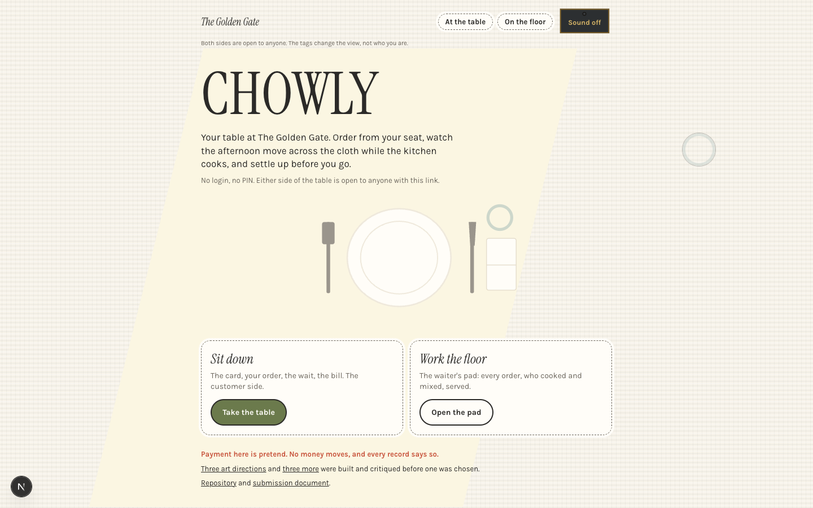 | 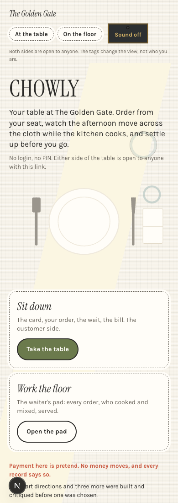 | 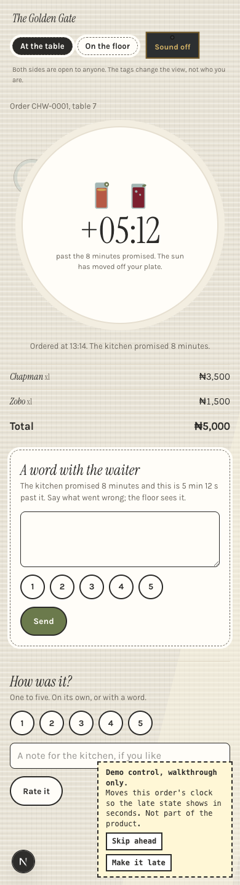 | 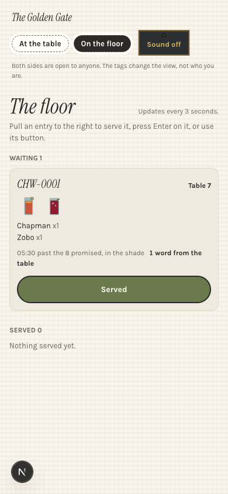 |

What works: the clock. Light moving across a cloth is the brief's own sentence, and it is
felt before it is read. The whole page is the condition, the sun patch is warm without
being bright, and the shade is a real thing that happens to a table in the afternoon, not
a warning. The gouache is the best food of the three: the double coat reads as paint on
paper, and every dish is recognisable at 60 pixels. The napkin is a good object for the
order to sit on, and the place setting on the landing tells you where you are with no copy.

What is derivative, named: Instrument Serif in italic over a plain sans is the most worn
display pairing of the last two years; it is on half the startup landing pages built since
2024, and it is the thing a person would recognise from somewhere else. The dashed
stitched border is a stock "handmade" device. The sun patch at 1440 is a large yellow
parallelogram, and at that size it reads as a decorative shape more than as light.

### The bar, answered for Linen

- **Could this be any other restaurant app with the logo swapped?** Not the order screen:
  no other app tells you the kitchen is late by moving the sun off your table. The menu
  could be, if the serif were swapped; the layout is a list.
- **The one thing remembered an hour later:** the sun going off the cloth.
- **Where it takes a real risk:** a page whose entire ground changes over twenty minutes,
  which has to stay slow and legible at both ends (measured: ink on linen and ink on shade
  both above 12:1); a yellow that is warmth and never an accent; a menu with no cards.
- **What has weight, texture or imperfection:** the weave in the cloth, the offset coats of
  gouache, the stitched edge, the sun patch cut on a skew like light through a window
  frame, the fold in the napkin.
- **Does the type do anything:** the serif at 7rem for the name is the room's sign, and the
  italic heads are the handwriting on a card; but the pairing itself does nothing a
  hundred other pages have not done.

### The five moments in Linen

1. **First load.** The cloth is there; the name, the line and the place setting settle in,
   then the two cards, then the links. One sequence, under a second.
2. **Committing the order.** The napkin folds up as the order goes; the button says "Ask
   the kitchen" and the page that follows says the kitchen promised the minutes.
3. **The wait.** The plate with the digits on it, and the sun on the cloth beside it. The
   sun crosses; the cloth goes to shade; the complaint card appears only then.
4. **The rail.** The floor is a pad, one entry per order, each in the shade of its own age.
   Pull an entry to the right, press Enter on it, or use its button.
5. **Payment and receipt.** The bill is a card on the cloth; paid, the receipt says "Paid,
   thank you." and the plate goes quiet.

## 2. Bill of fare

**World:** a printed card at the table, a candle beside it. **Material:** letterpress on
cotton paper: fibre in the ground, every rule a dark line with a paper-white highlight
under it, the second colour a hair out of register on the heads, old-style figures.
**Type:** EB Garamond, roman and italic, for everything printed; Work Sans only for the
controls. **Palette:** paper `#f4efe4`, dim `#e4ded0`, ink `#1e1b18`, green `#2f5d3a`,
flame `#e2a23a`. **Food:** ink line, the green laid down first and out of register, the
line over it. **Ambient time:** a candle. The wax burns down through the promised minutes
and the pool grows; past the promise the candle is a stub and the page has dimmed; paid, it
goes out.

| 1440 | 390 | late at 390 | the book at 390 |
|---|---|---|---|
| 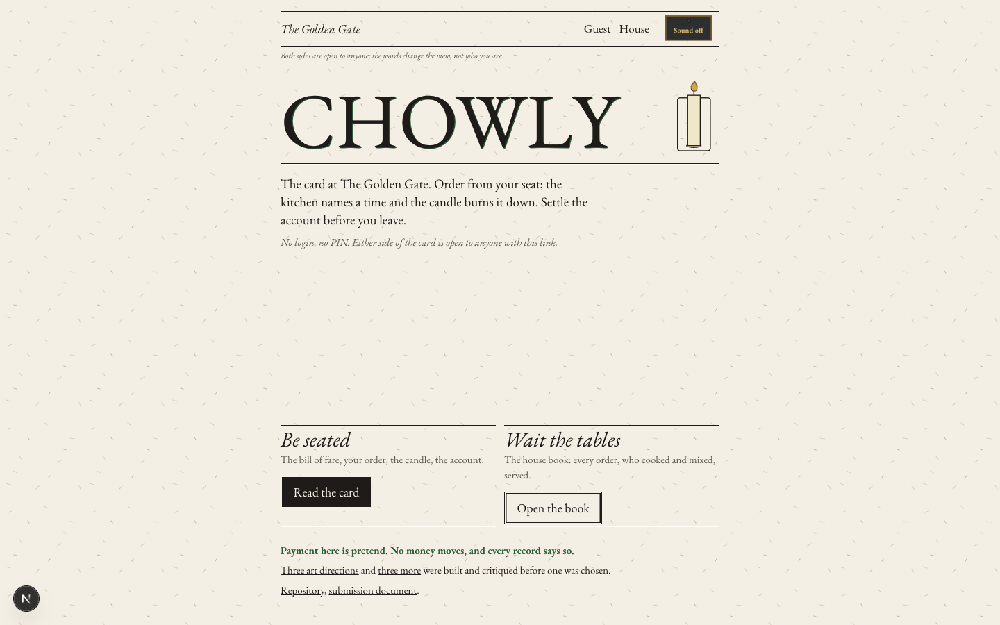 | 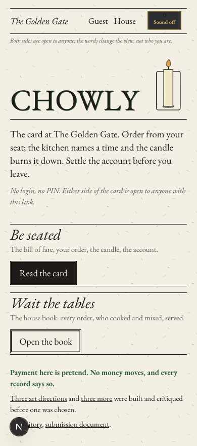 | 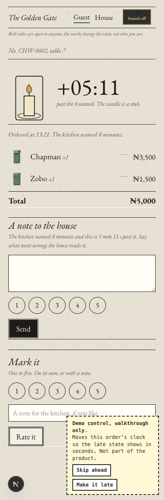 | 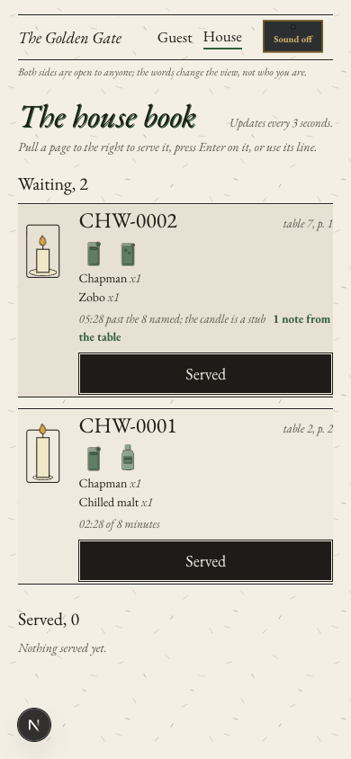 |

What works: it is the most restaurant-native of the three. A bill of fare as one long
printed column with leaders to the prices is how a card has looked for two hundred years,
and a person reads it without learning anything. The candle is the most legible clock at a
glance, and it survives shrinking to an icon on every page of the house book, so the floor
sees which tables are late without a number. The house book is a real object and the
copy stays in its register: notes, marks, the account, settled.

What is derivative, named: paper plus Garamond plus hairline rules is the "broadsheet"
default the calibration list names, and it is one hue away from the cream-and-serif tell.
The candle is the single most obvious restaurant metaphor there is. Misregistration is a
printmaker's affectation that is currently fashionable in editorial design. The food is
the least visible of the three: ink line at 56 pixels is a glyph, not a plate. At 1440 the
landing has an empty middle: the doors sit at the bottom of the viewport with nothing
between them and the line, which the two other directions fill with the table.

### The bar, answered for Bill of fare

- **Could this be any other restaurant app with the logo swapped?** The menu and the
  landing could pass for any letterpress-styled menu site. The order page and the house
  book could not; nobody else burns a candle down as the kitchen runs late.
- **The one thing remembered an hour later:** the candle as a stub.
- **Where it takes a real risk:** a menu with no images to speak of; a customer interface
  set entirely in one serif, including the digits; a page that dims rather than alerts.
- **What has weight, texture or imperfection:** the fibre in the paper, the letterpress
  rules with their highlight, the second colour out of register, the ink dishes with
  their green off the line, the candle's dripping wax.
- **Does the type do anything:** yes, and it is the only one of the three where the type
  is the whole design: the bill is set, not laid out. But the digits of the wait in an
  old-style serif are hard to read at a glance, which is the one place they must not be.

### The five moments in Bill of fare

1. **First load.** The rules print, the name comes up with its second colour off
   register, the candle lights.
2. **Committing the order.** The slip goes; the button says "Send to the kitchen".
3. **The wait.** The order printed beside its candle; the wax burns down; the page dims to
   the stub; "A note to the house" appears only then.
4. **The rail.** The house book, one page per order, a candle on each at its own height.
   Pull a page right, press Enter, or use its line.
5. **Payment and receipt.** The account, then "Paid in full." and the candle out with a wisp.

## 3. Glaze

**World:** a stoneware plate on a terrazzo table, the room settling into evening.
**Material:** terrazzo in the ground (chips of rust, sage, sand and ink, no two the same
shape) and glazed stoneware for every light surface: white, a dark rim, a teal drip at the
top edge, crazing drawn as fine cracks. Mass is a hard offset in ink, never a blur.
**Type:** Newsreader at its largest optical size for the name and the digits; Figtree for
everything else. **Palette:** terrazzo `#eee9e0`, dusk `#d6d5cd`, ink `#2a2b2e`, white
`#faf8f2`, teal `#3d7a78`, ochre `#c98b2c`, rust `#b4553a`, sage `#7e9a7b`. **Food:** the
dish glazed onto its own plate: pooled colour with a darker edge, crazing across it.
**Ambient time:** the room. The ground mixes from bright terrazzo to a cool grey-green
dusk through the promised minutes, and the plate's hard shadow lengthens as the light
drops. Past the promise, "the room has settled into evening". Never red, never purple.

| 1440 | 390 | late at 390 | the floor at 390 |
|---|---|---|---|
| 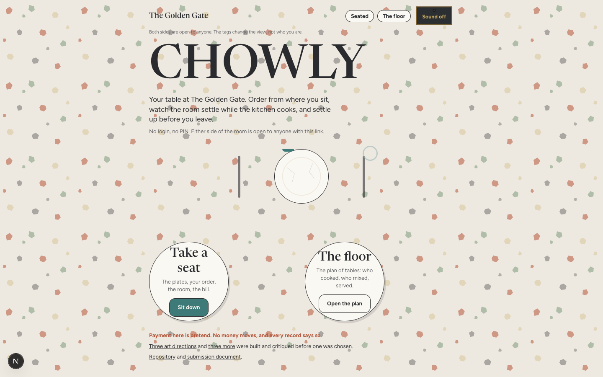 | 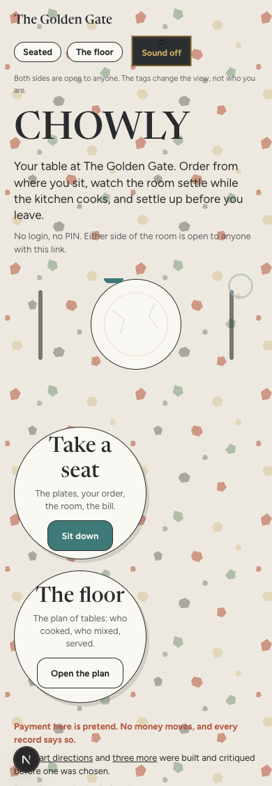 | 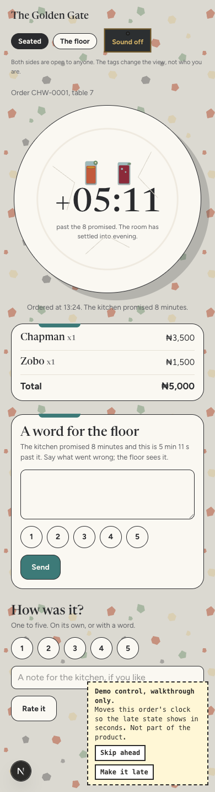 | 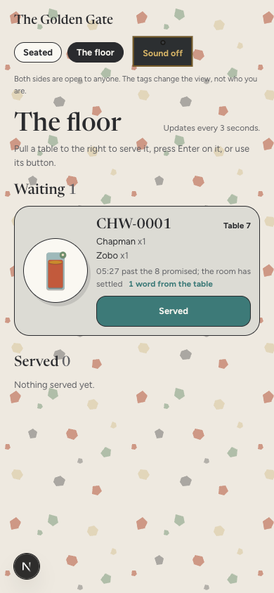 |

What works: the food is the most visible of the three by a distance. Each dish sits at 104
pixels on a 132-pixel plate, the glaze reads as a material rather than a drawing, and a
menu of plates on a table is a thing a person understands with their thumb. The order
screen has the strongest single hero: one big plate carrying the digits and the dishes,
its shadow lengthening. The entrances on the landing are two plates in the lower third of
the phone, the best thumb reach of the three.

What is derivative, named: terrazzo was the trend material of every cafe and brand
identity from 2018 to 2020, and sage, rust and sand are its stock chips; a person will
place it. The round-plate entrances are a gimmick. Figtree is a common geometric sans. The
chips are loud behind body text on the landing, and the room's settling is the subtlest
clock of the three: a person who has not been told may not notice the ground has cooled.

### The bar, answered for Glaze

- **Could this be any other restaurant app with the logo swapped?** The menu of plates and
  the order plate could not. The floor plan, a list of rounded cards, could.
- **The one thing remembered an hour later:** the plate with the digits on it, and the
  terrazzo, which is the problem.
- **Where it takes a real risk:** a loud patterned ground under an interface; food as the
  hero of the menu with the copy secondary; a clock that is only a change in the light of
  the room.
- **What has weight, texture or imperfection:** the terrazzo chips, the pooled glaze edge,
  the crazing, the teal drip, the hard shadow that lengthens.
- **Does the type do anything:** Newsreader at its largest optical size gives the digits on
  the plate the look of a number painted on stoneware, and that is the one place the type
  matters. Elsewhere it is a good serif over a plain sans.

### The five moments in Glaze

1. **First load.** The name, then the line, then the place setting; the plates arrive from
   the centre outward.
2. **Committing the order.** The bill at the foot of the screen; the button says "Order",
   then "Ordered".
3. **The wait.** The plate with the digits; the room settles; the shadow lengthens; "A word
   for the floor" appears on a glazed card only then.
4. **The rail.** A plan of tables, each a plate on a card in the room's light for its age.
   Pull a table right, press Enter, or use its button.
5. **Payment and receipt.** The bill on a glazed card; "Settled. Thank you."

## Ranking

1. **Linen.** The truest reading of the brief, and the only clock a person feels without
   being told. Its faults are surface: the serif and the stitched edge.
2. **Glaze.** The most visible food and the strongest hero, held back by a material that
   dates it and a clock too quiet to notice.
3. **Bill of fare.** The most restaurant-native and the most legible clock, but the whole
   look is the template the calibration list names, and the food is barely there.

## The pick, in three sentences

Linen. It is the one direction whose clock is the brief's own sentence, light moving across
a table through an evening, and a person at the table feels it without being told. Its
faults are surface and get replaced in the rebuild (a serif that is not this year's, the
stitched edge gone, the sun cut smaller at desktop), where Glaze's fault is its material
and Bill of fare's is its whole template.

## What to fix before the rebuild

- Replace Instrument Serif with a display serif that is not the current default, keeping
  the italic heads. Candidates to test on the real menu: Newsreader at high optical size,
  which Glaze proved works for digits, or Fraunces with its soft axis off.
- Drop the dashed stitched edge. Cards on the cloth get a hairline in ink or no edge at all.
- Cut the sun patch to a narrower, taller shape at 1440 so it reads as a window, not a
  parallelogram.
- Bring Glaze's plate sizes to the Linen menu: the food at 104 pixels, not 60.
- The Sound tag is still The Pass's brass plate. It gets restyled in linen.

## Housekeeping

- The walkthroughs write real rows. Every run removed its own orders afterwards.
- The demo control (skip ahead, make it late) renders only on the three order screens
  under `/directions-2`, only for the order the browser placed, and only when the server
  runs with `DEMO_CONTROLS=true`. In production the endpoint is a 404 and the panel does
  not exist.
- The Pass's header steps aside under `/directions-2`; each direction brings its own chrome.
- No em dashes, no gradients, no blur, no purple anywhere in the built CSS (audited).
