# Three directions, third round

The second round produced three palettes on one layout. This round mandated the
differences. Direction one is The Pass with its three faults repaired, not reimagined.
Directions two and three each break a structural assumption every version so far
shared, and neither shares direction one's layout, its ground or its way of showing time.
Each is a full clickable walkthrough on the real API and the seeded data at
`/directions-3/one`, `/directions-3/two` and `/directions-3/three`, indexed at
`/directions-3`. Every screen was captured at 390 first and then at 1440 in Chromium, and
every landing, menu and floor was rendered again in the system WebKit (Safari's engine),
which is the engine that caught the CSP fault last round. The WebKit frames carry
`webkit` in the name.

Constant across all three: no sound feature, no explanatory callouts, the word pretend
only on the payment button and the receipt (the walkthrough counts the word on every
screen: zero on the landing and the menu, one on the served ticket, one on the paid), a
landing page designed to the same bar, the food painted rather than named, the role
switch immediate.

## The role switch, diagnosed

Measured on the production build of the current app, from the tap on a tag to the other
side's content being visible: 1.3s to Waiter and 2.3s to Customer the first time, then
60ms and 3.2s. Two causes. The Customer side is a `force-dynamic` server page that waits
on the database before sending any HTML (0.41s of server time from this machine) and
then replays its two-second entrance choreography on every arrival. The Waiter side
renders an empty shell at once and then waits on a rail API that makes seven sequential
database round trips through Prisma's nested includes (up to 2.5s from this machine,
far less from Vercel beside Neon, but every round trip counts on a phone on mobile
data). Nothing was wrong with the navigation itself; the waiting was data and motion.

In all three directions the pages carry no server data. The menu is read once through
the API into the client cache and kept, the rail keeps its previous data while it
revalidates, both are preloaded when a frame mounts and again when a tag is hovered or
focused, the menu API is cached on the server for thirty seconds, and the entrance
choreography plays once per session. Measured the same way in the walkthroughs:

| Direction | To Waiter, first and second | To Customer, first and second |
|---|---|---|
| One | 111ms, 63ms | 116ms, 86ms |
| Two | 128ms, 63ms | 103ms, 78ms |
| Three | 124ms, 70ms | 280ms, 269ms |

Three's Customer figure is its bowls fading in over a quarter second; the data is there.

## 1. The Pass, repaired

**What was repaired, exactly.** The metal: brushed steel and brass are gone. The room is
lamplit plaster drawn as stipple, the rail is wood with its grain drawn, the served shelf
is worn stone, the name sits on a ceramic sign, every dish is gouache on a ceramic
plate, and the tickets hang from wooden pegs. The weight: the ground went from steel at
25% lightness to plaster at 75%, text on the room is ink, and the lamps still hang over
it. The ordering screen: a plain list, plate, name, two lines, price and minutes, one
plus per row, and a ticket that lives in a strip along the counter's bottom edge and
opens as a sheet only when asked. On the phone the lamps stay off the ordering screen
entirely. **Kept:** the lamp as the clock, its pool shrinking through the promised
minutes and cooling to a grey shade when late; the ticket from menu to rail to receipt;
the five moments; halftone and grain for every texture.

| 390 | late at 390 | the pass at 390 | 1440 |
|---|---|---|---|
| 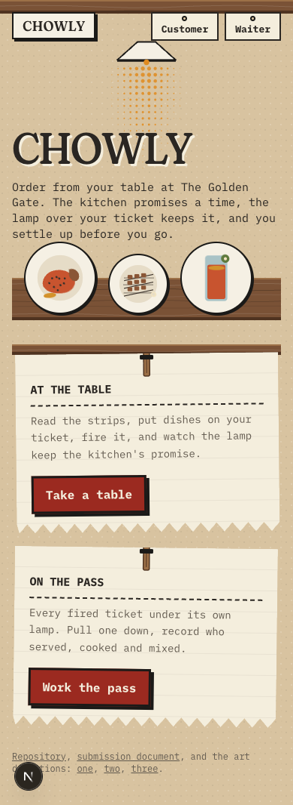 | 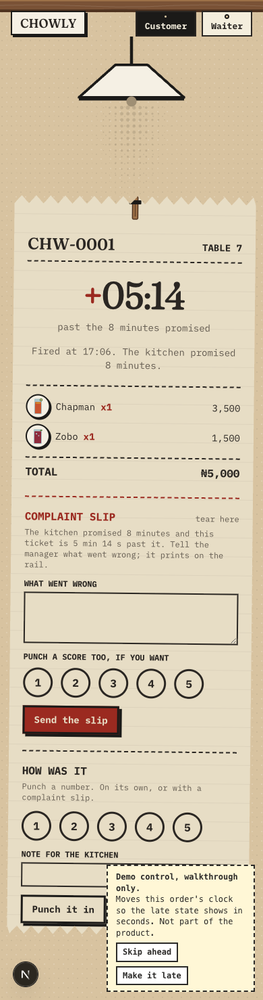 | 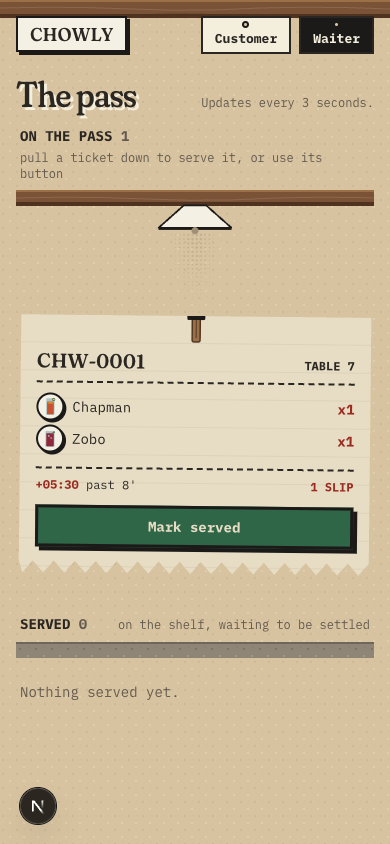 | 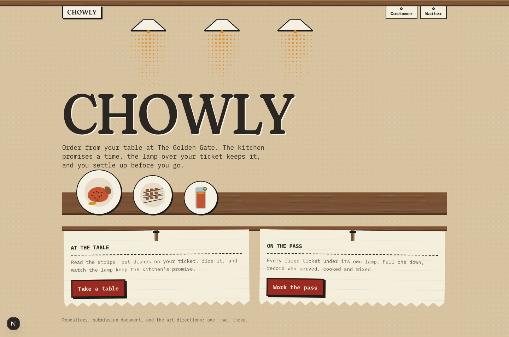 |

What works: the clock still reads, and now on a room a person would sit in. The
ordering list is the first version of this app where nothing sits between a person and
the plus button. The ticket on a peg under a lamp is still the most specific object in
any of the three.

What is derivative, named: the new palette walked out of one cliché into another. Warm
cream paper, a high-contrast serif with a soft axis, and a terracotta-red button is the
first entry on the list of things generated pages default to, and the plus buttons in
char red on cream paper are exactly that tell. Wood rail, plaster, kraft and ceramic is
the "artisan bistro" brand kit of the last decade. And IBM Plex Mono at 12 and 13 pixels
for every line of a ticket is the least legible body text of the three; the ticket
metaphor is charging real readability for its fidelity.

### The bar, answered for The Pass, repaired

- **Could this be any other restaurant app with the logo swapped?** The order screen and
  the rail could not: nobody else hangs your ticket under a lamp whose light is the
  clock. The menu now could, with the plates removed.
- **The one thing remembered an hour later:** the lamp going grey over a late ticket.
- **Where it takes a real risk:** a whole-screen ground that shifts over twenty minutes
  and has to stay legible at both ends; a ticket set entirely in mono on a phone.
- **What has weight, texture or imperfection:** stipple in the plaster, drawn grain in
  the wood, speckle in the stone, halftone light, torn paper, pegs, the ceramic sign's
  hard offset, two coats of gouache that do not quite meet.
- **Does the type do anything:** Fraunces at scale with a hard paper offset is a painted
  sign; the mono is the printer's logic. Both are also the defaults the calibration
  list warns about, and they now sit on the palette it warns about.

## 2. The Run

**The two assumptions broken, of the four offered:** not a scrolling list, and time as
something other than light. The menu is a lacquer tray with every bowl on its rim;
turning it, by swipe or by the two buttons or by tapping a bowl, brings one bowl to the
front, large, with its name, price and minutes. One action, in the lower third: put it
on my tray. Time is distance: the room is drawn in chalk on a raffia mat, and a runner
carries your bowl along the route from the pass to your table, its position the fraction
of the promised minutes used. Past the promise the runner is on a lap round the room and
the lap count says how far past. The floor shows every run on one plan. Nothing here is
a feed and nothing here is a lamp. **Material:** a woven raffia mat, lacquer trays in
deep green, terracotta bowls with the food glazed into them, chalk. **Type:** Syne and
Hanken Grotesk. **Desktop changes shape:** tray beside text, plan beside cards.

| 390 | late at 390 | the floor at 390 | 1440 |
|---|---|---|---|
| 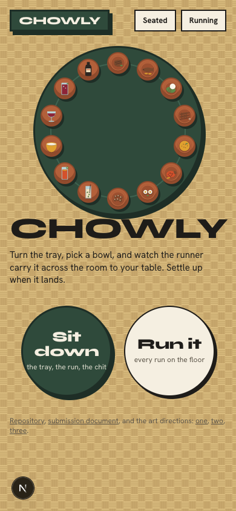 | 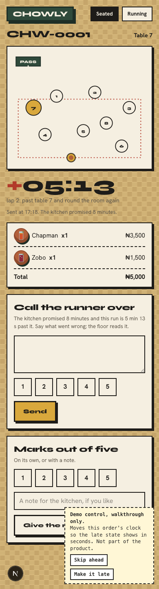 | 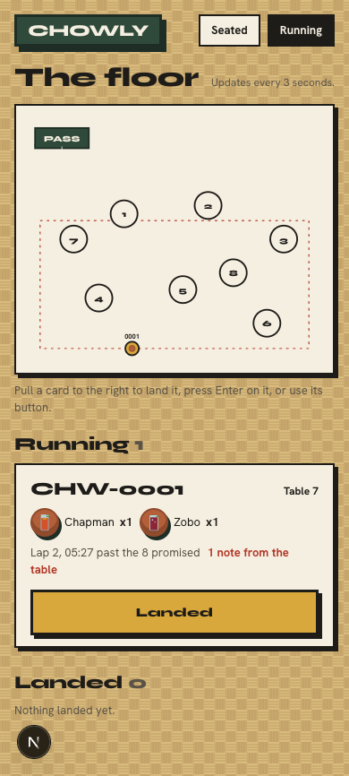 | 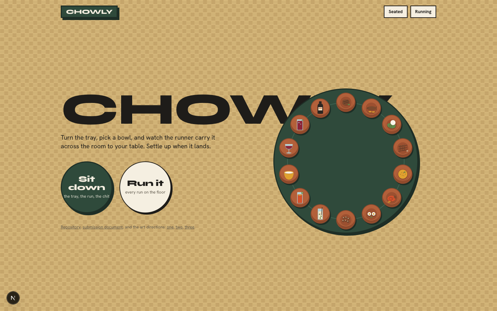 |

What works: it is structurally its own thing, and the food is the biggest of the three:
one bowl at 104 pixels at the front of a tray, with all fourteen visible around it.
Time as distance is legible without a legend: "65% of the way", "lap 2". The floor plan
gives the waiter the whole room in one look, which no other version has offered.

What is derivative, named: thick black borders, hard black offsets, a mustard button and
an extended grotesk is the neo-brutalist web kit of 2022 to 2024, and the chalk cards
are that kit exactly. The weave tile reads as a stock basket texture rather than a
specific mat. The room plan reads as a board game, not a dining room, and the lap
loop is drawn in red, the nearest anything in these three comes to an alarm. The
structural break also charges for itself: choosing between two mains means turning the
tray past twelve others, and a person cannot see two descriptions at once.

### The bar, answered for The Run

- **Could this be any other restaurant app with the logo swapped?** No. Nobody else
  carries your bowl across a plan of the room.
- **The one thing remembered an hour later:** the runner on lap 2.
- **Where it takes a real risk:** a menu that shows one dish at a time; a clock that is a
  position on a map; a landing whose hero is a tray of fourteen tiny bowls.
- **What has weight, texture or imperfection:** the weave, the lacquer's turned rim, the
  pooled glaze in the bowls, the chalk line's dashes, the runner's hard shadow.
- **Does the type do anything:** Syne extended at 8rem is the tray's own bold voice, and
  it is why the name overflowed at 390 in the first frames. Beyond the name it is a
  label face.

## 3. The Placemat

**The two assumptions broken, of the four offered:** not a flat ground but an illustrated
environment the interface sits inside, and a desktop layout that changes shape. Your
table at a buka at dusk, seen from above: a wax-print cloth, a kraft placemat the
interface is printed on, an enamel bowl with its chip, cutlery, and a glass of water.
Time is quantity and wear: five cubes of ice when the order goes in, melting as the
promised minutes are used, none when the promise is past, and from then the glass sweats
a ring into the placemat that spreads the longer it waits. Served, the bowl lands on the
mat; paid, the glass is empty. **Material:** wax print, kraft with its fibre drawn in,
enamel with a dark rim and one chip, paper slips on clips. **Type:** Young Serif and
Nunito Sans. **Desktop changes shape:** two placemats side by side on the landing, the
chit lying open beside the menu mat, the glass mat beside the slips on the order.

| 390 | late at 390 | the tables at 390 | 1440 |
|---|---|---|---|
| 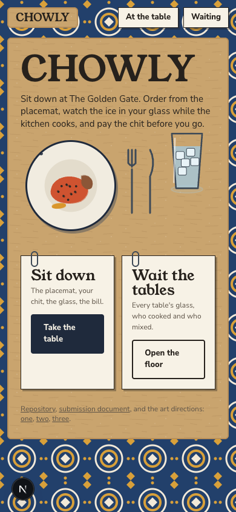 | 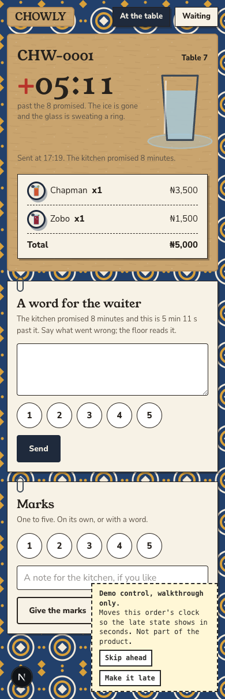 | 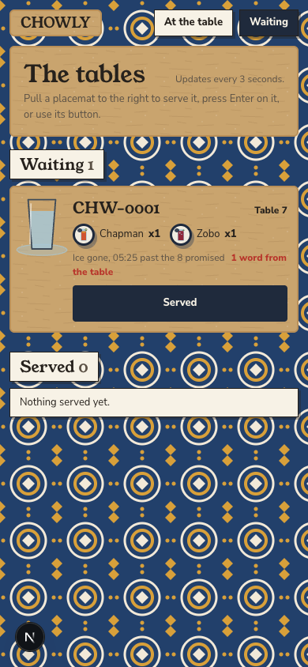 | 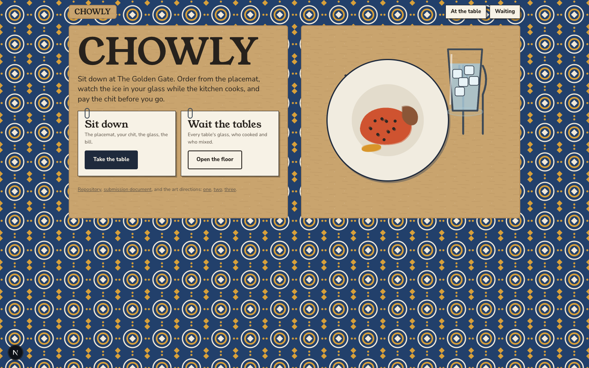 |

What works: the clock needs no explanation at all. A glass with the ice gone, sweating
a ring onto the paper, is what waiting too long looks like at a real table, and the
waiter's floor reads "ice gone" per table. The environment is specific: the chip on the
enamel rim, the print, the placemat menu with the bowls in rows, which is how a buka's
menu is read. The food is the most legible of the three in daily use, at 96 pixels in a
white bowl. And it is the only one of the three whose desktop layout is not the phone
layout widened.

What is derivative, named: the wax print is the move every diaspora restaurant brand
makes, and it is loud enough to fight the interface: the floor's headings had to be put
on slips to be read at all. Kraft placemat, white slips and paperclips is the "handmade
café menu" template. The top-down illustrated table is the food-delivery hero of the
last decade. Young Serif over a rounded sans is a friendly food-blog pairing. Ice as a
timer has been done, though rarely for this.

### The bar, answered for The Placemat

- **Could this be any other restaurant app with the logo swapped?** The order screen
  could not, and the floor could not. The menu could pass for a placemat menu anywhere,
  which is partly the point and partly the problem.
- **The one thing remembered an hour later:** the ring under the glass.
- **Where it takes a real risk:** a patterned ground under an interface; a clock with
  no digits in it (the digits are printed beside it, but the glass carries the state);
  a landing that is a picture of a table.
- **What has weight, texture or imperfection:** the print, the fibre in the kraft, the
  chip on every bowl, the clip on every slip, the sweat ring, the cubes.
- **Does the type do anything:** Young Serif on kraft is a printed placemat, and that is
  all it needs to be. It lacks the naira sign, which the first frames showed as a
  struck-through N in the chit; the totals now set in the body face.

## Ranking

1. **The Placemat.** The most legible clock of any round, the most legible food, the
   only desktop layout that changes shape, and an environment a person would recognise.
   Its faults are a loud cloth and a template-ish slip vocabulary, both of which can be
   dialled back without touching the idea.
2. **The Pass, repaired.** The strongest through-line and the strongest choreography, and
   the three defects are fixed as asked. It ranks second because its new surface is the
   cream, serif and terracotta default, and because a ticket set in mono on a phone
   makes a person work to read their own order.
3. **The Run.** The boldest structure and the biggest food, ranked last because the
   structure charges the person choosing dinner for it, because the chalk card kit is the
   most derivative surface of the three, and because the plan reads as a game.

If one ships as is, it is The Pass, repaired: least to change, every moment already
choreographed. If one is worth the remaining work, it is The Placemat: quieten the cloth
to a border or a lower-contrast tile, replace the paperclip slips with something printed
on the mat, and bring The Pass's choreography of the five moments across.

## Housekeeping

- The walkthroughs write real rows. Every run removed its own orders afterwards.
- The demo control renders only on the three order screens under `/directions-3`, only
  for the order the browser placed, and only when the server runs with
  `DEMO_CONTROLS=true`. In production the endpoint is a 404 and the panel does not exist.
- The Pass's header steps aside under `/directions-3`; each direction brings its own chrome.
- Verified in WebKit: every landing, menu and floor at 390 and 1440, all stylesheets
  applied, no console errors, no sideways scroll.
