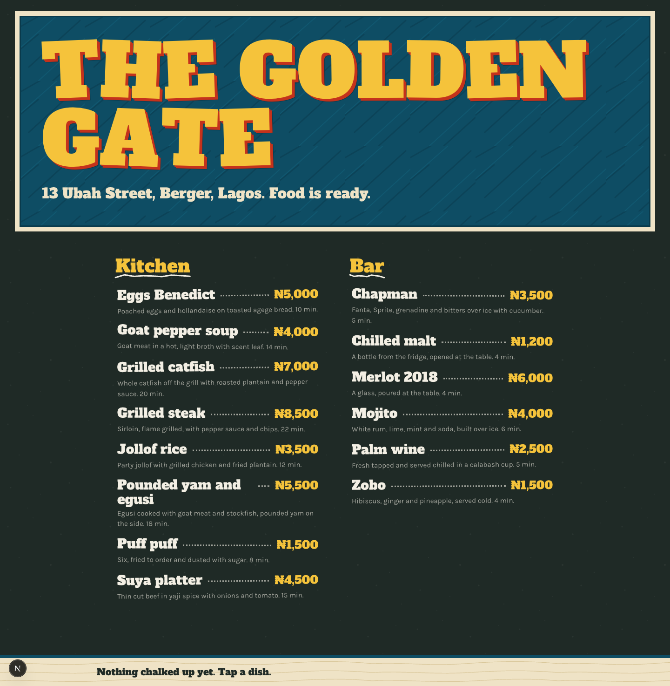
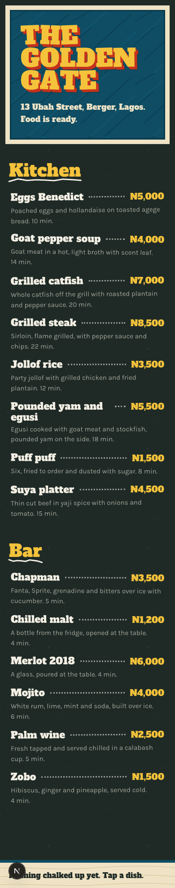
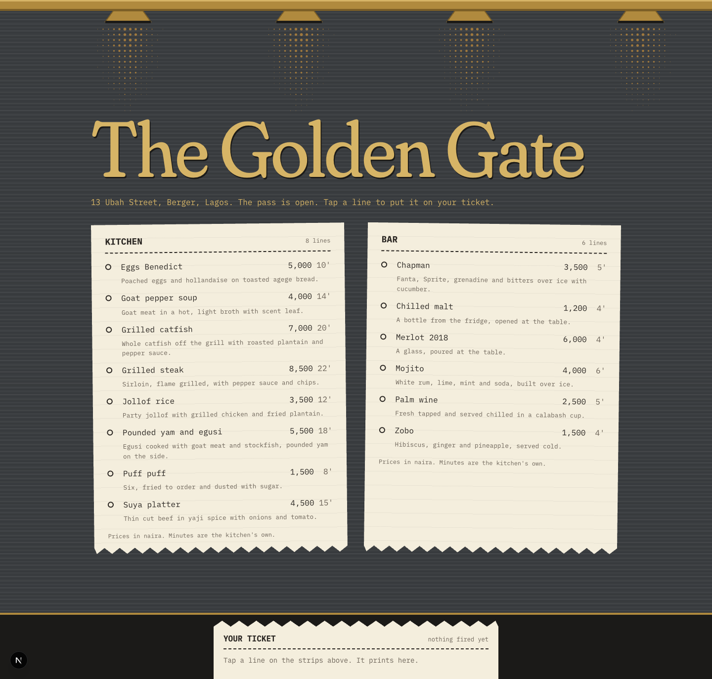
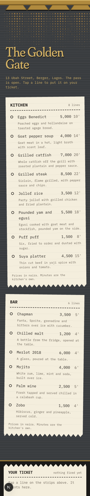
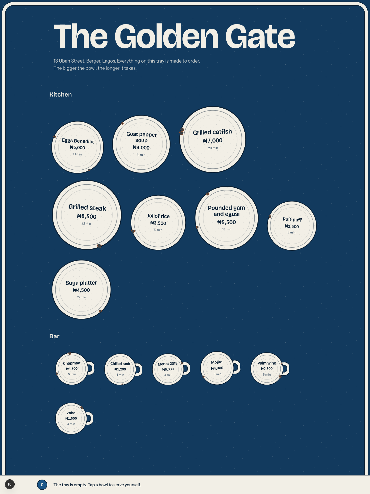
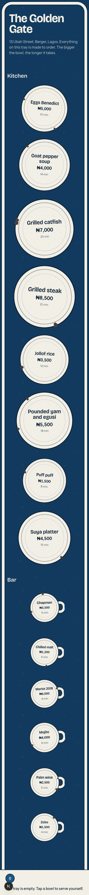

# Three art directions for CHOWLY

The Phase 4 interface was competent and forgettable. Before rebuilding, three genuinely
different directions were proposed, each built for real as the menu screen on the seeded
data with its own entrance and add-to-order motion, then screenshotted at 1440 and 390 and
critiqued against the bar. The prototypes live at `/directions/signwriter`,
`/directions/pass` and `/directions/enamel` on this branch.

## 1. Signwriter

**World:** a bukka off Ubah Street at dusk, its plywood signboard freshly painted, the
day's menu chalked on slate. **Material:** painted plywood and chalk on slate.
**Type:** Alfa Slab One with a hard cut-in shade, Karla for the small print.
**Palette:** board blue-green, sign yellow, sign red, plywood cream, slate, chalk.

| 1440 | 390 |
|---|---|
|  |  |

What works: the loudest first three seconds of the three. The sign is unmistakably a
painted Nigerian signboard, and "Food is ready" is a line every Lagosian has read on a
wall. The type does real work: the fat slab with the red shade cut in behind it is the
lettering, not a label for it. Chalk leaders and yellow prices are how a bukka writes
its prices.

What is derivative: the chalkboard menu is one of the most worn tropes in cafe design
anywhere in the world, and the wobbly hand-drawn underline is its stock accessory. The
hard-offset "retro sign" display treatment is a current fashion, so the board would
date. And the world stops at the menu. Time is chalk tally marks wiped away, which is a
metaphor a person has to be told about, not a condition they feel; the waiter's rail
would be a second chalkboard, which is a classroom, not a kitchen; and payment has no
material of its own. It wins moment one and has no answer for moments three and four.

## 2. The Pass

**World:** the pass of a hotel kitchen on Berger at nine at night, a brass rail, heat
lamps, thermal tickets curling in the heat. **Material:** brushed steel, brass, thermal
paper, heat. **Type:** Fraunces with its soft and wonk axes for the name and the big
numbers, IBM Plex Mono for everything a printer would print. **Palette:** steel, brass,
heat amber, thermal cream, char red, print soot.

| 1440 | 390 |
|---|---|
|  |  |

What works: it is one world with a place in it for every screen. The customer stands on
the kitchen side of the pass; their order is a ticket under a heat lamp; the waiter's
rail is a rail; the receipt is the same paper torn off. Time is the lamp, and a lamp is
a condition of the whole room, which is exactly what moment three asks for: as an order
runs late the light itself warms toward red and the paper darkens under it. The rail is
a kitchen by construction, not by styling. Texture is everywhere and none of it is
decoration: brushed steel, machined brass edges, halftone light, print ruling, punched
holes, torn edges, strips hung crooked.

What is derivative: the receipt aesthetic, mono type on cream paper with a zigzag edge,
has become a recognisable microsite trope, and Fraunces is the opinionated serif of the
moment, chosen by a great many independent brands. Halftone is print nostalgia. And the
steel base sits one wrong decision away from the near-black-with-one-accent default the
brief bans; it only escapes because the steel is a mid-tone with visible grain and there
are three warm materials on it rather than one accent.

## 3. Cast Enamel

**World:** the shelf above a Lagos kitchen stove, enamel bowls and trays stacked, chipped
at the rims. **Material:** enamel over pressed steel, with chips showing the metal.
**Type:** Bricolage Grotesque on its width axis, Instrument Sans.
**Palette:** the seven original tokens plus chip metal and rust.

| 1440 | 390 |
|---|---|
|  |  |

What works: one real idea, that the bowl's size carries data, so the slowest dish is
the biggest bowl and the drinks are cups, and it is honest information design rather
than decoration. The chips are the only imperfection any of the three earned from the
material itself.

What is derivative: it is the existing app with the plates rounded off. Same palette,
same type, same ground, so it carries the exact "competent and forgettable" risk the
brief opened with. Scattered circles on a dark ground read as a bubble interface, a
pattern every design tool's template library has. The tray rim barely registers at any
size, so "the screen is a tray" is a caption, not a perception. The illustration is
thin: a circle with rings is a diagram of a bowl, not a bowl. Time as a pot boiling
over would need real drawing to land, and the rail as a tray of tickets is a dashboard
with a texture on it. At 390 it is a long column of identical circles.

## The choice: The Pass

It is the only direction where the app's subject, time under pressure, is the material
itself: the heat lamp is the clock, so as an order runs late the whole screen's light
changes, and moment three is answered without a widget. It gives every screen a place in
one world, because the customer's ticket, the waiter's rail and the paid receipt are
three states of the same piece of thermal paper, so the story is continuous rather than
themed. And it takes the real risk of the three, a steel and brass kitchen that could tip
into the banned dark-with-one-accent default, and answers it with three warm materials,
halftone light and torn paper instead of gradients and glow.

### The bar, answered for The Pass

- **Could this be any other restaurant app with the logo swapped?** No. No other
  restaurant app puts the customer on the kitchen side of the pass with their order
  hanging under a heat lamp, and the copy speaks in the kitchen's own verbs: fire, pass,
  ticket.
- **The one thing remembered an hour later:** the heat lamps, and that the light is the
  clock.
- **Where it takes a real risk:** the dark steel base, one step from a banned default;
  kitchen jargon on a customer's screen; the entire wait screen changing colour
  temperature, which has to stay slow and motion-safe; halftone light that could read as
  retro print rather than heat.
- **What has weight, texture or imperfection:** brushed steel grain, brass with machined
  edges, halftone light, print ruling, punched holes, torn zigzag edges, strips hung
  crooked. In the full build: paper that browns under the lamp as the wait runs late,
  the curl of a ticket that has hung too long, and the tear of a receipt.
- **Does the type do anything:** Fraunces at scale is the only curve in a room of straight
  lines, and its soft axis warms as the name comes in under the lamps. The mono is not a
  style; it is the ticket's own logic, columns that a printer would align.

### What The Pass will do for the five moments

1. **First load.** The lamps come on one at a time over the steel, the name warms in,
   the strips drop off the rail and print.
2. **Committing the order.** The ticket tears off the printer with a zigzag, swings up
   onto the rail and is spiked. The button says what a kitchen says: fire the order.
3. **The wait.** The order page is the ticket under its lamp. The lamp's halftone pool
   is the countdown, shrinking as the promised minutes are used; the light warms from
   amber toward red as the order runs late and the paper browns beneath it. The whole
   screen is the condition, slowly, never flashing.
4. **The rail.** A brass rail with tickets on spikes, a lamp over each, the late ones
   browning. Dragging a ticket down the rail to the served hook; the button and the
   keyboard do the same.
5. **Payment and receipt.** The ticket is pulled off the spike, the receipt prints and
   tears, the PAID stamp lands in char red, and the lamp goes out.
